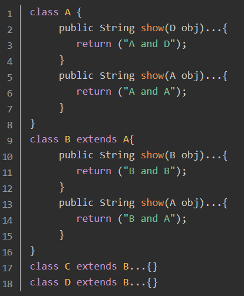
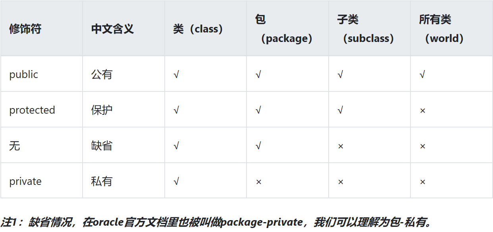
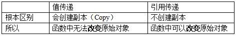
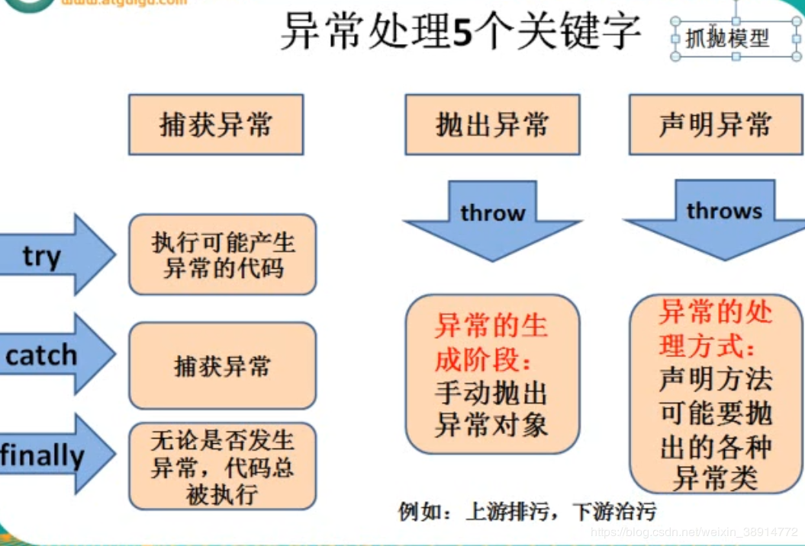
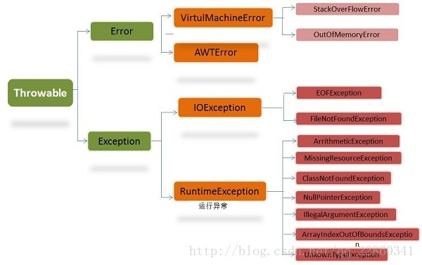

# 一、Java语言特点

## 1、Java 语言有哪些特点/什么是Java？

1. 简单易学；
2. 面向对象（封装，继承，多态）；
3. 平台无关性（ Java 虚拟机实现平台无关性）；
4. GC实现垃圾回收；
5. 异常处理机制；
6. 支持多线程；
7. 支持网络编程并且很方便；
8. 编译与解释并存；

## 2、面向对象和面向过程的区别

- **面向过程** ：**面向过程性能比面向对象高。** 因为类调用时需要实例化，开销比较大，比较消耗资源，所以当性能是最重要的考量因素的时候，比如单片机、嵌入式开发、Linux/Unix等一般采用面向过程开发。但是，**面向过程没有面向对象易维护、易复用、易扩展。**
- **面向对象** ：**面向对象易维护、易复用、易扩展。** 因为面向对象有封装、继承、多态性的特性，所以可以设计出低耦合的系统，使系统更加灵活、更加易于维护。但是，**面向对象性能比面向过程低**。

## 3、Java和C++的区别?⭐

1. 二者都是面向对象的语言，都支持封装、继承和多态。C++ 为了兼容 C 也支持面向过程。
2. Java通过虚拟机实现跨平台，C++依赖特定的平台
3. Java没有指针的概念，c++有，Java对内存的访问更加安全
4. Java有内存管理/垃圾回收机制，c++需要程序员手动释放内存。
5. Java支持单继承，c++支持多继承；虽然 Java 的类不可以多继承，但是接口可以多继承。
6. c++的字符串、字符串数组需要加一个结束符‘\0’。Java不需要

其他版本：

1. Java 是纯粹的面向对象语言，所有的对象都继承自 java.lang.Object，C++ 为了兼容 C 即支持面向对象也支持面向过程。
2. Java 通过虚拟机从而实现跨平台特性，但是 C++ 依赖于特定的平台。
3. Java 没有指针，它的引用可以理解为安全指针，而 C++ 具有和 C 一样的指针。
4. Java 支持自动垃圾回收，而 C++ 需要手动回收。
5. Java 不支持多重继承，只能通过实现多个接口来达到相同目的，而 C++ 支持多重继承。
6. Java 不支持操作符重载，虽然可以对两个 String 对象执行加法运算，但是这是语言内置支持的操作，不属于操作符重载，而 C++ 可以。
7. Java 的 goto 是保留字，但是不可用，C++ 可以使用 goto。

**JAVA与C的区别**

1、Java是面向对象的语言，c是面向过程的语言

2、Java没有指针，c有指针

3、Java有虚拟机，与C相比更容易跨平台

## 4、Java 面向对象编程三大特性: 封装 继承 多态

### 封装

把描述一个对象属性和行为的代码封装在一个类中：属性用变量定义，行为用方法进行定义。

方法可以直接访问同一个对象中的属性。 

### 继承

- 子类继承父类的属性和方法。
- 子类可以有父类非私有的方法、属性。
- 子类也可以对父类进行扩展，也可以重写父类的方法。
- 缺点就是提高了代码之间的耦合性。 

### 多态

多态是同一个行为具有多个不同表现形式或形态的能力。

多态是指程序中定义的引用变量所指向的具体类型和通过该引用变量发出的方法调用，在编程时并不确定，而是在程序运行期间才确定(比如：向上转型，只有运行才能确定其对象属性)。方法覆盖和重载体现了多态性。

## 5、多态详解

### （1）多态分为两种类型：

1、编译时多态：方法重载。

2、运行时多态：JAVA运行时，根据调用该方法的实例的类型来决定选择调用哪个方法则被称为运行时多态。

### （2）运行时多态存在的三个必要条件：

1. 继承（包括接口的实现）
2. 重写
3. 父类引用指向子类对象

### （3）多态的好处

1.可替换性（substitutability）

多态对已存在代码具有可替换性。

2.可扩充性（extensibility）

多态对代码具有可扩充性。增加新的子类不影响已存在类的多态性、继承性，以及其他特性的运行和操作。

3.接口性（interface-ability）

多态是超类通过方法签名，向子类提供了一个共同接口，由子类来完善或者覆盖它而实现的。

4.灵活性（flexibility）

它在应用中体现了灵活多样的操作，提高了使用效率。

5.简化性（simplicity）

多态简化对应用软件的代码编写和修改过程，尤其在处理大量对象的运算和操作时，这个特点尤为突出和重要。

### （4）多态实践

https://www.jianshu.com/p/3601dc63e5d8

考察：多态下调用的优先级从高到低：

- this.show(O)、
- super.show(O)、
- this.show((super)O)、
- super.show((super)O)。



```java
A a1 = new A();    
A a2 = new B();    
B b = new B();    
C c = new C();    
D d = new D();    
```

```java
System.out.println(a1.show(b));   ①  A and A System.out.println(a1.show(c));   ②  A and A System.out.println(a1.show(d));   ③  A and D 
System.out.println(a2.show(b));   ④  B and A
System.out.println(a2.show(c));   ⑤   B and A
System.out.println(a2.show(d));   ⑥   A and D
System.out.println(b.show(b));     ⑦   B and B
System.out.println(b.show(c));     ⑧   B and B
System.out.println(b.show(d));     ⑨   A and D
```

部分解析

```
System.out.println(a2.show(b));   ④  B and A
```

解析：

(a2的类型是A，寻找A的show(b)方法的调用；找到对应的方法之后看B类中是否对其覆盖重写。若是，则用B的方法)

1. a2是B类的引用对象，类型为A，所以this指向A类，
2. 然后在A类里面找`this.show(B)`方法，没有找到，所以到了`super.show(B)`,由于A类没有超类，所以到了`this.show（super B）`，B的超类是A，即`super B = A`，所以执行方法`this.show（A）`，
3. 在A方法里面找`show（A）`，找到了，
4. 但是由于a2是一个类B的引用对象，而B类里面覆盖了A类的`show（A）`方法，所以最终执行的是B类里面的show（A）方法，即输出B and A；

```
System.out.println(a2.show(c));   ⑤   B and A
```

解析：

(a2的类型是A，寻找A的show(c)方法的调用；找到对应的方法之后看B类中是否对其覆盖重写。若是，则用B的方法)

1. a2是B类的引用对象，类型为A，所以this指向A类，
2. 然后在A类里面找this.show(C)方法，没有找到，所以到了super.show（C）方法，由于A类没有超类，所以到了this.show(super C),
3. C的超类是B，所以在A类里面找show（B），同样没有找到，发现B还有超类，即A，所以还继续在A类里面找show（A）方法，找到了，
4. 但是由于a2是一个类B的引用对象，而B类里面覆盖了A类的show（A）方法，所以最终执行的是B类里面的show（A）方法，即输出B and A；

```
System.out.println(a2.show(d));   ⑥   A and D
```

解析：

a2是B类的引用对象，类型为A，所以this指向A类，然后在A类里面找this.show(D)方法，找到了，但是由于a2是一个类B的引用对象，所以在B类里面查找有没有覆盖show（D）方法，没有，所以执行的是A类里面的show（D）方法，即输出A and D；

## 6、访问级别修饰符

  

# 二、数据类型

## 1、Java有几种基本数据类型

八种：

1. byte
2. boolen
3. char
4. int
5. short
6. long
7. float
8. double

## 2、基本类型和引用类型？他们的区别

除了8中基本数据类型都是引用类型， 为了面向对象操作的一致性，每种数据类型都有对应的包装类。

**不同点**：

* 赋值方法不同，基本类型直接赋值，引用类型通过 new 创建对象，然后再把对象赋予相应的变量。
* 比较方面的不同，== 号的比较：引用类型比较的是引用地址，基本类型比较的是值
* 在数据做为参数传递的时候，基本数据类型是值传递，而引用数据类型是引用传递（地址传递）。 

**分别放在 JVM 的哪里？**

1. 基本数据类型在被创建时，在栈上给其划分一块内存，将数值直接存储在栈上（也不完全一定）。

2. 而引用数据类型在被创建时，首先要在栈上给其引用（句柄）分配一块内存，而对象的具体信息都存储在堆内存上，然后由栈上面的引用指向堆中对象的地址。


**引用类型的创建过程：**

现在为其创建一个对象MyDate d1 = new MyDate(8,8,2008);

在内存中的具体创建过程是：

1）首先在**栈内存**中为其d1分配一块空间；

2）然后在**堆内存**中为MyDate对象分配一块空间，并为其三个属性设初值0，0，0；

3）根据类MyDate中对属性的定义，为该对象的三个属性进行赋值操作；

4）调用构造方法，为三个属性赋值为8，8，2008；（注意这个时候d1与MyDate对象之间还没有建立联系）

5）**将MyDate对象在堆内存中的地址，赋值给栈中的d1**;通过句柄d1可以找到堆中对象的具体信息。 

## 3、Java值传递与引用传递⭐

简略的回答

在java里面，只有基本数据类型和String是按值传递的，后者String也是保存在栈内存的字符串常量池里面。对象之间的传递就是引用传递，传递地址。

详细的解释：

https://www.zhihu.com/question/31203609

### 值传递

在调用函数时**将实际参数复制**一份传递到函数中；

在函数中如果对参数进行修改，将不会影响到实际参数。

### 引用传递

在调用函数时将实际**参数的地址直接**传递到函数中；

那么在函数中对参数所进行的修改，将影响到实际参数。



在Java中，其实可以把引用传递视为值传递，原因是在参数传递过程中，是把实际参数的地址复制了一份，传递给形参。

所以，**Java的引用传递其实也是值传递，把实参对象引用的地址当做值传递给了形式参数。**

所以说，Java中其实还是值传递的，只不过对于对象参数，值的内容是对象的引用。

# 三、概念对比

## 1、重载和重写的区别⭐

#### 重载

发生在同一个类中，方法名必须相同，参数类型不同、个数不同、顺序不同，方法返回值和访问修饰符可以不同。

#### 重写

重写是子类对父类的可访问方法的重写，发生在子类中。

方法名、参数列表必须相同，返回值范围小于等于父类，抛出的异常范围小于等于父类，访问修饰符范围大于等于父类。

另外，如果父类方法访问修饰符为 private，则子类就不能重写该方法。**也就是说方法提供的行为改变，而方法的外貌并没有改变。**

## 2、接口和抽象类的区别⭐

1. 接口体现的是一种规范，抽象类体现的是模板式设计。
2. 一个类可以实现多个接口，但只能继承一个抽象类（接口可以多继承，抽象类只能单继承）。
3. 接口里只能有抽象方法，抽象类里面可以有非抽象方法。
4. 接口里不可以有构造函数和初始化块，抽象类里可以有
5. 接口里不可以定义静态方法，抽象类里可以。
6. 接口里的变量全部为静态常量，抽象类里可以有普通变量

其他表述：

1. 接口的方法默认是 public，所有方法在接口中不能有实现(Java 8 开始接口方法可以有默认实现），而**抽象类可以有非抽象的方法**。
2. 接口中除了static、final变量，不能有其他变量，而抽象类中则不一定。
3. **一个类可以实现多个接口，但只能实现一个抽象类。**接口自己本身可以通过extends关键字扩展多个接口。
4. 接口方法默认修饰符是public，抽象方法可以有public、protected和default这些修饰符
5. **从设计层面来说，抽象是对类的抽象，是一种模板设计，而接口是对行为的抽象，是一种行为的规范。**

### （1）什么是抽象类？

由abstract修饰的方法叫抽象方法；由abstract修饰的类叫抽象类。

抽象的类无法进行实例化，因为他不是具体存在的类，或者说这样的类还不够完善，不能直接使用new关键字调用其构造器生成该类的对象。

### （2）什么是接口？

接口就是一个规范，类似于硬件上面的接口。

接口也弥补了Java单一继承的弱点，也就是类可以实现多个接口。

我们使用interface关键字定义接口。

### （3）抽象类必须要有抽象方法吗？

- 抽象类可以没有抽象方法
- 声明为抽象类的类不能被实例化，只能被继承。
- 如果一个类中含有抽象方法，那这个类必须被声明为抽象类，否则编译不通过。

## 3、静态变量与实例变量

### （1）区别

静态变量前要加上static关键字；而实例变量前则不加。

静态变量属于类，只要程序加载了类的字节码，静态变量就会被分配空间；实例变量属于某个对象，必须创建了实例对象，实例变量才会被分配空间。

静态变量可直接通过类名来调用；实例变量必须通过实例对象来调用。

实例变量不能被静态方法访问。

### （2）为什么不允许从静态方法中访问非静态变量？

是因为非静态变量是跟具体的对象实例关联的，而静态的却没有和任何实例关联。

## 4、== 和 equals 的区别⭐

- == 对于基本类型来说是值比较，对于引用类型来说比较的是地址；
- 而 equals 默认情况下是 `==`比较，只是很多类重写了 equals 方法，比如 String、Integer 等把它变成了值比较，所以一般情况下 equals 比较的是值是否相等。

### equals

Object类的equals方法：

```java
 public boolean equals(Object obj) {
        return (this == obj);
    }
```

可以看出其实就是==
而String类中重写了父类Object的equals方法：

```java
public boolean equals(Object anObject) {
        if (this == anObject) {
            return true;
        }
        if (anObject instanceof String) {
            String anotherString = (String)anObject;
            int n = value.length;
            if (n == anotherString.value.length) {
                char v1[] = value;
                char v2[] = anotherString.value;
                int i = 0;
                while (n-- != 0) {
                    if (v1[i] != v2[i])
                        return false;
                    i++;
                }
                return true;
            }
        }
        return false;
    }
```

可以看出此方法就是先使用==比较，如果不同再把对象转换为字符串逐一字符比较。

## 5、hashCode 与 equals (重要)⭐

### （1）hashCode()介绍

hashCode() 的作用是获取哈希码，也称为散列码；它实际上是返回一个 int 整数。这个哈希码的作用是确定该对象在哈希表中的索引位置。

散列表存储的是键值对(key-value)，它的特点是：能根据“键”快速的检索出对应的“值”。这其中就利用到了散列码！（可以快速找到所需要的对象）

### （2）为什么要有 hashCode

**我们先以“HashSet 如何检查重复”为例子来说明为什么要有 hashCode：** 当你把对象加入 HashSet 时，

1、HashSet 会先计算对象的 hashcode 值来判断对象加入的位置，同时也会与其他已经加入的对象的 hashcode 值作比较，如果没有相符的hashcode，HashSet会假设对象没有重复出现。

2、但是如果发现有相同 hashcode 值的对象，这时会调用 `equals()`方法来检查 hashcode 相等的对象是否真的相同。

3、如果两者相同，HashSet 就不会让其加入操作成功。如果不同的话，就会重新散列到其他位置。这样我们就大大减少了 equals 的次数，相应就大大提高了执行速度。

可以看出：`hashCode()` 的作用就是**获取哈希码**；它实际上是返回一个int整数。这个**哈希码的作用**是快速确定该对象在哈希表中的索引位置。

**`hashCode() `在哈希表中才有用，在其它情况下没用**。

### （3）hashCode()与equals()的相关规定

1. 如果两个对象相等，则hashcode一定也是相同的，equals方法一定返回true
2. 如果两个对象有相同的hashcode值，它们也不一定是相等的
3. **equals 方法被重写，则 hashCode 方法也必须重写**
4. hashCode() 的默认行为是对堆上的对象产生独特值。如果没有重写 hashCode()，则该 class 的两个对象无论如何都不会相等（即使这两个对象指向相同的数据）

**哪些场景下，子类需要重写 equals 方法和 hashCode 方法？**  

需要判断两个对象状态的相等性的时候。

### 为什么要重写 hashcode( ) 还要重写 equals( ) ？反之亦可问。

- 重写equals方法是为了按我们自己的想法来比较两个对象是否相等。

  重写equals就要重写hashcode()，因为如果不重写hashCode方法，可能出现**具有相同含义的不同对象**（他们的hashCode不同）的情况。

- 而如果只重写 hashCode 不重写 equals 方法，因为 equals其实就是 == ，只是判断两个对象是否是同一个对象，所以不能得到我们想要的结果。

所以需要同时重写equals和hashCode方法，目的是为了准确定位到我们期望的key。

**在 hashmap 中考虑：**

**通过阅读源码得知，在 hashMap 的 put 方法中，寻址找到的桶位如果上面已经有元素了，就判断 hash 值是否相同的同时也要通过 equals 判断（equals 是判断 map 的key 值），都为 true 才覆盖原来的值。如果只重写其中任意一个就会造成值的重复。 **

通俗点的解释

hashcode就类似 门牌号，小区非常大但定位你住哪里告诉门牌号就可以，非常快速定位到（非常像组数下标）

equals就是找到门牌号后需要比较里面具体的房间，少一个都不可以。

## 6、String、StringBuffer 和 StringBuilder 的区别是什么?

**数据可变和不可变**

1. `String`的值不可变的。
2. `StringBuffer`和`StringBuilder`的值是可变的，底层使用的是可变字符数组：`char[] value;`

**线程安全**

 `StringBuilder`是线程不安全的，效率较高；而`StringBuffer`是线程安全的，效率较低。

**性能**

每次对 String 类型进行改变的时候，都会生成一个新的 String 对象，然后将指针指向新的 String 对象。StringBuffer 每次都会对 StringBuffer 对象本身进行操作，而不是生成新的对象并改变对象引用。相同情况下使用 StringBuilder 相比使用 StringBuffer 仅能获得 10%~15% 左右的性能提升，但却要冒多线程不安全的风险。

**使用场景**

* 如果需要操作少量的数据用 String
* 单线程操作字符串缓冲区的情况下操作大量数据使用 StringBuilder  
* 多线程操作字符串缓冲区 下操作大量数据使用 StringBuffer 

## 7、final、finally、finalize 有什么区别？

- final可以修饰类、方法、变量，修饰类表示该类不能被继承、修饰方法表示该方法不能被重写、修饰变量表示不能被重新赋值。
- finally一般作用在try-catch代码块中，在处理异常的时候，通常我们将一定要执行的代码方法finally代码块中，表示不管是否出现异常，该代码块都会执行，一般用来存放一些关闭资源的代码。

```java
try {
  tryCode - 尝试执行代码块
}
catch(NullPointerException e) {
   catchCode -  try 语句发生错误后，执行的代码块；如果 try 语句没发生错误该代码不会执行。
} 
finally {
   finallyCode - 无论 try / catch 结果如何都会执行的代码块
}
```

- **finalize是一个方法**，是Object类的一个方法，而Object类是所有类的父类，该方法一般由垃圾回收器来调用，**当我们调用System的gc()方法的时候，由垃圾回收器调用finalize()，回收垃圾**。 

## 8、浅拷贝和深拷贝

浅拷贝和深拷贝都是只针对引用数据类型的。

**浅拷贝：**只复制指向某个对象的引用，而不复制对象本身。新旧对象共享同一块内存。

**深拷贝：**另外创建一个一模一样的对象，新对象跟原对象不共享内存。修改新对象，不会影响到原对象。


# 四、关键字

## 1、final 在 java 中有什么作用？

- final 修饰的类不能被继承。
- final 修饰的方法不能被重写。
- final 修饰的变量不可更改，**其不可更改指的是其引用不可修改，对于引用类型值还是可能改变的，举个列子：String 内部对于 value 的定义；而对于基本类型来说就叫做常量了。** 

##  2、String关键字

###  （1）String是如何实现不可变的？

String对象的底层是一个使用private、final修饰的char[]数组：

```java
private final char value[];  
```

- 使用了final修饰，表示一旦创建，该值就不可改变。

  但是注意final修饰引用类型的变量时，指的是引用类型地址值不能发生改变。但是Array数组的元素是可变的，如果我们不改变指向value[]的地址，而改变value[]的值呢？

- 此时需要注意value[]是采用private修饰的，String里面没有修改value[]里元素的方法，而且String类不可被继承，不能重写方法，所以String不可变。

而StringBuffer对象的底层也是一个char[]数组：

```
char[] value;
```

但是并没有用final修饰，所以数组的值是可变的。

### （2）String为什么设置为不可变？

* 为了实现字符串常量池(只有当字符是不可变的，字符串池才有可能实现) 
*  为了线程安全(字符串自己便是线程安全的) 
* 为了保证同一个对象调用 hashCode() 都产生相同的值，String 设置为不可变可以对这个条件有很好的支持，这也是 Map 类的 key 使用 String 的原因。

### （3）字符串常量池（位于方法区）

保存着所有字符串字面量（literal strings），这些字面量在编译时期就确定。

当一个字符串调用 intern() 方法时，

- 如果 String Pool 中已经存在一个字符串和该字符串值相等（使用 equals() 方法进行确定），那么就会返回 String Pool 中字符串的引用；
- 否则，就会在 String Pool 中添加一个新的字符串，并返回这个新字符串的引用。
- 如果是采用 "bbb" 这种字面量的形式创建字符串，会自动地将字符串放入 String Pool 中。

### （4）使用String.intern()

在创建一个String对象之后，可以使用 String 的 intern() 方法在运行过程将字符串添加到 String Pool 中。

```text
String a = new String("1").intern();
String b = "1";
System.out.println(a == b); // true
```

### （5）String s = new String(“abc”) 会创建几个对象

若常量池原本没有“abc”字面量，则一共会创建两个对象。

1. 编译期时，在常量池中查找是否有“abc”对象

   有则返回对应的引用实例；没有则创建对应的实例对象

2. 在堆中 new 一个 String("abc") 对象

3. 将对象地址赋值给str4,创建一个引用

所以，常量池中没有“abc”字面量，则创建两个对象；否则创建一个对象；以及创建一个引用。

###  （6）字面量变式题

```java
String str1 = new String("A"+"B") ; 会创建多少个对象?
String str2 = new String("ABC") + "ABC" ; 会创建多少个对象?
```

 str1：

 字符串常量池："A","B","AB" : 3个

 堆：new String("AB") ：1个

 引用： str1 ：1个

 总共 ： 4个对象，1个引用

 str2 ：

 字符串常量池："ABC" : 1个

 堆：new String("ABC") ：1个

 引用： str2 ：1个

 总共 ： 2个对象，1个引用

https://blog.csdn.net/xiamiflying/article/details/82860721

## 3、transient阻止序列化

Java序列化中如果有些字段不想进行序列化，怎么办？

对于不想进行序列化的变量，使用transient关键字修饰。

transient关键字的作用是：阻止实例中那些用此关键字修饰的的变量序列化；当对象被反序列化时，被transient修饰的变量值不会被持久化和恢复。transient只能修饰变量，不能修饰类和方法。

java的serialization提供了一个非常棒的存储对象状态的机制，说白了serialization就是把对象的状态存储到硬盘上 去，等需要的时候就可以再把它读出来使用。

有些时候像银行卡号、密码这些字段是不希望在网络上传输的，**transient的作用就是把这个字段的生命周期仅存于调用者的内存中而不会写到磁盘里持久化**，意思是transient修饰的变量字段，他的生命周期仅仅在内存中，不会被写到磁盘中。

# 五、异常

## 1、与处理异常相关的5个关键字

1. try：将可能发生异常的代码括起来

2. catch：如果有异常就会执行catch里面的语句；用于处理try捕获到的异常

3. finally：不论是否有异常都会进行执行的语句

4. throws：在**方法声明上**声明抛出异常类型

5. throw：在**方法内部**主动抛出异常；**一般会用于程序出现某种逻辑时程序员主动抛出某种特定类型的异常**

   异常具有可抛性是因为 Exception 的父类是  Throwable ，只有继承它，才具有可抛性。

   **程序在执行到throw语句时立即终止，它后面的语句都不执行。通过throw抛出异常后，如果想在上一级代码中来捕获并处理异常，则需要在抛出异常的方法中使用throws关键字在方法的声明中指明要抛出的异常；如果要捕获throw抛出的异常，则必须使用try-catch语句块；**

   下面是一个空指针的例子的例子；

   ```java
   public class NullpointExceptionTest {
       static void testNull()throws NullPointerException{	
           String s = null;	
           if(s==null){		
               throw new NullPointerException();	
           }
       }
       public static void main(String []args){	
           try {		
               testNull();	
           } catch (NullPointerException e) {		
               // TODO: handle exception					System.out.println("testNull()中抛出的异常是"+e);	
           }
       }
   }
   ```


举例：

### try、catch、finally

```java
try {
  tryCode - 尝试执行代码块
}
catch(NullPointerException e) {
   catchCode -  try 语句发生错误后，执行的代码块；如果 try 语句没发生错误该代码不会执行。
} 
finally {
   finallyCode - 无论 try / catch 结果如何都会执行的代码块
}
```

### throw

**一般会用于程序出现某种逻辑时，程序员在代码块里主动抛出某种特定类型的异常。**

```java
public static void main(String[] args) { 
   String s = "abc"; 
   if(s.equals("abc")) { 
   		throw new NumberFormatException(); 
   }  
   else{ 
      	System.out.println(s); 
   } 
   //function(); 
} 
```

### throws

是方法可能抛出异常的声明。(用在声明方法时，表示该方法可能要抛出异常)
语法：[(修饰符)](返回值类型)(方法名)([参数列表])[throws(异常类)]{......}
如： 

```java
`public` `void` `function() ``throws` `Exception{......}`
```

当某个方法可能会抛出某种异常时用于throws 声明可能抛出的异常，然后交给上层调用它的方法程序处理。如：

```java
`public` `static` `void` `function() ``throws` `NumberFormatException{ ``  ``String s = ``"abc"``; ``  ``System.out.println(Double.parseDouble(s)); `` ``} ``  ` ` ``public` `static` `void` `main(String[] args) { ``  ``try` `{ ``   ``function(); ``  ``} ``catch` `(NumberFormatException e) { ``   ``System.err.println(``"非数据类型不能转换。"``); ``   ``//e.printStackTrace(); ``  ``} ``} `
```



### 2、Exception与Error的区别？



**Throwable:有两个重要的子类：Exception（异常）和Error（错误）** 

- **Error是IVM/程序无法处理的错误。**是非代码性错误，包括OutOfMemoryError：内存不足错误；StackOverflowError：栈溢出错误。

  此类错误发生时，JVM 将终止线程。

- **Exception**是是程序本身可以捕获并处理的异常。 包括运行时异常、编译时异常。

### 3、运行时异常和非运行时异常（一般异常/编译异常）的区别？

**【运行时异常】是Unchecked Exception**

RuntimeException及其子类都是unchecked exception。这种异常是运行时发生，无法预先捕捉处理的。

**是由 Java 虚拟机自动抛出并自动捕获**。

包括：NullPointerException空指针异常、ArrayIndexOutBoundException数组下标越界异常、ClassCastException类型转换异常、ArithmeticExecption算术异常

**【编译异常】编译异常是checked exception**可检查的异常，是我们**必须手动在代码里捕获并处理的异常**，如果不处理，程序就不能编译通过。包括IOException、SQLException等以及用户自定义的Exception异常。

### 4、受检异常与非受检异常

- 受检异常 

编译器要求必须处理的异常。

**除 RuntimeException 及其子类外，其他的 Exception 异常都属于受检异常**。

- 非受检异常

编译器不会进行检查并且不要求必须处理的异常。

**该类异常包括运行时异常（RuntimeException极其子类）和错误（Error）。**

### 5、空指针异常？

#### 什么是空指针异常？

Java 中任何对象都有可能为空，当我们调用空对象的方法时就会抛出 NullPointerException 空指针异常

#### 解决办法？

1、在调用对象的方法前添加一个判断，使用if(对象==null)语句

2、使用Java的静态代码分析工具，如 Eclipse IDE、SpotBugs、Checker Framework 等，它们可以帮助程序员检测出编译期的错误。结合 @Nullable 和 @Nonnull 等注解，我们就可以在程序运行之前发现可能抛出空指针异常的代码。

# 六、其他

## 1、Object类有哪些常用的方法？

equals 方法，hashCode 方法，toString 方法，wait 和 notify 系列的几个， getclass

## 2、幂等性

幂等（idempotent、idempotence）是一个数学与计算机学概念，常见于抽象代数中，即f(f(x)) = f(x).简单的来说就是一个操作多次执行产生的结果与一次执行产生的结果一致。有些系统操作天生就具有幂等性例如数据库的select语句，但更多时候是需要程序员来做保证的，尤其是在分布式系统环境中，接口能不能做到保证幂等性对系统的影响可能是非常大的，例如很常见的支付下单等场景，由于分布式环境中网络的复杂性，用户误操作，网络抖动，消息重复，服务超时导致业务自动重试等等各种情况都可能会使线上数据产生了不一致，造成生产事故。 

## 3、怎么防止前端重复提交？

1. 提交按钮后屏蔽提交按钮(前端js控制)
2. 前端生产唯一id， 后端在数据库设计时业务字段加唯一约束，防止数据库插入重复数据。 
3. 利用Session防止表单重复提交


## 4、缓存池
**JVM会自动维护八种基本类型的常量池，int常量池中初始化-128~127的范围**

基本类型的valueOf() 方法会调用缓存池比较值的大小：

```java
public static Integer valueOf(int i) {
    if (i >= IntegerCache.low && i <= IntegerCache.high)
        return IntegerCache.cache[i + (-IntegerCache.low)];
    return new Integer(i);
}
```
判断值是否在缓存池中，如果在的话就直接返回缓存池的内容，不在就新建一个。
Integer 缓存池的大小默认为 -128~127。
编译器会在自动装箱过程调用 valueOf() 方法，因此多个值相同且值在缓存池范围内的 Integer 实例使用自动装箱来创建，那么就会引用相同的对象。

```java
Integer m = 123;
Integer n = 123;
System.out.println(m == n); // true
```
基本类型对应的缓冲池如下：

```java
boolean values true and false
all byte values
short values between -128 and 127
int values between -128 and 127
char in the range \u0000 to \u007F
```

在 jdk 1.8 所有的数值类缓冲池中，Integer 的缓冲池 IntegerCache 很特殊，这个缓冲池的下界是 - 128，上界默认是 127，但是这个上界是可调的，在启动 jvm 的时候，通过 -XX:AutoBoxCacheMax=<size> 来指定这个缓冲池的大小，该选项在 JVM 初始化的时候会设定一个名为 java.lang.IntegerCache.high 系统属性，然后 IntegerCache 初始化的时候就会读取该系统属性来决定上界。

在 jdk 1.8 所有的数值类缓冲池中，Integer 的缓冲池 IntegerCache 很特殊，这个缓冲池的下界是 - 128，上界默认是 127，但是这个上界是可调的，在启动 jvm 的时候，通过 -XX:AutoBoxCacheMax=<size> 来指定这个缓冲池的大小，该选项在 JVM 初始化的时候会设定一个名为 java.lang.IntegerCache.high 系统属性，然后 IntegerCache 初始化的时候就会读取该系统属性来决定上界。

## 5、什么场景下需要用到序列化？

（1）远程通信

（2）本地存储

# 七、java高级特性

## 1、反射

### （1）什么是反射？

反射是在运行状态中，

对于任意一个类，都能够知道这个类的所有属性和方法；

对于任意一个对象，都能够调用它的任意一个方法和属性；

这种动态获取的对象信息以及动态调用对象的方法的功能

称为Java语言的反射机制。

举例

可以通过类的全限定名来获得一个类的类对象。进而获得类的所有属性、方法、构造器。

```java
import java.lang.reflect.Constructor;
import java.lang.reflect.Field;
import java.lang.reflect.Method;
import java.util.Arrays; 
public class Test01 {
    public static void main(String[] args) throws ClassNotFoundException {
        String a = "java.lang.String";
        //        String a = "java.lang.HashMap";         
        // 根据一类的全名字符串来获得一个类的类对象        
        Class<?> clazz = Class.forName(a);        
        // 获得传递过来的类的所有方法        
        Method[] methods = clazz.getDeclaredMethods();
        //        String s = Arrays.toString(methods);        
        for (Method m: methods) {            
            System.out.println(m);        
        }        
        System.out.println("------------------------------------------");        
        // 获得类的所有属性        
        Field[] declaredFields = clazz.getDeclaredFields();        
        for(Field d : declaredFields) {            
            System.out.println(d);        
        }        
        System.out.println("-------------------------------------");        
        // 获得类的所有构造器        
        Constructor<?>[] constructors = clazz.getDeclaredConstructors();        
        for (Constructor c : constructors) {            
            System.out.println(c);        
        }    
    }
}
```

### （2）哪里用到反射机制？

JDBC中，利用反射动态加载了数据库驱动程序。

### （3）反射机制的优缺点？

1. 优点：可以动态执行，在运行期间根据业务功能动态执行方法、访问属性，最大限度发挥了java的灵活性。
2. 缺点：对性能有影响，这类操作总是慢于直接执行java代码。

### 【待学习】（4）动态代理是什么？有哪些应用？

1. 动态代理是运行时动态生成代理类。
2. 动态代理的应用有 Spring AOP数据查询、测试框架的后端 mock、rpc，Java注解对象获取等。

## 2、泛型

#### （1）什么是泛型？

泛型的本质的参数化类型，这种参数类型可以用在类、接口、方法的创建中，分别成为泛型类、泛型接口、泛型方法。

#### （2）泛型是如何工作的？什么是类型擦除？

泛型是通过类型擦除实现的，编译器在编译时擦除了所有泛型类型相关的信息，所以在运行时不存在泛型任何泛型类型相关的信息。

泛型擦除具体来说就是在编译成字节码时，首先进行类型检查，接着进行类型擦除。（即所有类型参数都是用他们的限定类型）

## 3、注解

#### （1）什么是注解？

注解是附加在代码中的一些元信息，起到说明、配置的功能。

注解不会也不能影响代码的实际逻辑，仅仅起到辅助性的作用。

#### （2）应用场景？

- 编译器的信息 - **使用注解，编译器可以检测错误或抑制警告**
- 编译时和部署时处理 - **软件工具可以处理注解并生成代码，配置文件等。**
- 运行时处理 - **可以在运行时检查注解以自定义程序的行为**

#### （3）一些注解

@Override -标记方法是否覆盖超类中声明的元素。如果它无法正确覆盖该方法，编译器将发出错误

@Deprecated - 表示该元素已弃用且不应使用。如果程序使用标有此批注的方法，类或字段，编译器将发出警告