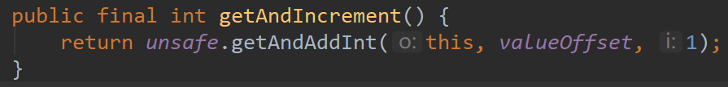
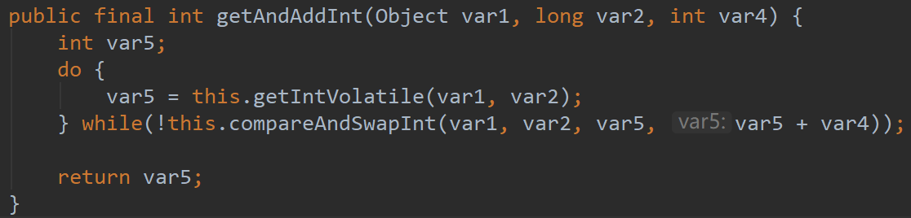
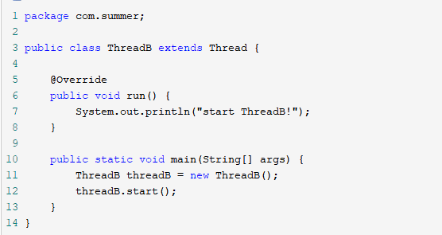
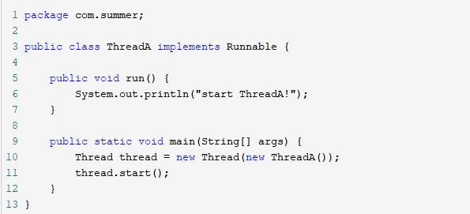
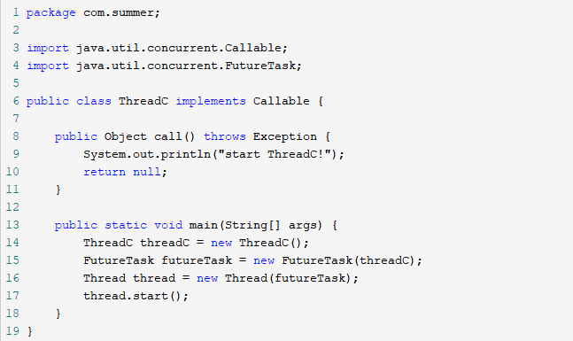
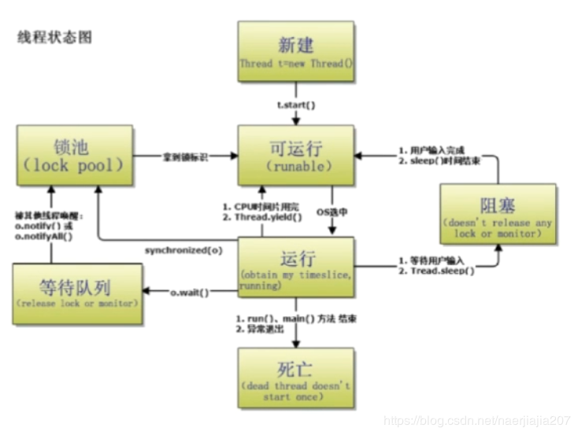
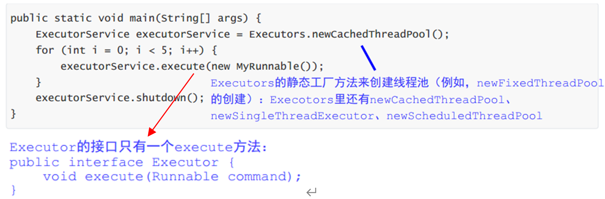
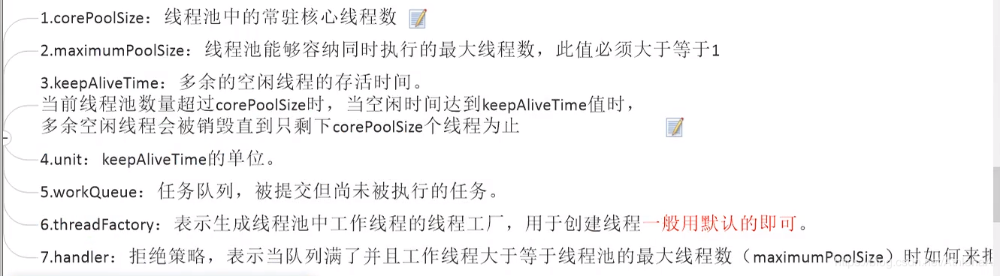
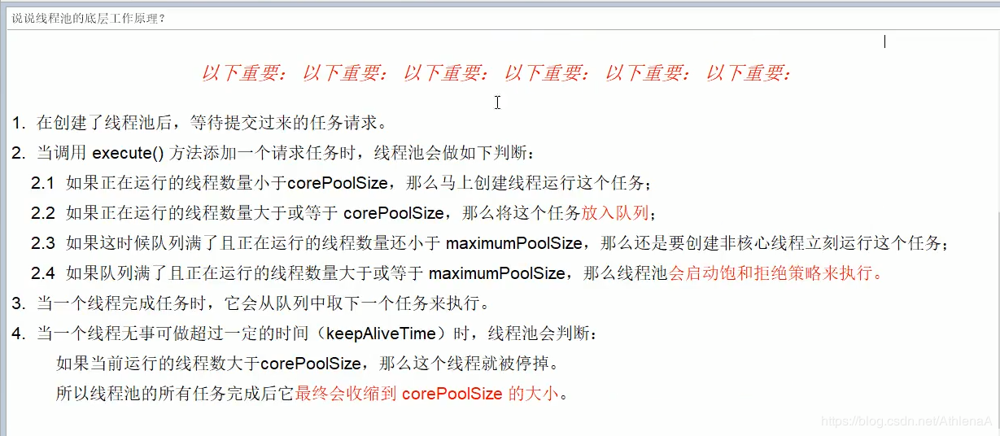

面试题

## 什么是守护进程？

守护进程是在后台运行不受终端控制的进程（如输入、输出等），Linux系统的大多数服务器就是通过守护进程实现的。

守护进程程序的名称通常以字母“d”结尾，常见的守护进程包括

- 系统日志进程syslogd、 
- web服务器httpd、
- 数据库服务器mysqld等。　　

守护进程一般在系统启动时开始运行，除非强行终止，否则直到系统关机都保持运行。

~~比如使用docker run -d参数创建一个后台运行的容器进程，想要终止它的话，可以使用ps查看到进程号再kill掉。~~

## 什么是非守护进程？

## 前台进程、后台进程、守护进程的转换？

1. **前台进程**：以一个名叫a的程序为例，一般我们启动一个进程是直接`./a`执行的，这时会话会一直阻塞等待a结束，这样启动的进程a是前台进程。
2. **后台进程**：若`./a &`，这样a就变成一个后台进程了，后台进程的stdout（标准输出）和stderrr（标准错误）仍然是输出到终端，但stdin（标准输入）无法联系到终端了。也就是说进程a无法通过"ctrl + d"结束，因为他已经收不到stdin的消息了，但是当会话结束时，后台进程a也会结束。
3. **守护进程**：nohup ./a &，可以创建守护进程a，使a在会话结束后继续运行。

## 守护进程与后台进程的区别？

1. **守护进程已经完全脱离终端控制台**了，而后台程序并未完全脱离终端(在终端未关闭前还是会往终端输出结果);
2. 守护进程在**关闭终端控制台**时不会受影响，而后台程序会随用户退出而停止，需要在以nohup command & 格式运行才能避免影响;
3. 守护进程的会话组和当前目录、文件描述符都是独立的。后台运行只是终端进行了一次fork，让程序在后台执行，这些都没改变; 

## 如何创建一个后台进程？

1. 运行程序时,加&;例如：./test_app &
2. 使用ctrl+z,bg等命令

## 如何创建一个守护进程？？？？

编写守护进程的一般步骤步骤：

（1）在父进程中执行fork并exit退出；

（2）在子进程中调用setsid函数创建新会话；

（3）在子进程中调用chdir函数，让根目录 ”/” 成为子进程的工作目录；

（4）在子进程中调用umask函数，设置进程的umask为0；

（5）在子进程中关闭任何不需要的文件描述符。

## Java如何创建一个守护进程？？？？

# 一、JMM（Java 内存模型）

概念：Java 内存模型（JMM）是一种抽象的概念，并不真实存在，它描述了一组规则或规范，通过这组规范定义了程序中各个变量（包括实例字段、静态字段和构成数组对象的元素）的访问方式。

目的：试图屏蔽各种硬件和操作系统的内存访问差异，以实现让 Java 程序在各种平台下都能达到一致的内存访问效果。

什么是JMM？

JMM定义了线程的本地内存与主内存的抽象关系，每个线程都有自己的本地内存，线程间共享主内存，线程A与线程B通信要经历2个步骤：1）线程A把本地内存A更新过的共享变量刷新到主内存；2）线程B到主内存中去读取线程A线程A更新过的共享变量。

JMM与JVM内存区域划分的区别： 

-   JMM描述的是一组规则，围绕原子性、有序性和可见性展开； 

-  相似点：存在共享区域和私有区域 

## 1、三大特性

### 原子性（Atomictiy）

原子性是指一个操作是不可中断的。即使是在多个线程一起执行的时候，一个操作一旦开始，就不会被其他线程干扰。

Java 内存模型保证了 read、load、use、assign、store、write、lock 和 unlock 操作具有原子性

int cnt; cnt++这种复合操作不具备原子性，可以使用AtomicInteger保证多线程修改的原子性。

### 可见性（Visibility）

可见性是指当一个线程修改了共享变量的值，其他线程能否立即知道这个修改。

### 有序性（Ordering）

有序性是指：在本线程内观察，所有操作都是有序的。在一个线程观察另一个线程，所有操作都是无序的，无序是因为发生了指令重排序。在 Java 内存模型中，允许编译器和处理器对指令进行重排序，重排序过程不会影响到单线程程序的执行，却会影响到多线程并发执行的正确性。 

## 2、指令重排

在汇编语言层面，计算机使用流水线技术来执行命令，为了防止流水线中断，就需要使用指令重排。

### 哪些指令不能重排：Happen-Before 规则

* 程序顺序原则：一个线程内保证语义的串行性。
* **volatile 规则**：volatile 变量的写先于读发生，保证了这个变量的可见性。
*  **一个 unlock 操作，先行发生于后面对同一个锁的 lock 操作。** 
* **Thread 对象 start() 方法的调用，先行发生于此线程的每一个动作。**
*  Thread 对象的结束先行发生于 join() 方法返回。 
*  对线程 interrupt() 方法的调用先行发生于被中断线程的代码，因此可以通过 interrupted() 方法检测到是否有中断发生。 
*  一个对象的初始化完成（构造函数执行结束）先行发生于它的 finalize() 方法的开始。
*  **如果操作 A 先行发生于操作 B，操作 B 先行发生于操作 C，那么操作 A 先行发生于操作 C。**  

##  3、线程中断

线程中断是一种重要的线程协作机制。线程中断并不会使线程立即退出，而是给线程发送一个通知，告知线程需要退出了。至于目标线程接到通知后如何处理是由它自己决定。这也是和stop方法的根本区别。

有三个方法与线程中断有关：

* interrupt() // 通知目标线程中断，也就是设置中断标志位
* isInterrupted() // 通过检查编中断标志位判断线程是否被中断
* interrupted() // 静态方法，判断是否被中断并清楚当前中断状态

### InterruptedException

通过调用一个线程的 interrupt() 来中断该线程，如果该线程处于阻塞、限期等待或者无限期等待状态，那么就会抛出 InterruptedException，从而提前结束该线程。 

 对于以下代码，在 main() 中启动一个线程之后再中断它，由于线程中调用了 Thread.sleep() 方法，因此会抛出一个 InterruptedException，从而提前结束线程，不执行之后的语句。 

```java
public class InterruptExample {

    private static class MyThread1 extends Thread {
        @Override
        public void run() {
            try {
                Thread.sleep(2000);
                System.out.println("Thread run");
            } catch (InterruptedException e) {
                e.printStackTrace();
            }
        }
    }
}
```

```java
public static void main(String[] args) throws InterruptedException {
    Thread thread1 = new MyThread1();
    thread1.start();
    thread1.interrupt();
    System.out.println("Main run");
}
```

### interrupted()

如果一个线程的 run() 方法执行一个无限循环，并且没有执行 sleep() 等会抛出 InterruptedException 的操作，那么调用线程的 interrupt() 方法就无法使线程提前结束。

但是调用 interrupt() 方法会设置线程的中断标记，此时调用 interrupted() 方法会返回 true。因此可以在循环体中使用 interrupted() 方法来判断线程是否处于中断状态，从而提前结束线程。

```java
public class InterruptExample {

    private static class MyThread2 extends Thread {
        @Override
        public void run() {
            while (!interrupted()) {
                // ..
            }
            System.out.println("Thread end");
        }
    }
}
```

```java
public static void main(String[] args) throws InterruptedException {
    Thread thread2 = new MyThread2();
    thread2.start();
    thread2.interrupt();
}
```

## 4、等待（wait）和通知（notify）

这两个方法是Object类中的，任何对象都可以调用这两个方法。

wait()方法只能在synchronized方法或synchronized块中使用（原因：wait方法会释放锁，只有在syn中才有锁）

notifyAll会让所有处于等待池的线程全部进入锁池去竞争获取锁的机会

notify只会随机选取一个处于等待池中的线程进入锁池去竞争获取锁的机会。

**锁池EntiyList**：当一个线程需要调用调用此方法时必须获得该对象的锁，而该对象的锁被其他线程占用，该线程就需要在一个地方等待锁释放，这个地方就是锁池。（准备抢锁的池子）
**等待池WaitSet**：调用了wait方法的线程会释放锁并进入等待池，在等待池的线程不会竞争锁。（休息的池子）

值得注意的是无论是wait方法还是notify方法都需要首先获得目标对象的一个监视锁（monitor lock），得到锁后才可以执行方法。

wait 和 sleep 的区别：

Thread.sleep只会让出CPU ,不会释放任何资源；
Object.wait不仅让出CPU , 还会释放已经占有的同步资源锁。

# 二、volatile⭐

JVM提供的轻量级同步机制

## 1、概念

volatile是Java虚拟机提供的**轻量级**的同步机制。

volatile保证可见性、不保证原子性、可以禁止指令重排（有序性）。

## 2、三大特性：

### （1）保证可见性

volatile关键字可以保证可见性，一个线程改变变量之后，会及时通知其他线程：主物理内存的值已经被修改

**可见性就是指一个线程对volatile变量的读，会看到其他线程对这个变量最终的写。**

- 在JMM中，线程之间的通信采用共享内存来实现的，线程有自己的本地内存；
- 如果一个线程修改了共享变量的值，其新值可能不会立即写入到在主内存中。
- 如果使用Volatile，则可以保证新值立即写入，并且其他线程始终从主内存中读取volatile变量，而不是从线程的本地缓存中读取。这样就保证了不同线程之间的变量是彼此可见的。

**volatile 告诉编译器它修饰的变量会不断的被修改，编译器就会通过强制主内存读写同步，防止指令重排序来保证原子性，可见性和有序性。但不能代替锁，不能保证i++这种复合操作的原子性。**

### （2）不保证原子性

##### 原子性

指的是不可分割、完整性，也即某个线程在做某个业务时，中间不可以被加塞或者被分割，需要整体完成，要么同时成功、同时失败。比如，volatile number; number++（这条语句被拆分成3个指令get、add、put）;

##### 【重要】number++操作线程不安全

多个线程执行number++操作时，

- 首先会将number的值从主内存拷贝到各自的工作内存（栈内存），
- 然后在工作内存中对number的副本进行+1操作，
- 最后将副本的值写回主内存。

（1、执行getfield拿到原始值number

​    2、执行iadd进行+1操作

​    3、执行putfield写 把累加后的值写回）

丢失写值的情况：线程1读取number并修改后，准备写回主内存的时候，这时，CPU调度切换，CPU开始执行线程2，线程2执行操作并写回之后，CPU又切换到线程1，这时线程1写入，导致上一次写的值丢失。

- 如何解决原子性

  - 使用sync，但是杀鸡用牛刀了

  - AtomicInteger解决原子性（原理：CAS）

    ```
    //使用AtomicInteger类型的数据
    AtomicInteger atomicInteger = new AtomicInteger();
    public void addMyAtomic()
    {
    	atomicInteger.getAndIncrement();
    
    ```


### （3）禁止指令重排  

(涉及到happen-bofore原则)

源代码	-》	**编译器优化的重排**	-》	**指令并行的重排**	-》	**内存系统的重排**	-》	最终执行的指令

#### <1>指令重排的原则：

处理器在进行指令重排时，要考虑**数据之间的依赖性**。

不存在数据依赖性的语句，可能会被指令重排。

#### <2>场景

- 在单线程环境里面，最终执行结果和代码顺序执行的结果一致

  （单线程环境下，指令重排不影响执行结果）

- 多线程环境中，由于线程交替执行，且编译器优化重排的存在，两个线程中使用的变量是否能够保证一致性，是无法确定的。

  （多线程环境下，指令重排可能导致数据不一致）

#### <3>volatile

volatile实现禁止指令重排优化，从而避免多线程环境下程序出现乱序执行的现象。

原理：内存屏障（Memory Barrier）

通过插入内存屏障

- 禁止在内存屏障前后的指令，执行重排序优化；

- 强制刷新各种CPU的缓存数据，因此任何CPU上的线程都能读到这些数据的最新版本。

  写操作+store（强制写到主内存）

  load+读操作（从主内存中读）

- 工作内存与主内存同步延迟导致的可见性问题：

  使用volatile/synchronized关键字解决，使一个线程修改后的变量立即对其他线程可见

- 对于指令重排导致的可见性与有序性问题：

  使用volatile关键字解决，禁止指令重排序

## 3、i++是线程安全的吗？

分2种情况

1. 局部变量肯定是线程安全的（原因：方法内局部变量是线程私有的）
2. 成员变量多个线程共享时，就不是线程安全的（原因：成员变量是线程共享的，因为 i++ 是三步操作。即使使用volatile修饰i，i++操作也不是线程安全的。

## 4、【重要】单例模式（双端检锁+volatile）

#### 【不推荐】使用synchronized对方法加锁

重量级锁

```java
public class SingletonDemo {
    private static SingletonDemo instance = null;
    //构造方法
    private SingletonDemo() {
 		System.out.println(Thread.currentThread().getName() + "\t 构造方法SingletonDemo（）");
    }
    public static synchronized SingletonDemo getInstance() {
        if (instance == null) {
            instance = new SingletonDemo();
        }
        return instance;
    }
    public static void main(String[] args) {
        //构造方法只会被执行一次
        //构造方法会在一些情况下执行多次（未加锁）
        for (int i = 0; i < 10; i++) {
            new Thread(() -> {
                SingletonDemo.getInstance();
            }, "Thread " + i).start();
        }
    }
}
```

#### 【推荐】DCL

单例模式（对象创建模式）下的（Double Check Lock）双端检锁机制

不把synchronized加到方法上，而是加到方法里面的代码块，并且在加锁的前和后，都进行一次是否为null的判断。

##### 存在的问题

不一定线程安全，因为有**指令重排**的存在，加入volatile可以禁止指令重排。

**（新建对象的时候三个步骤）**：创建对象的过程分3步完成，首先为对象分配内存空间，然后初始化对象，最后设置instance变量指向刚刚分配的内存地址。后面两步不存在数据依赖关系，可能发生指令重排，导致instance不为null时，实例还没有初始化完成，造成线程安全问题。

原因：某一个线程执行到第一次检测，读取到的instance不为null时，instance的引用对象**可能没有完成初始化**。instance = new SingletonDemo()；可以分为以下3步完成：

- memory = allocate();//1、分配对象的内存空间
- instance(memory);//2、初始化对象
- instance = memory；//3、设置instance指向刚分配的内存地址，直到此时，instance != null

但是步骤2、3不存在数据依赖关系，而且，无论重排不重排，程序的执行结果在单线程中并没有改变，因此，这种重排是允许的。

- memory = allocate();//1、分配对象的内存空间
- instance = memory；//3、设置instance指向刚分配的内存地址，直到此时，instance != null。但是对象还未完成初始化
- instance(memory);//2、初始化对象

但是指令重排只会保证单线程下语句执行的一致性，不保证多线程下语句执行的一致性。

所以当一条线程访问instance不为null时，由于instance实例未必已初始化完成，也就造成了线程安全问题。

##### 解决办法

设置instance为**volatile类型**

```java
public class SingletonDemo {
    private static volatile SingletonDemo instance = null;
    //构造方法
    private SingletonDemo() {
        System.out.println(Thread.currentThread().getName() + "\t 构造方法SingletonDemo（）");
    }
//不对方法加锁，只对关键代码块加锁，但存在指令重排
    public static SingletonDemo getInstance() {
		//在对类加锁前后都要进行判断，判断instance是否为null
        if (instance == null) {
            synchronized (SingletonDemo.class) {
                if (instance == null) {
                    instance = new SingletonDemo();
                }
            }
        }
        return instance;
    }

    public static void main(String[] args) {
        //构造方法只会被执行一次
        //构造方法会在一些情况下执行多次
        for (int i = 0; i < 10; i++) {
            new Thread(() -> {
                SingletonDemo.getInstance();
            }, "Thread " + i).start();
        }
    }
}
```


# 三、synchronized⭐

## 1、synchronized作用

1. 原子性：确保线程互斥的访问同步代码；

2. 可见性：保证共享变量的修改能够及时可见。

   其实是通过Java内存模型中的 “**对一个变量unlock操作之前，必须要同步到主内存中；如果对一个变量进行lock操作，则将会清空工作内存中此变量的值，在执行引擎使用此变量前，需要重新从主内存中load操作或assign操作初始化变量值**” 来保证的；

3. 有序性：有效解决重排序问题，可以修饰对象，方法、代码块。

   即 “一个unlock操作，先行发生(happen-before)于后面对同一个锁的lock操作”；

## 2、synchronized 的用法（不能禁止指令重排）

* 作用于对象：对给定的对象加锁，线程进入同步代码块之前要获得给定对象的锁。
* 作用于实例方法：相当于对当前实例对象加锁，线程进入同步代码前要获得当前实例的锁
* 作用于静态方法：相当于对当前类加锁，线程进入同步代码前要获得当前类的锁

## 3、原理？？？

对象在内存中分为对象头，实例数据和对齐填充三个区域。在对象头中保存了锁标志位和指向 Monitor 对象的起始地址。当 Monitor 被某个线程占用后就会处于锁定状态。 **synchronized 同步语句块的实现使用的是 monitorenter 和 monitorexit 指令，其中 monitorenter 指令指向同步代码块的开始位置，monitorexit 指令则指明同步代码块的结束位置。** synchronized 修饰的方法使用是 ACC_SYNCHRONIZED 标识，该标识指明了该方法是一个同步方法，JVM 通过该 ACC_SYNCHRONIZED 访问标志来辨别一个方法是否声明为同步方法，从而执行相应的同步调用。 

#### JDK1.6 之后的synchronized 关键字底层做了一些优化

偏向锁、轻量级锁、自旋锁、适应性自旋锁、锁消除、锁粗化，详见 JVM 篇。

## 4、synchronized 和 volatile 的区别是什么？

volatile本质是在告诉jvm当前变量在工作内存中的值是不确定的，需要从主存中读取； synchronized则是锁定当前变量，只有当前线程可以访问该变量，其他线程被阻塞住。

1. volatile能保证数据可见性，但是无法保证数据的原子性；

   Synchronize既能保证数据可见，也能保证数据原子性

2. volatile标记的变量不会被编译器优化；

   synchronized标记的变量可以被编译器优化。

   （volatile禁止指令重排序，synchronized不会禁止指令重排序）

3. volatile仅能使用在变量级别；synchronized则可以使用在变量、方法、和类级别的。

4. volatile不会造成线程的阻塞；synchronized可能会造成线程的阻塞。

## 5、synchronized与lock的区别⭐5个方面

- 关键字/类？
  - synchronized是**关键字**，属于jvm层面的；
  - lock是一个**具体的类**，是Java api层面的锁。

>  **synchronized 同步语句块的实现使用的是 monitorenter 和 monitorexit 指令，**其中 monitorenter 指令指向同步代码块的开始位置，monitorexit 指令则指明同步代码块的结束位置。底层是通过monitor对象来完成。
>
>  Lock是具体类（Java.util.concurrent.locks.Lock）

- 是否需要手动释放锁？
  - synchronized不需要用户手动释放锁，系统会在代码执行完后自动释放对锁的引用
  - lock则需要用户手动释放锁，若没有主动释放锁，可能会出现死锁的现象。try/finally语句块配合lock/unlock方法。

- 等待是否可中断？
  - synchronized不可中断，要么抛出异常，要么正常运行完成。
  - ReentrantLock：可以被中断
    - 设置超时方法tryLock(long timeout, TimeUnit unit)
    - lockInterruptibly()放代码块中，调用interrupt()方法可中断
- 加锁是否公平？
  - synchronized非公平锁
  - reentrantLock既支持公平锁，也支持非公平锁；构造方法传入boolean值，true为公平，false为不公平。
- 锁是否可以绑定多个条件condition？
  - synchronized不可以绑定condition，要么随机唤醒一个，要么全部唤醒。
  - ReentrantLock可以，用来实现分组唤醒需要唤醒的线程；可以精确唤醒，而不是像synchronized要么随机唤醒一个，要么全部唤醒。

存在的问题：

虚假唤醒：使用while判断，不要用if，否则会出现问题

```java
public` `void` `increment() ``throws` `InterruptedException {
    ``lock.lock();
    ``try` `{
      ``//1、判断，此处要用while，不能用if
      ``while` `(number != ``0``) {
        ``//等待，不能生产
        ``condition.await();
      ``}
      ``//2、干活
      ``number++;
      ``System.out.println(Thread.currentThread().getName() + ``" "` `+ number);
      ``//3、通知唤醒
      ``condition.signalAll();
         ``} ``finally` `{
      ``lock.unlock();
    ``}
  ``}
```

# 四、【待完成】Java锁【参考Java虚拟机】

## 1、有哪些锁

公平锁/非公平锁**

**可重入锁 ReentrantLock**

自旋锁

互斥锁在Java中的具体实现就是ReentrantLock

**读写锁在Java中的具体实现就是ReadWriteLock**

## 2、CAS（乐观锁）

https://blog.csdn.net/xiaobudian0381/article/details/91564648

### 关键词

ABA问题、**UnSafe类**、汇编指令cmpxchg 

cmpxchg = cas修改变量值

关键指令：cmpxchg 不能保证原子性，所以前面要加lock，保证CPU在执行这条指令（修改内存）的时候，不允许其他的CPU打断它。

### 考点

CAS、UnSafe类、CAS底层思想、**ABA问题**、原子引用更新、如何规避ABA问题。

### （1）什么是CAS？

简略：

CAS有3个操作数，要更新的变量V、预期值A、更新值B;

当且仅当要更新的变量值与预期值相同时，将要更新的变量值修改新值，否则不修改。

详细：

CAS(Compare And Swap)，比较交换。与锁相比，使用 CAS 会使程序看起来更复杂一些，但天生避免死锁，线程间的互相影响也小于锁的方式，拥有比锁更好的性能。

CAS 的算法过程：它包含三个参数Value,Expect,New，其中 V(value)表示要更新的变量，E(expect)表示预期值，N(new)表示新值。仅当 V 值 等于 E 时，才会将 V 设置成 N，如果V 和 E 不同，说明已经有其他线程做了更新，则当前线程什么都不做。最后，CAS 返回当前 V 的真实值。

CAS 是抱着乐观的态度进行的，他总认为自己可以完成操作，当多个线程同时使用 CAS 操作以操作一个变量时，只有一个会胜出，其余会失败。失败的线程不会被挂起，仅是被告知失败，允许再次尝试或者放弃操作。基于这样的原理，CAS 操作即使没有锁也可以发现各个线程之间的干扰，进行恰当的处理。

### （2）CAS实现原理？？？

G8.jpg)

**CAS使用了unsafe类的native方法，直接访问内存数据，并且是原子操作。**

AtomicInteger类的部分属性和部分方法（getAndIncrement方法）



Unsafe类的getAndAddInt方法：有3个参数

var1：AtomicInteger对象本身

var2：该对象的引用地址

var4：需要变动的数量

var5：通过var1、var2找到的主内存中真实的值

再获取该对象，与var5比较，

如果相同，则更新var5+var4并且返回true

如果不相同，继续取值然后再比较，直到更新完成。



**1、unsafe类**

unsafe类是CAS的核心，由于Java方法无法直接访问底层系统，需要通过本地（native）方法来访问，unsafe相当于一个后门，基于unsafe类可以直接操作特定内存的数据。

unsafe类存在于sun.misc包中，其内部方法操作可以像C的指针一样直接操作内存，因为Java中CAS操作的执行依赖于unsafe类的方法。（unsafe类中的所有方法都是native修饰的，都直接调用操作系统底层资源执行相应的任务）

**2、变量valueOffset**

表示该变量在内存中的偏移地址，因为unsafe就是根据内存偏移地址获取数据的。

  

**3、变量value用volatile修饰**

保证了多线程之间的内存可见性。

解决number++的问题：

AtomaicInteger atomicInteger = new AtomicInteger();

atomicInteger

### （3）为什么用CAS，不用synchronized？

synchronized对对象加锁，同一时间段，只允许一个线程来访问，一致性得到了保障，但是并发性下降。

cas没有加锁，可以反复用cas比较，既保证了一致性，又保证了并发性。

但是：

1. 循环时间长开销大；
2. 只能保证一个共享变量的原子操作；
   对于多个共享变量操作时，循环 CAS 就无法保证操作的原子性。
3. 会出现ABA问题。

### 应用：Atomic类

所谓原子类说简单点就是具有原子/原子操作特征的类。 

#### 基本数据类型的原子类

* AtomicLong/AtomicInteger/AtomicBoolean：通过底层工具类 unsafe 类实现，基于 CAS。unsafe 类提供了类似 C 的指针操作，都是本地方法。
* LongAdder/LongAccumulator：基于 Cell 实现，基于分段锁思想，是一种以空间换时间的策略，适合高并发场景。
* AtomicReference：引用类型原子类，用于原子性对象的读写。
* AtomicStampedReference/AtomicMarkableReference：解决 ABA 问题的类

#### Atomic类如何保证原子性⭐

​      CAS，Compare and Swap即比较并交换。主要利用 CAS (compare and swap) + volatile 和 unsafe 类的 底层 native 方法来保证原子操作，从而避免 synchronized 的高开销，执行效率大为提升。 

#### CAS 可能会导致什么问题？

ABA问题，就是在写入时，读取到的数据是和预期的是都是A，但是这个 A 可能已经被其他线程修改成 B 再修改回来了。解决办法：**增加额外的标志位或时间戳**。（解决CAS的ABA问题：需增加版本号机制）

## 3、AQS？？？

AQS的全称为（AbstractQueuedSynchronizer），在java.util.concurrent.locks包下面。 

AQS定义两种资源共享方式

- **Exclusive**（独占）：只有一个线程能执行，如ReentrantLock。又可分为公平锁和非公平锁：

- - 公平锁：按照线程在队列中的排队顺序，先到者先拿到锁
  - 非公平锁：当线程要获取锁时，无视队列顺序直接去抢锁，谁抢到就是谁的

- **Share**（共享）：多个线程可同时执行，如Semaphore/CountDownLatch。Semaphore、CountDownLatch、 CyclicBarrier、ReadWriteLock。

**异步工具类：**

Executors
CompletableFuture：支持流式调用,多future组合,可以设置完成时间
FutureTask
ForkJoinPool ：分治思想+工作窃取

## JVM对锁的优化

这里的锁优化主要是指 JVM 对 synchronized 的优化。 

## 3、偏向锁

偏向锁的思想是偏向于让第一个获取锁对象的线程，这个线程在之后获取该锁就不再需要进行同步操作，甚至连 CAS 操作也不再需要。

当锁对象第一次被线程获得的时候，进入偏向状态，标记为 1 01。同时使用 CAS 操作将线程 ID 记录到 Mark Word 中，如果 CAS 操作成功，这个线程以后每次进入这个锁相关的同步块就不需要再进行任何同步操作。

当有另外一个线程去尝试获取这个锁对象时，偏向状态就宣告结束，此时撤销偏向（Revoke Bias）后恢复到未锁定状态或者轻量级锁状态。如果锁竞争比较大的情况就不要使用了。

### 轻量级锁

如果偏向锁失败，虚拟机不会立即挂起线程，还会使用一种轻量级锁的优化手段， 轻量级锁是相对于传统的重量级锁而言，它使用 CAS 操作来避免重量级锁使用互斥量的开销。对于绝大部分的锁，在整个同步周期内都是不存在竞争的，因此也就不需要都使用互斥量进行同步，可以先采用 CAS 操作进行同步，如果 CAS 失败了再改用互斥量进行同步。 

 如果 CAS 操作失败了，虚拟机首先会检查对象的 Mark Word 是否指向当前线程的虚拟机栈，如果是的话说明当前线程已经拥有了这个锁对象，那就可以直接进入同步块继续执行，否则说明这个锁对象已经被其他线程线程抢占了。如果有两条以上的线程争用同一个锁，那轻量级锁就不再有效，要膨胀为重量级锁。 

### 自旋锁

自旋锁的思想是让一个线程在请求一个共享数据的锁时执行忙循环（自旋）一段时间，如果在这段时间内能获得锁，就可以避免进入阻塞状态。

自旋锁虽然能避免进入阻塞状态从而减少开销，但是它需要进行忙循环操作占用 CPU 时间，它只适用于共享数据的锁定状态很短的场景。

### 锁消除

锁消除是指对于被检测出不可能存在竞争的共享数据的锁进行消除。

锁消除主要是通过逃逸分析来支持，如果堆上的共享数据不可能逃逸出去被其它线程访问到，那么就可以把它们当成私有数据对待，也就可以将它们的锁进行消除。

### 乐观锁和悲观锁的区别？ 

#### 悲观锁

总是假设最坏的情况，每次去拿数据的时候都认为别人会修改。

所以每次在拿数据的时候都会上锁。

这样别人想拿这个数据就会阻塞直到它拿到锁（共享资源每次只给一个线程使用，其它线程阻塞，用完后再把资源转让给其它线程）。

传统的关系型数据库里边就用到了很多这种锁机制，比如行锁，表锁等，读锁，写锁等，都是在做操作之前先上锁。Java中synchronized和ReentrantLock等独占锁就是悲观锁思想的实现

#### 乐观锁

总是假设最好的情况，每次去拿数据的时候都认为别人不会修改。

所以不会上锁。

但是在更新的时候会判断一下在此期间别人有没有去更新这个数据，可以**使用版本号机制和CAS算法**实现。

**乐观锁适用于多读的应用类型，这样可以提高吞吐量** 

### 如何实现一个乐观锁？ 

在数据表中加上一个数据版本号 version 字段，表示数据被修改的次数，当数据被修改时，version 值会加一。当线程A要更新数据值时，在读取数据的同时也会读取 version 值，在提交更新时，若刚才读取到的 version 值为当前数据库中的 version 值相等时才更新，否则重试更新操作，直到更新成功。

### ThreadLocal 

#### （1）原理

每个线程独享的局部变量。

ThreadLocal使用**弱引用** ThreadLocalMap 保存弱引用的局部变量。使用的 key 为 ThreadLocal 的弱引用,而 value 是强引用。 

#### （2）ThreadLocal用来解决什么问题？

ThreadLocak不是用来解决多线程共享变量的问题，而是线程数据隔离的问题

### 死锁

多个线程同时被阻塞，它们中的一个或者全部都在等待某个资源被释放。由于线程被无限期地阻塞，因此程序不可能正常终止。 

**如何避免线程死锁?**

**破坏互斥条件**

这个条件我们没有办法破坏，因为我们用锁本来就是想让他们互斥的（临界资源需要互斥访问）。

**破坏请求与保持条件**

一次性申请所有的资源。

**破坏不剥夺条件**

占用部分资源的线程进一步申请其他资源时，如果申请不到，可以主动释放它占有的资源。

**破坏循环等待条件**

靠按序申请资源来预防。按某一顺序申请资源，释放资源则反序释放。破坏循环等待条件。

## 锁优化

### 提高锁性能的几点建议

1.减少锁持有时间，只在必要的时候进行同步

2.减小锁粒度，就是缩小锁定对象的范围，降低锁冲突的可能性。

3.在**读多写少**的场合**使用读写分离锁替换独占锁**

4.锁分离

5.锁粗化， 如果一系列的连续操作都对同一个对象反复加锁和解锁，频繁的加锁操作就会导致性能损耗。 锁粗化就是把加锁的范围扩展（粗化）到整个操作序列的外部。

# 五、JDK 并发包（JUC）⭐

Java的标准库中提供了大量的同步机制，如队列、future、executor等，大多位于 java.util.concurrent包中。应首先考虑使用这些工具，而非低级的锁、volatile变量、原子类。比起基本的锁、volatile变量，这些工具实现同步更简单，而且更难以出错。

## 1、重入锁 ReentrantLock

ReentrantLock 是 java.util.concurrent（J.U.C）包中的锁。synchronized与ReentrantLock两者性能差距不大， 完全可以使用 ReentrantLock替代 synchronized。

### （1）原理

想要支持重入性，要解决两个问题：

1. 在线程获取锁的时候，如果已经获取锁的线程是当前线程的话则直接再次获取成功；
2.  由于锁会被获取n次，那么只有锁在被释放同样的n次之后，该锁才算是完全释放成功。

#### 重入锁实现可重入性原理⭐

每一个锁关联一个**线程持有者**和**计数器**，

当计数器为 0 时表示该锁没有被任何线程持有，那么任何线程都可能获得该锁而调用相应的方法；

当某一线程请求成功后，JVM会记下锁的持有线程，并且将计数器置为 1；

此时其它线程请求该锁，则必须等待；

而该持有锁的线程如果再次请求这个锁，就可以再次拿到这个锁，同时计数器会递增；

当线程退出同步代码块时，计数器会递减，如果计数器为 0，则释放该锁。

### （2）非公平锁的源码：

ReentrantLock 的实现，包含三要素：

* 原子状态。原子状态使用 CAS 操作来存储当前锁的状态，判断锁是否被其他线程持有。
* 等待队列（等待池）。
* 阻塞原语 park(),unpark()，用来挂起和恢复线程。有关 park(),unpark() 的介绍，见下文线程阻塞工具类： LockSupport。

#### Acquire

```java
final boolean nonfairTryAcquire(int acquires) {    
    final Thread current = Thread.currentThread();    
    int c = getState();    
    //1\. 如果该锁未被任何线程占有，该锁能被当前线程获取    
    if (c == 0) {        
        if (compareAndSetState(0, acquires)) {
            setExclusiveOwnerThread(current);            
            return true;        
        }    
    }    
    //2.若被占有，检查占有线程是否是当前线程    
    else if (current == getExclusiveOwnerThread()) {        
        // 3\. 再次获取，计数加一        
        int nextc = c + acquires;        
        if (nextc < 0) 
            // overflow            
            throw new Error("Maximum lock count exceeded");        
        setState(nextc);        
        return true;    
    }    
    return false; 
} 
```

为了支持重入性，在第二步增加了处理逻辑，如果该锁已经被线程所占有了，会继续检查占有线程是否为当前线程，如果是的话，同步状态加1返回true，表示可以再次获取成功。每次重新获取都会对同步状态进行加一的操作。

#### Release

```java
protected final boolean tryRelease(int releases) {
    //1\. 同步状态减1    
    int c = getState() - releases;    
    if (Thread.currentThread() != getExclusiveOwnerThread())
        throw new IllegalMonitorStateException();    
    boolean free = false;    
    if (c == 0) {        
        //2\. 只有当同步状态为0时，锁成功被释放，返回true        
        free = true;        
        setExclusiveOwnerThread(null);    
    }    
    // 3\. 锁未被完全释放，返回false    
    setState(c);    
    return free; 
}
```

重入锁的释放必须得等到同步状态为0时锁才算成功释放，否则锁仍未释放。如果锁被获取n次，释放了n-1次，该锁未完全释放返回false，只有被释放n次才算成功释放，返回true。

#### 使用举例

```java
public class LockExample {
    private Lock lock = new ReentrantLock();
//volatile标记的变量不会被编译器优化；synchronized标记的变量可以被编译器优化。
    public void func() {
        lock.lock();
        try {
            for (int i = 0; i < 10; i++) {
                System.out.print(i + " ");
            }
        } finally {
            lock.unlock(); // 确保释放锁，从而避免发生死锁。
        }
    }
}
```

与 synchronized 相比，重入锁有着显式的操作过程，必须由开发人员指定何时加锁，何时释放。

对于一个线程来说，连续获得两次同一把锁是允许的，但要记得释放同样的次数。这也是为什么叫重入锁的原因。

### （3）公平锁

针对获取锁而言的，如果一个锁是公平的，那么锁的获取顺序就应该符合请求上的绝对时间顺序，满足FIFO。ReentrantLock的构造方法无参时是构造非公平锁。

#### Acquire

```java
protected final boolean tryAcquire(int acquires) {    
    final Thread current = Thread.currentThread();    
    int c = getState();    
    if (c == 0) {        
        if (!hasQueuedPredecessors() && compareAndSetState(0, acquires)) {            
            setExclusiveOwnerThread(current);            
            return true;        
        }    
    }else if (current == getExclusiveOwnerThread()) {        
        int nextc = c + acquires;        
        if (nextc < 0)            
            throw new Error("Maximum lock count exceeded"); 
        setState(nextc);       
        return true;    
    }    
    return false;  
} 
}
```

代码的逻辑与nonfairTryAcquire基本上一直，唯一的不同在于增加了hasQueuedPredecessors的逻辑判断，方法名就可知道该方法用来判断当前节点在同步队列中是否有前驱节点的判断，如果有前驱节点说明有线程比当前线程更早的请求资源，根据公平性，当前线程请求资源失败。如果当前节点没有前驱节点的话，再才有做后面的逻辑判断的必要性。**公平锁每次都是从同步队列中的第一个节点获取到锁，而非公平性锁则不一定，有可能刚释放锁的线程能再次获取到锁**。

### （4）公平锁 vs 非公平锁

1. 公平锁每次获取到锁为同步队列中的第一个节点，**保证请求资源时间上的绝对顺序**，而非公平锁有可能刚释放锁的线程下次继续获取该锁，则有可能导致其他线程永远无法获取到锁，**造成“饥饿”现象**。
2. 公平锁为了保证时间上的绝对顺序，需要频繁的上下文切换，而非公平锁会降低一定的上下文切换，降低性能开销。因此，ReentrantLock默认选择的是非公平锁，则是为了减少一部分上下文切换，**保证了系统更大的吞吐量**。

### （5）如何实现公平和非公平锁 

公平锁需要系统维护一个有序队列，获取锁时会判断阻塞队列里是否有线程再当前线程的前面等待，若有获取锁就会失败，并且会加入阻塞队列。 

非公平锁获取锁时不会判断阻塞队列是否有线程在前面等待，所以对于已经在等待的线程来说是不公平的，但如果是因为其它原因没有竞争到锁，它也会加入阻塞队列。 

进入阻塞队列的线程，竞争锁时都是公平的，因为队列为先进先出（FIFO）。 

### （6）ReentrantLock的高级功能

**1.中断响应**

ReentrantLock 提供了在等待锁的过程中，取消对锁的请求的方法 lockInterruptibly() 方法。可以对线程中断进行响应的锁申请动作，即在等待锁的过程中可以响应线程的中断。

**2.锁申请等待限时**

ReentrantLock.tryLock()方法可以实现等待超时后自动放弃锁请求。

**3.公平锁**

在大多数情况下，锁的申请都是非公平的。儿而重入锁可以对公平性进行控制，从而避免了线程饥饿现象。然而公平锁需要系统维护一个有序队列，成本较高，性能低下，因此非必要情况不要使用公平锁。

### （7）synchronized和lock用途区别

synchronized原语和ReentrantLock在一般情况下没有什么区别，但是在非常复杂的同步应用中，请考虑使用ReentrantLock，特别是遇到下面3种需求的时候。

1. 需要支持中断：某个线程在等待一个锁的控制权的这段时间需要中断。

2. 需要支持唤醒指定线程：ReentrantLock里面的Condition应用，能够控制notify哪个线程。

   - synchronized就相当于整个Lock对象中只有一个单一的Condition对象，所有的线程都注册在它一个对象的身上。

   - 而**ReentrantLock可以使用多个Condition实现一次只通知部分线程**。

3. 需要支持公平锁：每个到来的线程都将排队等候，线程获取锁的顺序是先到先得。

## 2、Condition

### （1）概念

在线程交互中，`synchronize`与`Object.wait()`、`Object.notify()`函数配合使用；

而`Condition`有着大致相同的功能，它与`ReentrantLock`相关联。

*  `await()`方法会使线程等待，同时**释放当前锁**，当前线程加入`Condition`对象维护的等待队列中，
*  当其他线程中使用`signal()`或`signalAll()`方法时，线程会重新获得锁继续执行。或当线程被中断时，也会跳出等待。
*   `awaitUninterruptibly()`方法与`await()`方法基本相同，但它不会在等待过程中响应中断。
*  `signal()`方法用于唤醒一个在等待中的线程。`signalAll()`方法会唤醒所有在等待的线程。

### （2）示例

```java
package reenterLock; 
import java.util.concurrent.locks.Condition; 
import java.util.concurrent.locks.ReentrantLock; 
public class ReenterLockCondition implements Runnable {    
    public static ReentrantLock lock = new ReentrantLock();
    public static Condition condition = lock.newCondition(); 
    @Override    
    public void run() {
        lock.lock(); 
        try {
            condition.await();            
            System.out.println("线程继续执行");        
        } catch (InterruptedException e) {    
            e.printStackTrace();        
        }finally {            
            lock.unlock();        
        }    
    }    
    public static void main(String[] args) throws InterruptedException {        
        ReenterLockCondition tl = new ReenterLockCondition();  
        Thread t1 = new Thread(tl);        
        t1.start();        
        Thread.sleep(2000);        
        lock.lock();        
        condition.signal();        
        lock.unlock();    
    } 
}
```

子线程获得锁后，通过一个与重入锁`lock`相关联的`Condition`对象执行`await()`方法，从而释放锁；主线程获得该重入锁，然后执行`signal()`方法通知子线程可以继续执行，最后释放锁以让子线程获取。
 和`Object.wait()`和`Object.notify()`一样，当线程执行`condition.await()`方法，线程必须已经获得了该重入锁(否则都不占用锁，哪来的释放锁让别的线程占用)；同样，线程在执行`condition.signal()`时，系统会在等待队列中唤醒一个线程，线程一旦唤醒，它会重新尝试获得与之相关联的锁，一旦成功则继续执行。因此，执行`signal()`方法后需要释放锁。

### （3）【待完成】应用：生产者消费者模式


## 3、读写锁（ReadWriteLock）

### （1）概念

ReadWriteLock是读写分离锁，可以有限帮助减少锁竞争，提升系统性能。

如果在系统中，读操作次数远远大于写操作，则可以使用读写锁。

**ReadWriteLock同Lock一样也是一个接口，提供了readLock和writeLock两种锁的操作机制，一个是读锁，一个是写锁。**

读的时候加读锁，可以在没有写锁的时候被多个线程同时持有。

写的时候加写锁，写锁是独占的(排他的)。 每次只能有一个写线程，写的时候不能读。

### （2）示例

```java
public class Counter {
    private final ReadWriteLock rwlock = new ReentrantReadWriteLock();
    private final Lock rlock = rwlock.readLock();
    private final Lock wlock = rwlock.writeLock();
    private int[] counts = new int[10];

    public void inc(int index) {
        wlock.lock(); // 加写锁
        try {
            counts[index] += 1;
        } finally {
            wlock.unlock(); // 释放写锁
        }
    }
    public int[] get() {
        rlock.lock(); // 加读锁
        try {
            return Arrays.copyOf(counts, counts.length);
        } finally {
            rlock.unlock(); // 释放读锁
        }
    }
}
```

 把读写操作分别用读锁和写锁来加锁，在读取时，多个线程可以同时获得读锁，这样就大大提高了并发读的执行效率。

 使用`ReadWriteLock`时，适用条件是同一个数据，有大量线程读取，但仅有少数线程修改。

## 4、信号量（Semaphore）

### （1）概念

无论是synchronized还是重入锁，一次都只允许一个线程访问一个资源。

**而信号量可以指定多个线程同时访问同一个资源。**例如各种池：数据库连接池、对象池等，这些池的需求就是同一时刻允许多个线程同时使用连接池。

常用于限制可以访问某些资源的线程数量，例如通过 Semaphore 限流。

 **Semaphore的模型可以概括为一个计数器、一个等待队列、三个方法。**

Semaphore 只有3个操作：

1. 初始化
2. 增加
3. 减少


### （2）【待完成】原理/源码

 三个方法原子性分别是`init()、down()、up()`；

1.  `init()`：设置计数器的初始值。
2.  `down()`：将计数器的值减一，如果减了一之后，计数器的值小于0，则当前的线程被阻塞，否则继续执行。
3.  `up()`：将计数器的值加一，如果加了一之后，计数器的值小于等于0，则唤醒等待队列中的一个线程，并且将它移除出等待队列。(**注意是小于等于0，不应该理解为大于等于0**，因为大于等于0表明此时没有等待的线程，所以不会有唤醒这个操作。) 

简单的理解就是 **`Semaphore` 就是通过这三个方法来改变计数器，通过计数器的值来判断此时的线程是应该加入到等待队列中等待还是成功执行。**

### （3）示例

    int count;
    final Semaphore semaphore   = new Semaphore(1); // 初始化信号量
    // 用信号量保证互斥    
    void addOne() {
      try {
          semaphore.acquire();   //对应down
          count+=1;
        } catch (InterruptedException e) {
          e.printStackTrace();
        } finally {
          semaphore.release();  //对应up
        }
    }

如果你想多让几个线程进去临界区，那么就把`Semaphore`构造器中的1改为你想要的线程数。

可以理解为颁发许可证，比如想同时允许3个线程进入临界区，构造器中的数就填3，理解为搞了3张许可证，然后颁发出去，谁拿到了许可证谁就能进临界区，进入临界区后的线程搞完事了，就归还许可证，然后出去。

 `Semaphore`的内部共存在`Sync、NonfairSync、FairSync`三个类

## 5、倒计数器（CountDownLatch）

### （1）概念

这个工具常用来控制线程等待，可以让一个线程等待到倒计数结束（state=0）再执行。

### （2）【待完成】原理

https://zhuanlan.zhihu.com/p/95835099

### （3）示例

#### 使用步骤

1. 创建CountDownLatch实例，初始化state的值
2. 创建线程池，在线程池中新建线程，初始化线程中传入CountDownLatch实例
3. 在新建线程中处理业务代码，处理完成则调用countDown方法来对CountDownLatch实例中的state的标志量减1
4. 调用CountDownLatch实例中的await方法，如果没有设置超时时间，则将阻塞当前线程直到标志量state = 0为止；如果设置了await方法的超时时间，在超时时间内标志量state被减为0则退出线程阻塞，在超时时间内标志量state未被减为0，到了超时时间也会退出线程阻塞
5. 接下来将执行await方法后的逻辑

#### 主线程

```java
public class TestCountDownLatch {

  public static void main(String[] args) {
    ExecutorService executorService = Executors.newFixedThreadPool(2);
    //1、创建CountDownLatch实例，初始化state的值
    CountDownLatch countDownLatch = new CountDownLatch(10);
    for (int i = 0; i < 10; i++) {
      executorService.execute(new HaveCountDownLatchThread(countDownLatch, i, new Random()));
    }
    try {
      //4、调用CountDownLatch实例中的await方法
      countDownLatch.await();
	  //5、接下来将执行await方法后的逻辑
      System.out.println("查询当前状态量state : " +countDownLatch.getCount() + "; 前面的线程已经全部执行完成，可以接着冲啦。。。");
    } catch (InterruptedException e) {
      e.printStackTrace();
    }
  }
}
```

#### 任务线程

```java
public class HaveCountDownLatchThread implements Runnable{
  CountDownLatch countDownLatch;
  int i;
  Random random;
  //2、创建线程池，在线程池中新建线程，初始化线程中传入CountDownLatch实例
  HaveCountDownLatchThread(CountDownLatch countDownLatch, int i, Random random) {
    this.countDownLatch = countDownLatch;
    this.i = i;
    this.random = random;
  }
  @Override
  public void run() {
    int sleep = random.nextInt(1000);
    System.out.println("第【" + i + "】个启动的线程即将睡眠 " + sleep + "毫秒");
    try {
      Thread.sleep(sleep);
      System.out.println("第【" + i + "】个启动的线程已睡醒，查询当前的state状态量：" + countDownLatch.getCount());
    } catch (InterruptedException e) {
      e.printStackTrace();
    }
    System.out.println("第【" + i + "】个启动的线程已睡醒，即将执行countDown方法");
    //3、在新建线程中处理业务代码，处理完成则调用countDown方法
    countDownLatch.countDown();

  }
}
```

原文链接：https://blog.csdn.net/zhangzehai2234/article/details/105986056/

countDown 方法通知计数器一个线程已经完成，倒计数减一。主线程在CountDownLatch 上等待，所有检查任务完成后继续执行。

## 6、循环栅栏（CyclicBarrier）

### （1）概念

- CyclicBarrier类最主要的功能就是**使先到达屏障点的线程阻塞并等待后面的线程**。
- CyclicBarrier用来控制多个线程互相等待，只有当多个线程都到达时，这些线程才会继续执行。
- 和 CountdownLatch 相似，都是通过维护计数器来实现的。线程执行 await() 方法之后计数器会减 1，并进行等待，直到计数器为 0，所有调用 await() 方法而在等待的线程才能继续执行。

- **CyclicBarrier 和 CountdownLatch 的一个区别是，CyclicBarrier 的计数器通过调用 reset() 方法可以循环使用，所以它才叫做循环栅栏。**

现实生活中我们经常会遇到这样的情景，在进行某个活动前需要等待人全部都齐了才开始。例如吃饭时要等全家人都上座了才动筷子，旅游时要等全部人都到齐了才出发，比赛时要等运动员都上场后才开始。

在JUC包中为我们提供了一个同步工具类能够很好的模拟这类场景，它就是CyclicBarrier类。

CyclicBarrier字面意思是“可重复使用的栅栏”，CyclicBarrier 相比 CountDownLatch 来说，要简单很多，其源码没有什么高深的地方，它是 ReentrantLock 和 Condition 的组合使用。

看如下示意图，CyclicBarrier 和 CountDownLatch 是不是很像，只是 CyclicBarrier 可以有不止一个栅栏，因为它的栅栏（Barrier）可以重复使用（Cyclic）。


### （2）原理

首先，CyclicBarrier 的源码实现和 CountDownLatch 大相径庭，

- CountDownLatch 基于 AQS 的共享模式的使用，
- 而 CyclicBarrier 基于 Condition 来实现的。

因为 CyclicBarrier 的源码相对来说简单许多，读者只要熟悉了前面关于 Condition 的分析，那么这里的源码是毫无压力的，就是几个特殊概念罢了。

在CyclicBarrier类的内部有一个计数器，每个线程在到达屏障点的时候都会调用await方法将自己阻塞，此时计数器会减1，当计数器减为0的时候所有因调用await方法而被阻塞的线程将被唤醒。这就是实现一组线程相互等待的原理，下面我们先看看CyclicBarrier有哪些成员变量。

```java
//同步操作锁
private final ReentrantLock lock = new ReentrantLock();
//线程拦截器
private final Condition trip = lock.newCondition();
//每次拦截的线程数
private final int parties;
//换代前执行的任务
private final Runnable barrierCommand;
//表示栅栏的当前代
private Generation generation = new Generation();
//计数器
private int count; 
//静态内部类
Generationprivate static class Generation {  
    boolean broken = false;
}
```

省略.......................

原文链接：https://blog.csdn.net/qq_39241239/article/details/87030142


CyclicBarrier 有两个构造函数，其中 parties 表示计数器的初始值，barrierAction 在所有线程都到达屏障的时候会执行一次。

### （3）CountDownLatch与CyclicBarrier

CountDownLatch : 一个线程(或者多个)， 等待另外N个线程完成某个事情之后才能执行。   

CyclicBarrier : N个线程相互等待，任何一个线程完成之前，所有的线程都必须等待。

 这样应该就清楚一点了，对于CountDownLatch来说，重点是那个“一个线程”, 是它在等待， 而另外那N的线程在把“某个事情”做完之后可以继续等待，可以终止。而对于CyclicBarrier来说，重点是那N个线程，他们之间任何一个没有完成，所有的线程都必须等待。

## 7、线程阻塞工具类（LockSupport）

### （1）概念

`LockSupport`是一个线程阻塞工具类，所有的方法都是静态方法，可以让线程在任意位置阻塞，当然阻塞之后肯定得有唤醒的方法。

LockSupport 主要有两类方法：`park`和`unpark`。

### （2）示例

```java
public class LockSupportDemo {
    
    public static Object u = new Object();
    static ChangeObjectThread t1 = new ChangeObjectThread("t1");
    static ChangeObjectThread t2 = new ChangeObjectThread("t2");

    public static class ChangeObjectThread extends Thread {
        public ChangeObjectThread(String name) {
            super(name);
        }
        @Override public void run() {
            synchronized (u) {
                System.out.println("in " + getName());
                LockSupport.park();
                if (Thread.currentThread().isInterrupted()) {
                    System.out.println("被中断了");
                }
                System.out.println("继续执行");
            }
        }
    }

    public static void main(String[] args) throws InterruptedException {
        t1.start();
        Thread.sleep(1000L);
        t2.start();
        Thread.sleep(3000L);
        t1.interrupt();
        LockSupport.unpark(t2);
        t1.join();
        t2.join();
    }
}
```

运行的结果如下：

```java
in t1
被中断了
继续执行
in t2
继续执行
```

 这儿`park`和`unpark`其实实现了`wait`和`notify`的功能，不过还是有一些差别的。

1.  `park`不需要获取某个对象的锁
2. 因为中断的时候`park`不会抛出`InterruptedException`异常，所以需要在`park`之后自行判断中断状态，然后做额外的处理

https://www.jianshu.com/p/f1f2cd289205

# 六、线程/进程

## 1、概念对比

### （1）线程和进程的区别？⭐

* 进程是系统资源分配（CPU、内存等）的最小单位，线程是程序执行的最小单位

* 进程有自己独立的地址空间，每启动一个进程，系统都会为其分配地址空间；

  线程没有独立的地址空间，共用进程的地址空间；线程有自己的栈，但没有自己的堆；

* 进程占用的资源更多

* 进程上下文切换的开销更大

* 多进程程序更安全，一个进程死掉不会对另一个进程造成影响；

  而**多线程环境下，一个线程的崩溃可能会导致整个进程崩溃**（因为共享地址空间）

- 线程之间通信更方便，同一个进程下，线程共享全局变量，静态变量等数据；

  进程之间的通信需要以通信的方式（IPC，进程间通信）进行；（但多线程程序处理好同步与互斥是个难点）

### （2）并发与并行的区别

1. 并发：多个线程去访问同一个资源

2. 并行：多个事情并行去做

- 并发的关键是你有处理多个任务的能力，不一定要同时。
- 并行的关键是你有同时处理多个任务的能力。
- 所以我认为它们最关键的点就是：是否是『同时』。

例子：

你吃饭吃到一半，电话来了，你一直到吃完了以后才去接，这就说明你不支持并发也不支持并行。
你吃饭吃到一半，电话来了，你停了下来接了电话，接完后继续吃饭，这说明你支持并发。
你吃饭吃到一半，电话来了，你一边打电话一边吃饭，这说明你支持并行。

## 2、进程间通信方式

1. 无名**管道**：半双工的，即数据只能在一个方向上流动，只能用于具有亲缘关系的进程之间的通信，可以看成是一种特殊的文件，对于它的读写也可以使用普通的read、write 等函数。但是它不是普通的文件，并不属于其他任何文件系统，并且只存在于内存中。
2. FIFO命名管道：FIFO是一种文件类型，可以在无关的进程之间交换数据，与无名管道不同，FIFO有路径名与之相关联，它以一种特殊设备文件形式存在于文件系统中。
3. **消息队列**：消息队列，是消息的链接表，存放在内核中。一个消息队列由一个标识符（即队列ID）来标识。
4. **信号量**：信号量是一个计数器，信号量用于实现进程间的互斥与同步，而不是用于存储进程间通信数据。
5. **共享内存**：共享内存指两个或多个进程共享一个给定的存储区，一般配合信号量使用。

**TODO:简单介绍进程的切换过程**

主要考察线程上下文的切换代价，要回答切换会保持寄存器、栈等线程相关的现场，需要由用户态切换到内核态，最后知道可以通过vmstate命令查看上下文的切换状况 

## 3、线程通信方式

* volatile 关键字： 使用共享内存的思想，多个线程同时监听一个变量，当这个变量发生变化的时候 ，线程能够感知并执行相应的业务。
* 使用 Object 类的wait() 和 notify() 方法
* 使用 ReentrantLock 结合 Condition的 await() 和 signal() 方法
* 信号量 **Semaphore**，可以控制对共享资源的并发访问度，有 accquire() 和 release() 方法
* **CountDownLatch**：控制线程等待，计数器功能，可以用来等待多个线程执行任务后进行汇总
* **CyclicBarrier**：类似CountDownLatch但更强大，可以重复使用，控制多个线程，一般测试使用
* 基本LockSupport实现线程间的阻塞和唤醒

##  4、创建线程有哪几种方式，如何实现？⭐

①. 继承Thread类创建线程类

- 定义Thread类的子类，并重写该类的run方法，该run方法的方法体就代表了线程要完成的任务。因此把run()方法称为执行体。
- 创建Thread子类的实例，即创建了线程对象。
- 调用线程对象的start()方法来启动该线程。

​        

②. 通过Runnable接口创建线程类

- 定义runnable接口的实现类，并重写该接口的run()方法，该run()方法的方法体同样是该线程的线程执行体。

- 创建 Runnable实现类的实例，并依此实例作为Thread的target来创建Thread对象，该Thread对象才是真正的线程对象。

- 调用线程对象的start()方法来启动该线程。

  

③. 通过Callable和Future创建线程

- 创建Callable接口的实现类，并实现call()方法，**该call()方法将作为线程执行体，并且有返回值。**
- 创建Callable实现类的实例，使用FutureTask类来包装Callable对象，该FutureTask对象封装了该Callable对象的call()方法的返回值。调用FutureTask对象的get()方法来获得子线程执行结束后的返回值。  
- 使用FutureTask对象作为Thread对象的target，创建并调用start()启动新线程。
- 调用FutureTask对象的get()方法来获得子线程执行结束后的返回值。

不同的：call方法

1、要抛出异常throws Exception

2、有返回值

3、创建FutureTask实例，其target是Callable实例

4、创建Thread对象，其target是FutureTask实例



④. 通过线程池创建线程

* 调用Executors.newFixedThreadPool方法创建线程池。
* Runnable的匿名内部类创建线程。
* 结束要调用shutdown关闭线程池。

 ## 5、runnable 和 callable 有什么区别

- Runnable接口中的run()方法的返回值是void，它做的事情只是纯粹地去执行run()方法中的代码而已；
- Callable接口中的call()方法是有返回值的，要抛出异常，是一个泛型，和Future、FutureTask配合可以用来获取异步执行的结果。

## 6、sleep和wait的区别⭐

**本质区别**
Thread.sleep只会让出CPU ,不会导致锁行为的改变
Object.wait不仅让出CPU , 还会释放已经占有的同步资源锁

- wait属于Object类，sleep是Thread类的静态方法
- wait会释放对象锁，而sleep不会
- wait需要在同步块中使用，sleep可以在任何地方使用
- sleep需要捕获异常、wait不需要
- wait() 依靠notify或者notifyAll 、中断、达到指定时间来唤醒；而sleep()到达指定时间被唤醒.

## 7、notify()和 notifyAll()有什么区别

**锁池EntiyList**：当一个线程需要调用调用此方法时必须获得该对象的锁，而该对象的锁被其他线程占用，该线程就需要在一个地方等待锁释放，这个地方就是锁池。（准备抢锁的池子）
**等待池WaitSet**：调用了wait方法的线程会释放锁并进入等待池，在等待池的线程不会竞争锁。（休息的池子）

notifyAll会让所有处于等待池的线程全部进入锁池去竞争获取锁的机会

notify只会随机选取一个处于等待池中的线程进入锁池去竞争获取锁的机会。

## 8、线程的 run()和 start()有什么区别？为什么不能直接调用 run() 方法？

- run()方法：
  - 　　是在主线程中执行，和调用普通方法一样；（按顺序执行，同步执行）
- start()方法：
  - 　　是创建了新的线程，在新的线程中执行；（异步执行）

每个线程都是通过某个特定Thread对象所对应的方法run()来完成其操作的，方法run()称为线程体。通过调用Thread类的start()方法来启动一个线程。

start()方法来启动一个线程，这时无需等待run方法体代码执行完毕，可以直接继续执行下面的代码，真正实现了多线程运行。 此时start()方法启动的线程是处于就绪状态， 但并没有运行。 然后通过此Thread类调用方法run()来完成其运行状态， 这里方法run()称为线程体，它包含了要执行的这个线程的内容， run方法运行结束， 此线程终止。然后CPU再调度其它线程。

**run()方法是在本线程里的，只是线程里的一个函数,而不是多线程的。 如果直接调用run(),其实就相当于是调用了一个普通函数而已**，直接调用run()方法必须等待run()方法执行完毕才能执行下面的代码，所以执行路径还是只有一条，根本就没有线程的特征，所以在多线程执行时要使用start()方法而不是run()方法。

## 9、线程的生命周期和状态

* 新建(New) :创建后尚未启动的线程的状态

* 可运行(Runnable):就绪和运行两种状态统称为运行中

* 阻塞(Blocked):等待获取排它锁 

* 无限期等待(Waiting): 阻塞和等待的区别在于，阻塞是被动的，而等待是主动的，不会被分配CPU执行时间,需要显式被唤醒

| 进入方法                                   | 退出方法                             |
| ------------------------------------------ | ------------------------------------ |
| 没有设置 Timeout 参数的 Object.wait() 方法 | Object.notify() / Object.notifyAll() |
| 没有设置 Timeout 参数的 Thread.join() 方法 | 被调用的线程执行完毕                 |
| LockSupport.park() 方法                    | LockSupport.unpark(Thread)           |

* 限期等待(Timed Waiting):在一定时间后会由系统自动唤醒

| 进入方法                                 | 退出方法                                        |
| ---------------------------------------- | ----------------------------------------------- |
| Thread.sleep() 方法                      | 时间结束                                        |
| 设置了 Timeout 参数的 Object.wait() 方法 | 时间结束 / Object.notify() / Object.notifyAll() |
| 设置了 Timeout 参数的 Thread.join() 方法 | 时间结束 / 被调用的线程执行完毕                 |
| LockSupport.parkNanos() 方法             | LockSupport.unpark(Thread)                      |
| LockSupport.parkUntil() 方法             | LockSupport.unpark(Thread)                      |

调用 Thread.sleep() 方法使线程进入限期等待状态时，常常用“使一个线程睡眠”进行描述。调用 Object.wait() 方法使线程进入限期等待或者无限期等待时，常常用“挂起一个线程”进行描述。睡眠和挂起是用来描述行为，而阻塞和等待用来描述状态。 

* 结束(Terminated):已终止线程的状态,线程已经结束执行 

## 10、线程的各种状态的切换（重要）⭐？？？



1. 得到一个线程类，new出一个实例线程就进入new状态（新建状态）。
2. 调用start方法就进入Runnable（可运行状态）
3. 如果此状态被操作系统选中并获得时间片就进入Running状态
4. 如果Running状态的线程的时间片用完或者调用yield方法就**可能**回到Runnable状态
5. 处于Running状态的线程如果在进入同步代码块/方法就会进入Blocked状态（阻塞状态），锁被其它线程占有，这个时候被操作系统挂起。得到锁后会回到Running状态。
6. 处于Running状态的线程如果调用了wait/join/LockSupport.park()就会进入等待池（无限期等待状态）， 如果没有被唤醒或等待的线程没有结束，那么将一直等待。
7. 处于Running状态的线程如果调用了sleep(睡眠时间)/wait(等待时间)/join(等待时间)/ LockSupport.parkNanos(等待时间)/LockSupport.parkUntil(等待时间)方法之后进入限时等待状态，等待时间结束后自动回到原来的状态。
8. 处于Running状态的线程方法执行完毕或者异常退出就会进入死亡状态。


## 11、什么是上下文切换?⭐

多线程编程中一般线程的个数都大于 CPU 核心的个数，而一个 CPU 核心在任意时刻只能被一个线程使用，为了让这些线程都能得到有效执行，CPU 采取的策略是为每个线程分配时间片并轮转的形式（程序计数器）。当一个线程的时间片用完的时候就会重新处于就绪状态，把CPU让给其他线程使用，这个过程就属于一次上下文切换。

<概括来说就是：当前任务在执行完 CPU 时间片，切换到另一个任务之前会先保存自己的状态，以便下次再切换回这个任务时，可以再加载这个任务的状态。**任务从保存到再加载的过程就是一次上下文切换**。>

上下文切换通常是计算密集型的。也就是说，它需要相当可观的处理器时间，在每秒几十上百次的切换中，每次切换都需要纳秒量级的时间。所以，上下文切换对系统来说意味着消耗大量的 CPU 时间，事实上，可能是操作系统中时间消耗最大的操作。 

## 12、死锁的4个必要条件⭐

1. 互斥条件：一个资源每次只能被一个线程使用；
2. 请求与保持条件：一个线程因请求资源而阻塞时，对已获得的资源保持不放；
3. 不剥夺条件：进程已经获得的资源，在未使用完之前，不能强行剥夺；
4. 循环等待条件：若干线程之间形成一种头尾相接的循环等待资源关系。

## 13、如何分析是否有线程死锁？ ⭐

使用jconsole图形化工具直接检查死锁

使用jstack命令行分析线程Dump信息

## 14、理解线程的同步与异步、阻塞与非阻塞

同步与异步的区别是任务是否在同一个线程中执行的 ，阻塞与非阻塞的区别是异步执行任务时线程是不是会阻塞等待结果还是会继续等待后面的逻辑

## 15、有哪几种实现生产者消费者模式的方法？

锁、信号量、线程通信、阻塞队列。

## 16、Java 中是如何实现线程同步的？

1.同步方法 synchronized 关键字修饰的方法（悲观锁）

2.使用特殊域变量(volatile)实现线程同步（保持可见性，多线程更新某一个值时，比如说线程安全单例双检查锁）

3.ThreadLocal（每个线程获取的都是该变量的副本）

4.使用重入锁实现线程同步（相对 synchronized 锁粒度更细了，效率高）

​    一个java.util.concurrent 包来支持同步。 

​     ReentrantLock 类是可重入、互斥、实现了 Lock 接口的锁

​     ReentrantLock() : 创建一个 ReentrantLock 实例 

​      lock() : 获得锁 

​      unlock() : 释放锁 

5.java.util.concurrent.atomic 包 （乐观锁）JUC包

​      方便程序员在多线程环境下，无锁的进行原子操作

   

# 七、线程池

## 1、为什么要使用线程池⭐

1. 减少创建和销毁线程的次数，每个工作线程都可以被重复利用，可执行多个任务。
2. 可以根据系统的承受能力，调整线程池中工作线程的数目，放置因为消耗过多的内存，而把服务器累趴下。

## 2、创建线程池的方式

①. newFixedThreadPool(int nThreads)
创建一个固定线程数量的线程池，每当提交一个任务就创建一个线程，直到达到线程池的最大数量，这时线程规模将不再变化，新的任务会暂存在任务队列中，待有线程空闲时便处理任务。

②. newCachedThreadPool()
创建一个可缓存的线程池，如果线程池的规模超过了处理需求，将自动回收空闲线程，而当需求增加时，则可以自动添加新线程，线程池的规模不存在任何限制。

③. newSingleThreadExecutor()
这是一个单线程的Executor，它创建单个工作线程来执行任务，如果这个线程异常结束，会创建一个新的来替代它；它的特点是能确保依照任务在队列中的顺序来串行执行。

④. newScheduledThreadPool(int corePoolSize)（推荐）
创建了一个固定长度的线程池，而且以延迟或定时的方式来执行任务，类似于Timer。他也有Single版本。



⑤.newWorkStealingPool 
java8新特性，使用ForkJoinPool ,多任务队列的固定并行度，适合任务执行时长不均匀的场景

前四个都是使用 ThreadPoolExecutor() 的不同初始化参数创建的。

场景：大量短期的任务场景适合使用 Cached 线程池，系统资源比较紧张时使用固定线程池。慎用无界队列，有OOM风险。**自己项目有一个可能高吞吐量的场景就使用了 Cached 线程池**

## 3、线程池7大核心参数⭐

我们可以通过ThreadPoolExecutor来创建线程池（ThreadPoolExecutor是Executor框架中很重要的一个实现类）：

```java
ThreadPoolExecutor tpe = new ThreadPoolExecutor(corePoolSize, maximumPoolSize, keepAliveTime, timeUnit, runnalbleTaskQueue, handler);
```



1. **corePoolSize**：线程池里的线程数量，核心线程池大小 
2. **maxPoolSize**：线程池里的最大线程数量 
3. **workQueue**： 任务队列，用于存放提交但是尚未被执行的任务。 
4. keepAliveTime：当线程池中的线程数量大于 corePoolSize 时，核心线程外的线程不会立即销毁，而是会等待，直到等待的时间超过了  keepAliveTime 才会被回收销毁； 参数的时间单位为 unit。
5. timeUnit：存活时间的单位
6. threadFactory：线程工厂，用于创建线程，一般可以用默认的 
7. handler：拒绝策略 

## 4、线程池底层工作流程⭐



## 5、线程池的实现原理是什么？⭐？？？AQS

1. 在Java中，所谓的线程池中的“线程”，其实是被抽象为了一个静态内部类Worker，它基于AQS实现，存放在线程池的HashSet<Worker>workers成员变量中；
2. 而需要执行的任务则存放在成员变量workQueue（BlockingQueue<Runnable>workQueue）中。这样，整个线程池实现的基本思想就是：从workQueue中不断取出需要执行的任务，放在Workers中进行处理。

## 6、线程池都有哪些状态

RUNNING :能接受新提交的任务,并且也能处理阻塞队列中的任务
SHUTDOWN :不再接受新提交的任务,但可以处理存量任务
STOP :不再接受新提交的任务,也不处理存量任务
TIDYING :所有的任务都已终止
TERMINATED : 结束方法terminated()执行完后进入该状态

## 6、execute()方法和submit()方法

### 如何向线程池提交任务

 **有2种**：分别使用execute 方法和 submit 方法

### 区别

1. **execute()方法用于提交不需要返回值的任务，所以无法判断任务是否被线程池执行成功与否；**
2. **submit()方法用于提交需要返回值的任务。线程池会返回一个 Future 类型的对象，通过这个 Future 对象可以了解任务执行情况**，并且可以通过 Future 的 get() 方法来获取返回值，还可以取消任务执行。**底层也是通过 execute() 执行的。**

## 7、线程池的拒绝策略⭐

1. ThreadPoolExecutor.AbortPolicy:丢弃任务并抛出RejectedExecutionException异常。
2. ThreadPoolExecutor.DiscardPolicy：丢弃任务，但是不抛出异常。
3. ThreadPoolExecutor.DiscardOldestPolicy：丢弃队列最前面的任务，然后重新提交被拒绝的任务
4. ThreadPoolExecutor.CallerRunsPolicy：由提交任务的线程直接处理该任务

## 线程池满了，往线程池里提交任务会发生什么样的情况，具体分几种情况

- 如果你使用的**LinkedBlockingQueue（阻塞队列）**，也就是**无界队列**的话，没关系，**继续添加任务**到阻塞队列中等待执行，因为LinkedBlockingQueue可以近乎认为是一个**无穷大的队列，可以无限存放任务**；如果你使用的是**有界队列**比方说**ArrayBlockingQueue**的话，任务首先会被添加到ArrayBlockingQueue中，**ArrayBlockingQueue满了**，则会使用**拒绝策略RejectedExecutionHandler**处理满了的任务，默认是**AbortPolicy**。
- 线程池的饱和策略：当阻塞队列满了，且没有空闲的工作线程，如果继续提交任务，必须采取一种策略处理该任务，线程池提供了**4种策略**

## 8、线程池的线程数量怎么确定⭐？？？

设处理器的核数目为N，

1. 一般来说，如果是CPU密集型应用，要配置尽可能少的线程，线程池大小设置为N+1。
2. 一般来说，如果是IO密集型应用，则线程池大小设置为2N+1。
3. 在IO优化中，线程等待时间所占比例越高，需要越多线程，线程CPU时间所占比例越高，需要越少线程。这样的估算公式可能更适合：最佳线程数目 = （（线程等待时间+线程CPU时间）/线程CPU时间 ）* CPU数目

## 9、其他

### 如何指定多个线程的执行顺序/ 如何控制线程池线程的优先级 ⭐

1. 设定一个 orderNum，每个线程执行结束之后，更新 orderNum，指明下一个要执行的线程。并且唤醒所有的等待线程。
2. 在每一个线程的开始，要 while 判断 orderNum 是否等于自己的要求值，不是，则 wait，是则执行本线程。

##  常用的线程分析工具与方法 

jstack 分析线程的运行状态，查看锁对象的持有状况。

jconsole：JDK自带的图形化界面工具 

## 线程池用过吗？生产上你如何设置合理参数。

（尚硅谷面试题）阿里Java开发手册

# 八、阻塞队列⭐

阻塞队列面试题（尚硅谷）

尚硅谷周阳：https://www.cnblogs.com/wjh123/p/11123579.html

什么是阻塞？

- 在多线程领域，所谓阻塞，在某些情况下会挂起线程（阻塞），一旦条件满足，被挂起的线程又会自动被唤醒。

### （1）阻塞队列是什么？

- 当阻塞队列是空时，从队列中获取元素的操作将会被阻塞。take
- 当阻塞队列是满时，往队列里添加元素的操作将会被阻塞。put

### （2）为什么需要阻塞队列？

- 好处是我们不需要再关心什么时候需要阻塞线程，什么时候唤醒线程，因为这一切阻塞队列都包办了。
- 程序员不需要调用wait、notify方法。

### （3）常见的阻塞队列？

1. **ArrayBlockingQueue：由数组构成的有界阻塞队列.**
2. **LinkedBlockingQueue：由链表构成的有界阻塞队列（默认值为Integer.MAX_VALUE）**
3. **SynchronousQueue：是一个不存储元素的阻塞队列,也即单个元素的队列**（）
4. PriorityBlockingQueue：支持优先级排序的无界阻塞队列
5. DelayQueue：使用优先级队列实现的延迟无界阻塞队列
6. LinkedTransferQueue：由链表构成的无界阻塞队列
7. LinkedBlockingDeque：由链表构成的双向阻塞队列

### （4）BlockQueue的核心方法⭐

add()/remove()/element()：抛出异常

offer()/poll()：返回布尔类型/（队列满/空时）支持超时 blockingQueue.offer( e："abc",  timeout：2L,  TimeUnit.SECONDS)

put()/take()：阻塞

peek() 检查队列首元素

## （5）阻塞队列使用场景

1、生产者-消费者模式

 一个初始值为零的变量，两个线程对其交替操作，一个加1一个减1，来5轮

两种消费者模式代码见： https://www.cnblogs.com/wjh123/p/11123579.html 

- 第一种实现：synchronized + wait + notify
- 第二种实现：lock + await + singal
- 第三种实现：阻塞队列（不需要程序员await、singal）


2、线程池

3、消息中间件

## 怎么保证多线程的运行安全/保证线程安全的方法⭐

前提是保证下面三个方面：

原子性：提供互斥访问，同一时刻只能有一个线程对数据进行操作，（atomic,synchronized）；

可见性：一个线程对主内存的修改可以及时地被其他线程看到，（synchronized,volatile）；

有序性：一个线程观察其他线程中的指令执行顺序，由于指令重排序，该观察结果一般杂乱无序，（happens-before原则）。

**可以使用 CAS、Synchronized、Lock、ThreadLocal 来实现。**

## 如何尽可能提高多线程并发性能？

尽量减少临界区范围、使用ThreadLocal、减少线程切换、使用读写锁或CopyOnWrite机制

# 七、其他

### 并发集合

JUC包中包含了并发集合类有：

- ConcurrentHashMap,
- CopyOnWriteArrayList,
- ConcurrentLinkedQueue,
- BlockingQueue,
- ConcurrentSkipListMap.

### 高效读写的队列：ConcurrentLinkedQueue

ConcurrentLinkedQueue 这个队列使用链表作为其数据结构．ConcurrentLinkedQueue 应该算是在高并发环境中性能最好的队列了。它之所有能有很好的性能，是因为其内部复杂的实现。

ConcurrentLinkedQueue 内部代码我们就不分析了，大家知道 ConcurrentLinkedQueue 主要使用 CAS 非阻塞算法来实现线程安全就好了。

ConcurrentLinkedQueue 适合在对性能要求相对较高，同时对队列的读写存在多个线程同时进行的场景，即如果对队列加锁的成本较高则适合使用无锁的 ConcurrentLinkedQueue 来替代。

### 高效读取：CopyOnWriteArrayList

读取完全不加锁，写入也不会阻塞读取，当写入时进行一次自我赋值进行操作，不修改原本的内容，详解请看 Java 容器分析。

### 数据共享通道：BlockingQueue

 Java 提供的线程安全的 Queue 可以分为**阻塞队列**和**非阻塞队列**，其中阻塞队列的典型例子就是 BlockingQueue。

 阻塞队列（BlockingQueue）被广泛使用在“生产者-消费者”问题中，其原因是 BlockingQueue 提供了可阻塞的插入和移除的方法。当队列容器已满，生产者线程会被阻塞，直到队列未满；当队列容器为空时，消费者线程会被阻塞，直至队列非空时为止。 

BlockingQueue是一个接口而不是一个具体实现，主要实现包括： ArrayBlockingQueue、LinkedBlockingQueue。

### ThreadFactory

自定义线程创建，ThreadFactory 是一个接口，只有一个创建线程的方法，我们可以通过这个自定义线程池。

下面这个例子就是自定义线程池：

```java
public static void main(String[] args) throws InterruptedException {
		MyTask task = new MyTask();
		ExecutorService es = new ThreadPoolExecutor(5, 5,
                0L, TimeUnit.MILLISECONDS,
                new SynchronousQueue<Runnable>(),
                new ThreadFactory(){
					@Override
					public Thread newThread(Runnable r) {
						Thread t= new Thread(r);
						t.setDaemon(true);
						System.out.println("create "+t);
						return t;
					}
				}
               );
		for (int i = 0; i < 5; i++) {
			es.submit(task);
		}
		Thread.sleep(2000);
	}
}
```

### ForkJoin 框架

 ForkJoin 使用 ForkJoinPool 来启动，它是一个特殊的线程池，线程数量取决于 CPU 核数。 

 ForkJoinPool 实现了工作窃取算法来提高 CPU 的利用率。每个线程都维护了一个双端队列，用来存储需要执行的任务。工作窃取算法允许空闲的线程从其它线程的双端队列中窃取一个任务来执行。窃取的任务必须是最晚的任务，避免和队列所属线程发生竞争。 

 ### 多线程面试题

周阳：

CAS 面试相关问题：https://blog.csdn.net/xiaobudian0381/article/details/91564648

Java锁：https://blog.csdn.net/xiaobudian0381/article/details/92776278

可重入锁=递归锁，作用是防止死锁。

可重入锁：Synchronized、ReentranLock

必会包：java.util.concurrent、java.util.concurrent.atomic、java.util.concurrent.locks

**临界资源**

  临界资源是一次仅允许一个进程使用的共享资源。各进程采取互斥的方式，实现共享的资源称作临界资源。属于临界资源的硬件有，打印机，磁带机等；软件有消息队列，变量，数组，缓冲区等。诸进程间采取互斥方式，实现对这种资源的共享。

**临界区：**

  每个进程中访问临界资源的那段代码称为临界区（criticalsection），每次只允许一个进程进入临界区，进入后，不允许其他进程进入。