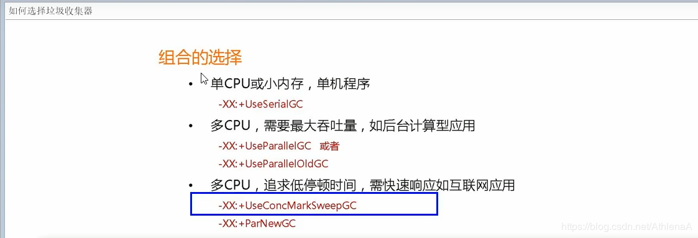
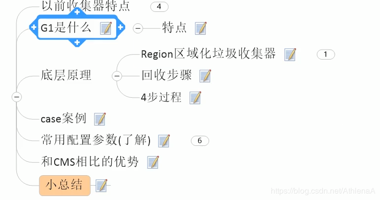

 ##  JVM 的主要组成部分及其作用

  

- 类加载器（ClassLoader）
- 运行时数据区（Runtime Data Area）
- 执行引擎（Execution Engine）
- 本地库接口（Native Interface）

组件的作用： 

首先通过类加载器（ClassLoader）会加载类文件到内存，Class loader只管加载，只要符合文件结构就加载。

运行时数据区（Runtime Data Area)是jvm的重点，我们所有所写的程序都被加载到这里，之后才开始运行。

而字节码文件只是 JVM 的一套指令集规范，并不能直接交个底层操作系统去执行，因此需要特定的命令解析器执行引擎（Execution Engine），将字节码翻译成底层系统指令，再交由 CPU 去执行，而这个过程中需要调用其他语言的本地库接口（Native Interface）来融合不同的语言为java所用,从而实现整个程序的功能。

## 关于类加载器

### JVM预定义的三种类型类加载器：

- **启动（Bootstrap）类加载器**：是用本地代码实现的类装入器，它负责将 <Java_Runtime_Home>/lib下面的类库加载到内存中（比如rt.jar）。由于引导类加载器涉及到虚拟机本地实现细节，开发者无法直接获取到启动类加载器的引用，所以不允许直接通过引用进行操作。
- **标准扩展（Extension）类加载器**：是由 Sun 的 ExtClassLoader（sun.misc.Launcher$ExtClassLoader）实现的。它负责将< Java_Runtime_Home >/lib/ext或者由系统变量 java.ext.dir指定位置中的类库加载到内存中。开发者可以直接使用标准扩展类加载器。
- **系统（System）类加载器**：是由 Sun 的 AppClassLoader（sun.misc.Launcher$AppClassLoader）实现的。它负责将系统类路径（CLASSPATH）中指定的类库加载到内存中。开发者可以直接使用系统类加载器。

除了以上列举的三种类加载器，还有一种比较特殊的类型 — 线程上下文类加载器。

###  什么是双亲委派模型？⭐ 

某个特定的类加载器在接到加载类的请求时，首先将加载任务委托给父类加载器，**依次递归**，如果父类加载器可以完成类加载任务，就成功返回；只有父类加载器无法完成此加载任务时，子类才会尝试去加载。

### 双亲委派机制的作用

1、防止重复加载同一个`.class`。通过委托去向上面问一问，加载过了，就不用再加载一遍。保证数据安全。
2、保证核心`.class`不能被篡改。通过委托方式，不会去篡改核心`.class`，不同的加载器加载同一个`.class`也不是同一个`Class`对象。这样保证了`Class`执行安全。

**委托机制的意义 — 防止内存中出现多份同样的字节码** 
 比如两个类A和类B都要加载System类：

- 如果不用委托而是自己加载自己的，那么类A就会加载一份System字节码，然后类B又会加载一份System字节码，**这样内存中就出现了两份System字节码。**
- 如果使用委托机制，会递归的向父类查找，也就是**首选用Bootstrap尝试加载**，如果找不到再向下。这里的System就能在Bootstrap中找到然后加载，如果此时类B也要加载System，也从Bootstrap开始，此时**Bootstrap发现已经加载过了System那么直接返回内存中的System即可而不需要重新加载**，这样内存中就只有一份System的字节码了。

### 沙箱安全机制

https://blog.csdn.net/qq_30336433/article/details/83268945

​	沙箱是一个限制程序运行的环境。

​	沙箱机制就是将 Java 代码限定在虚拟机(JVM)特定的运行范围中，并且严格限制代码对本地系统资源访问，通过这样的措施来保证对代码的有效隔离，防止对本地系统造成破坏。

​	沙箱**主要限制系统资源访问**，那系统资源包括什么？——`CPU、内存、文件系统、网络`。不同级别的沙箱对这些资源访问的限制也可以不一样。

  所有的Java程序运行都可以指定沙箱，可以定制安全策略。

##  JVM 运行时数据区⭐

**线程私有：**

- 程序计数器

  指向当前线程执行的字节码指令的地址（ 行号 ）。 这样做的**用处是多线程操作时， 挂起的线程在重新激活后能够知道上次执行的位置。**

- 虚拟机栈

  存储当前线程执行方法时所需要的数据，指令，返回地址。因此一个线程独享一块虚拟机栈 ，栈中内存的单位是栈帧。 每个栈帧中都拥有：局部变量表、操作数栈、动态链接、方法出口信息。

- 本地方法栈

  本地方法栈为虚拟机使用到的 Native 方法服务。 

**线程共有：有垃圾回收机制**

- 堆

  唯一目的就是存放对象实例，几乎所有的对象实例都在这里分配内存。 详见堆内存模型。

- 方法区

  用于存放已被加载的类信息、常量、静态变量、即时编译器编译后的代码等数据。方法区是一个 JVM 规范，永久代与元空间都是其一种实现方式。 

###  堆

堆内存模型：

 **此内存区域的唯一目的就是存放对象实例，几乎所有的对象实例以及数组都在这里分配内存。** 

### 堆和栈的区别

1. 栈内存存储的是局部变量而堆内存存储的是实体；
2. 栈内存的更新速度要快于堆内存，因为局部变量的生命周期很短；
3. 栈内存存放的变量生命周期一旦结束就会被释放，而堆内存存放的实体会被垃圾回收机制不定时的回收。、

### 分代回收

HotSpot JVM把年轻代分为了三部分：1个Eden区和2个Survivor区（分别叫from和to）。一般情况下，新创建的对象都会被分配到Eden区(一些大对象特殊处理),这些对象经过第一次Minor GC后，如果仍然存活，将会被移到Survivor区。对象在Survivor区中每熬过一次Minor GC，年龄就会增加1岁，当它的年龄增加到一定程度时，就会被移动到年老代中。

因为年轻代中的对象基本都是朝生夕死的，所以在年轻代的垃圾回收算法使用的是复制算法，复制算法的基本思想就是将内存分为两块，每次只用其中一块，当这一块内存用完，就将还活着的对象复制到另外一块上面。复制算法不会产生内存碎片。

在GC开始的时候，对象只会存在于Eden区和名为“From”的Survivor区，Survivor区“To”是空的。紧接着进行GC，Eden区中所有存活的对象都会被复制到“To”，而在“From”区中，仍存活的对象会根据他们的年龄值来决定去向。年龄达到一定值(年龄阈值，可以通过-XX:MaxTenuringThreshold来设置)的对象会被移动到年老代中，没有达到阈值的对象会被复制到“To”区域。经过这次GC后，Eden区和From区已经被清空。这个时候，“From”和“To”会交换他们的角色，也就是新的“To”就是上次GC前的“From”，新的“From”就是上次GC前的“To”。不管怎样，都会保证名为To的Survivor区域是空的。Minor GC会一直重复这样的过程，直到“To”区被填满，“To”区被填满之后，会将所有对象移动到年老代中。

## 对象的创建过程？

#### Step1:类加载检查

虚拟机遇到一条 new 指令时，首先将去检查这个指令的参数是否能在常量池中定位到这个类的符号引用，并且检查这个符号引用代表的类是否已被加载过、解析和初始化过。如果没有，那必须先执行相应的**类加载过程**。

#### Step2:分配内存

在**类加载检查**通过后，接下来虚拟机将为新生对象**分配内存**。对象所需的内存大小在类加载完成后便可确定，为对象分配空间的任务等同于把一块确定大小的内存从 Java 堆中划分出来。**分配方式**有 **“指针碰撞”** 和 **“空闲列表”** 两种。

#### Step3:初始化零值

内存分配完成后，虚拟机需要将分配到的内存空间都初始化为零值（不包括对象头），这一步操作保证了对象的实例字段在 Java 代码中可以不赋初始值就直接使用，程序能访问到这些字段的数据类型所对应的零值。

#### Step4:设置对象头

初始化零值完成之后，**虚拟机要对对象进行必要的设置**，例如这个对象是哪个类的实例、如何才能找到类的元数据信息、对象的哈希码、对象的 GC 分代年龄等信息。 **这些信息存放在对象头中。**

#### Step5:执行 init 方法

在上面工作都完成之后，从虚拟机的视角来看，一个新的对象已经产生了，但从 Java 程序的视角来看，对象创建才刚开始，方法还没有执行，所有的字段都还为零。所以一般来说，执行 new 指令之后会接着执行方法，把对象按照程序员的意愿进行初始化，这样一个真正可用的对象才算完全产生出来。

 ## 类加载的执行过程？

1. 加载：根据查找路径找到相应的 class 文件然后导入；
2. 检查：检查加载的 class 文件的正确性；
3. 准备：给类中的静态变量分配内存空间；
4. 解析：虚拟机将常量池中的符号引用替换成直接引用的过程。符号引用就理解为一个标示，而在直接引用直接指向内存中的地址；
5. 初始化：对静态变量和静态代码块执行初始化工作。

 ## 怎么判断对象是否可以被回收？

- 引用计数器：为每个对象创建一个引用计数，有对象引用时计数器 +1，引用被释放时计数 -1，当计数器为 0 时就可以被回收。它有一个缺点不能解决循环引用的问题；
- 可达性分析：从 GC Roots 开始向下搜索，搜索所走过的路径称为引用链。当一个对象到 GC Roots 没有任何引用链相连时，则证明此对象是可以被回收的。

## 常见的垃圾回收机制⭐

1. 引用计数法：引用计数法是一种简单但速度很慢的垃圾回收技术。jvm一般不采用。

   每个对象都含有一个引用计数器,当有引用连接至对象时,引用计数加1。

   当引用离开作用域或被置为null时,引用计数减1。

   缺点：

   - 每次对对象赋值时均要维护引用计数器，且计数器本身也有一定的消耗。

   - 较难处理循环引用

2. 可达性分析算法：这个算法的基本思路就是通过一系列的称为“GC Roots”的对象作为起始点，从这些节点开始向下搜索，搜索所走过的路径称为引用链，当一个对象到GC Roots没有任何引用链相连（用图论的话来说，就是从GC Roots到这个对象不可达）时，则证明此对象是不可用的。

 ##  jvm 有哪些垃圾回收算法⭐

### 停止-复制：

复制->清空->互换

- 先暂停程序的运行,然后将所有存活的对象从当前堆复制到另一个堆,没有被复制的对象全部都是垃圾。当对象被复制到新堆时,它们是一个挨着一个的,所以新堆保持紧凑排列,然后就可以按前述方法简单,直接的分配了。
- 缺点是
  - 一浪费空间、耗时，两个堆之间要来回倒腾,
  - 二是当程序进入稳定态时,可能只会产生极少的垃圾,甚至不产生垃圾,尽管如此,复制式回收器仍会将所有内存自一处复制到另一处。

### 标记-清除：

- 同样是从堆栈和静态存储区出发,遍历所有的引用,进而找出所有存活的对象。每当它找到一个存活的对象,就会给对象一个标记,这个过程中不会回收任何对象。只有全部标记工作完成的时候,清理动作才会开始。在清理过程中,没有标记的对象会被释放,不会发生任何复制动作。
- 产生内存碎片
- 但是剩下的堆空间是不连续的,垃圾回收器如果要希望得到连续空间的话,就得重新整理剩下的对象。

### 标记-整理：

- 它的第一个阶段与标记/清除算法是一模一样的，均是遍历GC Roots，然后将存活的对象标记。
- 移动所有存活的对象，且按照内存地址次序依次排列，然后将末端内存地址以后的内存全部回收。因此，第二阶段才称为整理阶段。
- 没有内存碎片，但是移动对象需要成本。

### 分代收集算法【重点】：

- 把Java堆分为新生代和老年代，然后根据各个年代的特点采用最合适的收集算法。
- 新生代中，对象的存活率比较低，所以选用复制算法，
- 老年代中对象存活率高且没有额外空间对它进行分配担保，所以使用“标记-清除”或“标记-整理”算法进行回收。

## 如何判断一个对象是否可以被回收？

1、引用计数法（不能处理循环引用的问题，一般不用此方法）

2、枚举根节点做**可达性分析**（根搜索路径）：从GC ROOT开始

### 哪些对象可以作为GC Roots

1. 虚拟机栈（栈帧中的局部变量表）中引用的对象。
2. 方法区中类静态属性引用的对象。
3. 方法区中常量引用的对象。
4. 本地方法栈中JNI（即一般说的Native方法）引用的对象。

### Minor GC和Full GC触发条件⭐

- Minor GC触发条件：当Eden区满时，触发Minor GC。
- Full GC触发条件：
  1. 调用System.gc时，系统建议执行Full GC，但是不必然执行
  2. 老年代空间不足
  3. 方法区空间不足
  4. 通过Minor GC后进入老年代的平均大小大于老年代的可用内存
  5. 由Eden区、From Space区向To Space区复制时，对象大小大于To Space可用内存，则把该对象转存到老年代，且老年代的可用内存小于该对象大小

### GC中Stop the world（STW）⭐

在执行垃圾收集算法时，Java应用程序的其他所有除了垃圾收集收集器线程之外的线程都被挂起。此时，系统只能允许GC线程进行运行，其他线程则会全部暂停，等待GC线程执行完毕后才能再次运行。这些工作都是由虚拟机在后台自动发起和自动完成的，是在用户不可见的情况下把用户正常工作的线程全部停下来，这对于很多的应用程序，尤其是那些对于实时性要求很高的程序来说是难以接受的。

但不是说GC必须STW,你也可以选择降低运行速度但是可以并发执行的收集算法，这取决于你的业务。

 ## jvm 有哪些垃圾回收器？

- Serial：最早的单线程串行垃圾回收器。

- Serial Old：Serial 垃圾回收器的老年版本，同样也是单线程的，可以作为 CMS 垃圾回收器的备选预案。

- ParNew：是 Serial 的多线程版本。

- Parallel 和 ParNew 收集器类似是多线程的，但 Parallel 是吞吐量优先的收集器，可以牺牲等待时间换取系统的吞吐量。

- Parallel Old 是 Parallel 老生代版本，Parallel 使用的是复制的内存回收算法，Parallel Old 使用的是标记-整理的内存回收算法。

- CMS：一种以获得最短停顿时间为目标的收集器，非常适用 B/S 系统。

- G1：一种兼顾吞吐量和停顿时间的 GC 实现，是 JDK 9 以后的默认 GC 选项。

## GC算法与垃圾收集器

GC算法（引用计数、复制、标记清除、标记整理）是内存回收的方法论，垃圾收集器是算法落地实现。

目前为止还没有完美的收集器出现，更加没有万能的收集器，只有针对具体应用选择合适的收集器。

- 四种垃圾收集思想：引用计数、复制、标记清除、标记整理
- 四种垃圾收集器：串行、并行、并发、G1

### 四种垃圾收集器

#### Serial串行垃圾收集器

它为单线程环境设计且只使用一个线程进行垃圾回收，会暂停所有的用户线程，所以不适合服务器环境。

#### Parallel并行垃圾收集器

多个垃圾收集线程并行工作，此时用户线程是暂停的，适用于科学计算/大数据处理首台处理等弱交互场景。

#### CMS(Concurrent Mark Sweep)并发垃圾收集器（互联网公司常用）

用户线程和垃圾收集线程同时执行（不一定是并行，可能交替执行），不需要停顿用户线程。

互联网公司多用它，适用于对响应时间有要求的场景。

#### GI（garbge first）

G1垃圾回收器将内存分割成不同的区域，然后并发的对其进行垃圾回收。

四大垃圾收集思想：复制、标记清除、标记整理、

### 新生代垃圾回收器和老生代垃圾回收器都有哪些？有什么区别？

- 新生代回收器：Serial Copying（串行）、ParNew（新生区适用的，并行）、Parallel Scavenge（并行）

- 老年代回收器：Serial Old、Parallel Old、CMS

- 整堆回收器：G1

新生代垃圾回收器一般采用的是复制算法，复制算法的优点是效率高，缺点是内存利用率低；

老年代回收器一般采用的是标记-整理的算法进行垃圾回收。

### 如何查看默认的垃圾收集器

-XX:+printCommandLineFlags -version

jinfo -flags UseSerialGC <进程号>：查看这个进行有没有用到串行垃圾收集器

### Java的GC类型有哪些？

1. UseSerialGC
2. UseSerialOldGC（废弃）
3. **UseParallelGC(默认)**
4. UseConcMarkSweepGC
5. UseParNewGC
6. UseParallelOldGC
7. UseG1GC

## GC之Serial收集器

## GC之Parallel收集器

## GC之ParallelOld收集器

java8的默认垃圾收集器是：新生代并行回收！

并行新生代

并行老年代

## GC之CMS收集器

标记清除：节约空间、有内存碎片

老年代CMS

新生代并行Parallel

1,3停 2,4不用停

## GC之SerialOld收集器

## GC之如何选择垃圾收集器

## GC之G1收集器

## GC之G1底层原理

## G1与CMS的比较

 ## 详细介绍一下 CMS 垃圾回收器⭐

CMS 是英文 Concurrent Mark-Sweep 的简称，是以牺牲吞吐量为代价来获得最短回收停顿时间的垃圾回收器。对于要求服务器响应速度的应用上，这种垃圾回收器非常适合。在启动 JVM 的参数加上“-XX:+UseConcMarkSweepGC”来指定使用 CMS 垃圾回收器。

CMS 使用的是标记-清除的算法实现的，所以在 gc 的时候回产生大量的内存碎片，当剩余内存不能满足程序运行要求时，系统将会出现 Concurrent Mode Failure，临时 CMS 会采用 Serial Old 回收器进行垃圾清除，此时的性能将会被降低。

### G1和CMS的比较

1. CMS收集器是获取**最短回收停顿时间**为目标的收集器，因为CMS工作时，GC工作线程与用户线程可以并发执行，以此来达到降低手机停顿时间的目的（只有初始标记和重新标记会STW）。但是CMS收集器对CPU资源非常敏感。在并发阶段，虽然不会导致用户线程停顿，但是会占用CPU资源而导致引用程序变慢，总吞吐量下降。
2. **CMS仅作用于老年代，是基于标记-清除算法，所以清理的过程中会有大量的空间碎片。**
3. CMS收集器无法处理浮动垃圾，由于CMS并发清理阶段用户线程还在运行，伴随程序的运行自热会有新的垃圾不断产生，这一部分垃圾出现在标记过程之后，CMS无法在本次收集中处理它们，只好留待下一次GC时将其清理掉。
4. G1是一款面向服务端应用的垃圾收集器，适用于多核处理器、大内存容量的服务端系统。G1能充分利用CPU、多核环境下的硬件优势，使用多个CPU（CPU或者CPU核心）来缩短STW的停顿时间，它满足短时间停顿的同时达到一个高的吞吐量。
5. **从JDK 9开始，G1成为默认的垃圾回收器。**当应用有以下任何一种特性时非常适合用G1：Full GC持续时间太长或者太频繁；对象的创建速率和存活率变动很大；应用不希望停顿时间长(长于0.5s甚至1s)。
6. G1将空间划分成很多块（Region），然后他们各自进行回收。堆比较大的时候可以采用，采用复制算法，碎片化问题不严重。**整体上看属于标记-整理算法，局部(region之间)属于复制算法。**
7. G1 需要记忆集 (具体来说是卡表)来记录新生代和老年代之间的引用关系，这种数据结构在 G1 中需要占用大量的内存，可能达到整个堆内存容量的 20% 甚至更多。而且 G1 中维护记忆集的成本较高，带来了更高的执行负载，影响效率。所以 CMS 在小内存应用上的表现要优于 G1，而大内存应用上 G1 更有优势，大小内存的界限是6GB到8GB。

### i++操作的字节码指令⭐？？？

1. 将int类型常量加载到操作数栈顶
2. 将int类型数值从操作数栈顶取出，并存储到到局部变量表的第1个Slot中
3. 将int类型变量从局部变量表的第1个Slot中取出，并放到操作数栈顶
4. 将局部变量表的第1个Slot中的int类型变量加1
5. 表示将int类型数值从操作数栈顶取出，并存储到到局部变量表的第1个Slot中，即i中

## 说一下 jvm 调优的工具

JDK 自带了很多监控工具，都位于 JDK 的 bin 目录下，其中最常用的是 jconsole 和 jvisualvm 这两款视图监控工具。

- jconsole：用于对 JVM 中的内存、线程和类等进行监控；
- jvisualvm：JDK 自带的全能分析工具，可以分析：内存快照、线程快照、程序死锁、监控内存的变化、gc 变化等。

### JVM参数类型有哪些？三种类型

1. 标配参数
   - -version
   - -help
   - java -showversion
2. X参数
   - -Xint：解释执行
   - -Xcomp：第一次使用就编译成本地代码
   - -Xmixed：混合模式（先javac编译，后java执行）
3. **XX参数**【重点】
   - boolean类型
     - 公式-XX:+/-某个属性值（+表示开启；-表示关闭）
     - case
       - jps -l：查看后台进程状态
       - jinfo -flag PrintGCDetails <进程号>：查看一个正在运行中的Java程序，是否开启某个参数（PrintGCDetails）
   - KV设值类型
     - 公式-XX:属性key=属性值value
     - case
       - -XX:MetaspaceSize=128m元数据空间大小
       - -XX:MaxTenuringThreshold=15多大的极限年龄可以申请成为老年代
         - jinfo -flag MetaspaceSize <GC进程号>

#### 常用的查询命令：

**jps -l （查看进程号）**

jinfo（查看指定进程、指定参数的值）

**jinfo -flags <进程号>：查看此进程默认的和设置的所有参数信息。**

jinfo -flags <具体参数> <进程号>：查看此进程指定的参数信息。

Java -XX:+PrintCommandLineFlags ：打印命令行参数

java -XX:+PrintFlagsInitial：查看JVM默认家底；

java -XX:+PrintFlagsFinal：查看修改后的

Java -XX:+PrintFlagsFinal -XX:MetaspaceSize=512m -Xss128k <要运行的Java类名>：使用自定义的参数运行Java代码

​			“=”表示初始值；“:=”表示人为改过，与初始值不同。

#### 常见的-XX参数：

1. -Xms2g：初始化堆大小为 2g；等价于-XX:InitialHeapSize
2. -Xmx2g：堆最大内存为 2g；等价于-XX:MaxHeapSize
3. -XX:NewRatio=4：设置年轻的和老年代的内存比例为 1:4；
4. -XX:SurvivorRatio=8：设置新生代 Eden 和 Survivor 比例为 8:2；
5. –XX:+UseParNewGC：指定使用 ParNew + Serial Old 垃圾回收器组合；
6. -XX:+UseParallelOldGC：指定使用 ParNew + ParNew Old 垃圾回收器组合；
7. -XX:+UseConcMarkSweepGC：指定使用 CMS + Serial Old 垃圾回收器组合；
8. -XX:+PrintGC：开启打印 gc 信息；
9. -XX:+PrintGCDetails：打印 gc 详细信息。

### 常用的jvm常用基本配置参数有哪些？

1. -Xms

   初始内存大小，默认为物理内存的1/64

   等价于-XX:InitialHeapSize

2. -Xmx

   最大分配内存，默认为物理内存的1/4

   等价于-XX：MaxHeapSize

3. -Xss

   (设置单个线程栈的大小)  栈空间的初始默认大小，一般默认为512k ~ 1024k

   等价于-XX:ThreadStackSize

4. -Xmn

   设置年轻代大小

5. -XX:MetaspaceSize

   设置元空间大小：元空间(java8)的本质和永久代(java7)类似，都是对JVM规范中方法区的实现。

   不过元空间与永久代之间最大的区别在于：元空间并不在虚拟机中，而是使用本地内存。

   因此，默认情况下，元空间的大小仅受本地内存限制。

#### 典型设置案例：

-Xms10m

-Xmx10m

-XXMetaspaceSize=1024m

-XX:+PrintFlagsFinal

-XX:+PrintCommandLineFlags

-XX:+PrintGCDetails

-XX:UseSerialGC

### 对PrintGCDetails参数的深度解析

尚硅谷周阳面试题视频P68，没听懂。

#### -XX:+PrintGCDetails

#### -XX:SurvivorRatio

#### -XX:NewRatio

#### -XX:MaxTenuringThreshold

#### -Xms与-Xmx配成一样

 ## Java 中都有哪些引用类型？

引用在栈里面

实例对象在堆里面

### 强引用

### 软引用

### 弱引用

redis缓存大量使用了软引用。

你知道弱引用的话，能谈一谈weakHashmap吗？

普通的HashMap的key=null，gc后不会被回收；weakHashmap中的key置null后，gc后会被回收。

### 虚引用/引用队列

### **GCRoots和四大引用小总结**

## Out Of Memory

### OOM之GC Java StackOverflowError

栈的方法调用深度太深了，出不来

### OOM之GC Java heap space

申请堆内存太多

### OOM之GC overhead limit exceeded

GC时间过长，超过了最大的极限（超过98%的时间用来做GC，且回收了不到2%的内存）

### OOM之Direct buffer memory

Netty技术

### OOM之unable to create new native thread

不能够创建新的线程了

### OOM之Metaspace

元空间

方法区

放一些类的模板

20多M

### JVM锁优化和膨胀过程⭐

1. 自旋锁：自旋锁其实就是在拿锁时发现已经有线程拿了锁，自己如果去拿会阻塞自己，这个时候会选择进行一次忙循环尝试。也就是不停循环看是否能等到上个线程自己释放锁。自适应自旋锁指的是例如第一次设置最多自旋10次，结果在自旋的过程中成功获得了锁，那么下一次就可以设置成最多自旋20次。
2. 锁粗化：虚拟机通过适当扩大加锁的范围以避免频繁的拿锁释放锁的过程。
3. 锁消除：通过逃逸分析发现其实根本就没有别的线程产生竞争的可能（别的线程没有临界量的引用），或者同步块内进行的是原子操作，而“自作多情”地给自己加上了锁。有可能虚拟机会直接去掉这个锁。
4. 偏向锁：在大多数的情况下，锁不仅不存在多线程的竞争，而且总是由同一个线程获得。因此为了让线程获得锁的代价更低引入了偏向锁的概念。偏向锁的意思是如果一个线程获得了一个偏向锁，如果在接下来的一段时间中没有其他线程来竞争锁，那么持有偏向锁的线程再次进入或者退出同一个同步代码块，不需要再次进行抢占锁和释放锁的操作。
5. 轻量级锁：当存在超过一个线程在竞争同一个同步代码块时，会发生偏向锁的撤销。当前线程会尝试使用CAS来获取锁，当自旋超过指定次数(可以自定义)时仍然无法获得锁，此时锁会膨胀升级为重量级锁。
6. 重量级锁：重量级锁依赖对象内部的monitor锁来实现，而monitor又依赖操作系统的MutexLock（互斥锁）。当系统检查到是重量级锁之后，会把等待想要获取锁的线程阻塞，被阻塞的线程不会消耗CPU，但是阻塞或者唤醒一个线程，都需要通过操作系统来实现。

## TODO：

- CMS GC回收分为哪几个阶段？分别做了什么事情？

- CMS有哪些重要参数？

- Concurrent Model Failure和ParNew promotion failed什么情况下会发生？

- CMS的优缺点？

- 有做过哪些GC调优？

- 为什么要划分成年轻代和老年代？

- 年轻代为什么被划分成eden、survivor区域？

- 年轻代为什么采用的是复制算法？

- 老年代为什么采用的是标记清除、标记整理算法

- 什么情况下使用堆外内存？要注意些什么？

- 堆外内存如何被回收？

  

- 为什么使用复制算法？好处

- 为什么要有servival区？减少GC次数

- 对象的最大分代年龄？15

  因为对象头的这一字节。

  s什么是fullGC、mirrorGC

# 其他

### Java虚拟机的内存结构

程序计数器、Java堆、Java虚拟机栈、本地方法栈、方法区

**JVM内存为什么要分成新生代，老年代，持久代**

### **垃圾收集算法**

GC最基础的算法有三种： 

- 标记 -清除算法、
- 复制算法、
- 标记-整理算法，
- 我们常用的垃圾回收器一般都采用**分代收集算法**。

### 你知道哪些JVM性能调优

- 设定堆内存大小

-Xmx：堆内存最大限制。

- 设定新生代大小。 新生代不宜太小，否则会有大量对象涌入老年代

-XX:NewSize：新生代大小

-XX:NewRatio 新生代和老生代占比

-XX:SurvivorRatio：伊甸园空间和幸存者空间的占比

- 设定垃圾回收器 年轻代用 -XX:+UseParNewGC 年老代用-XX:+UseConcMarkSweepGC

### **垃圾回收器**

- Serial收集器，串行收集器是最古老，最稳定以及效率高的收集器，可能会产生较长的停顿，只使用一个线程去回收。
- ParNew收集器，ParNew收集器其实就是Serial收集器的多线程版本。
- Parallel收集器，Parallel Scavenge收集器类似ParNew收集器，Parallel收集器更关注系统的吞吐量。
- Parallel Old 收集器，Parallel Old是Parallel Scavenge收集器的老年代版本，使用多线程和“标记－整理”算法
- CMS收集器，CMS（Concurrent Mark Sweep）收集器是一种以获取最短回收停顿时间为目标的收集器。
- G1收集器，G1 (Garbage-First)是一款面向服务器的垃圾收集器,主要针对配备多颗处理器及大容量内存的机器. 以极高概率满足GC停顿时间要求的同时,还具备高吞吐量性能特征

### 队列和栈的区别与怎么实现？

**栈可以用数组实现，**

定义一个数组和一个变量，这个变量保存栈顶的位置。

**栈也可以用链表实现，**

用一个节点表示栈顶元素，整数N记录栈大小。入栈时新节点的下一个节点引用指向原来的栈顶节点，出栈时栈顶元素指向原来栈顶元素的下一个节点。

**队列可以使用数组实现**

与实现栈不同，它需要两个指针，一个指向队头（front），一个指向队尾（rear），这样才能方便地进行入队或出队操作

先是1分钟自我介绍，然后问了两个技术类的问题：

#### 堆和栈的区别

对于c语言来说

- 栈区（stack）—由编译器自动分配释放，存放函数的参数值，局部变量的回值等
- 堆区（heap）—一般由答程序员分配释放，若程序员不释放，程序结束时可能由OS回收
- 总而言之：：栈由系统自动分配，而堆由程序代码控制。

对于Java来说

- 栈内存存的是局部变量
- 堆内存存的是对象，凡是new出来的对象都是放在堆内存的，堆内存有垃圾回收机制。