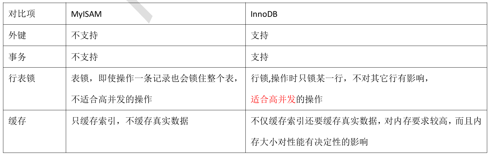
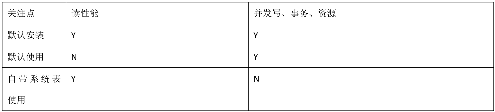
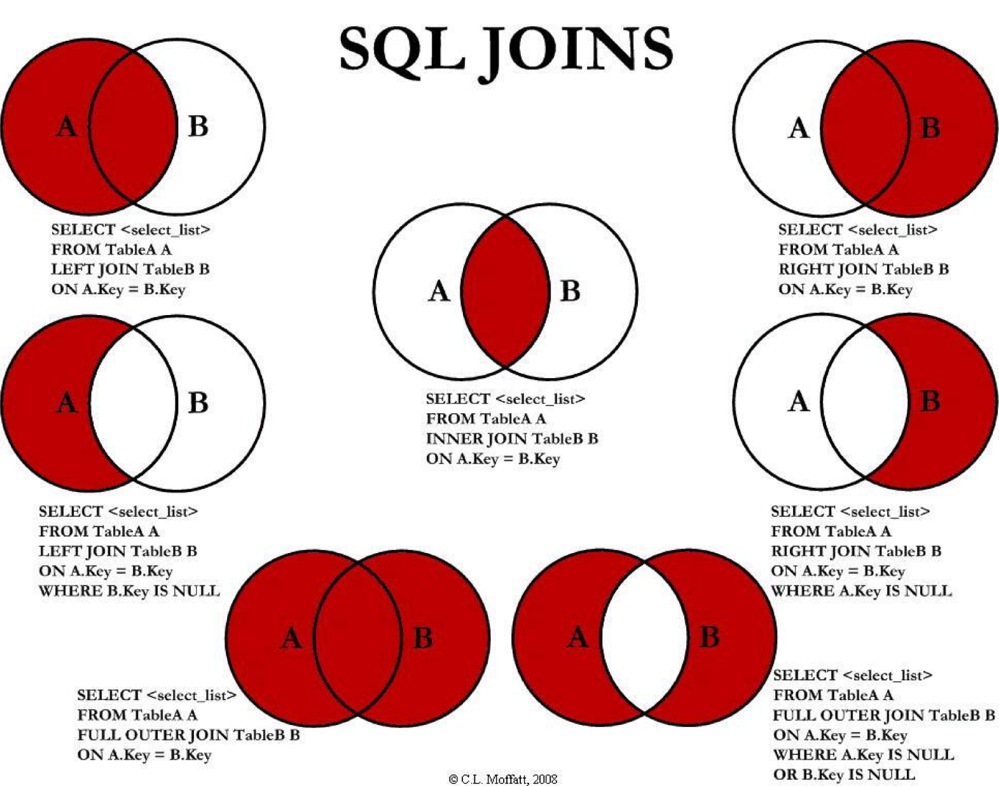
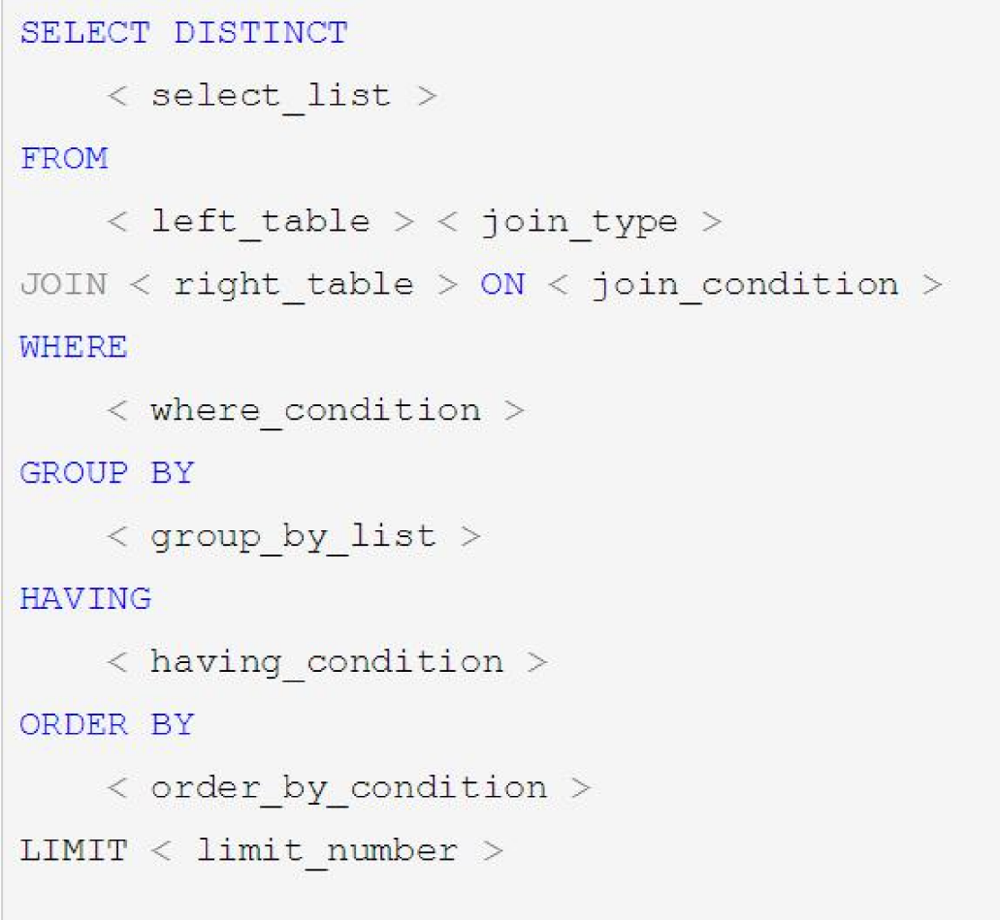
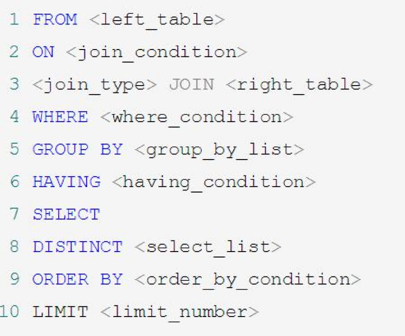
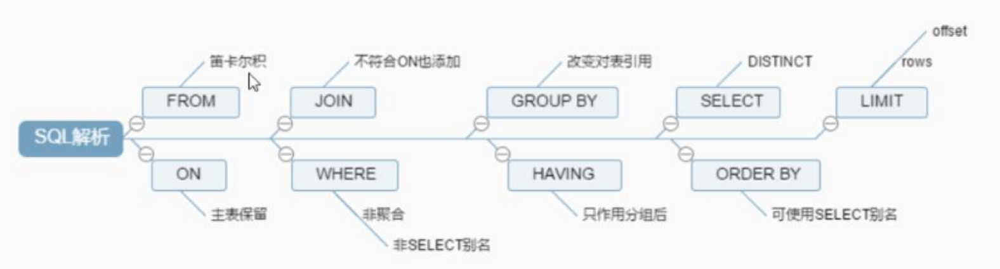
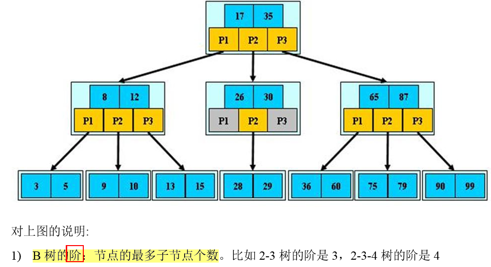
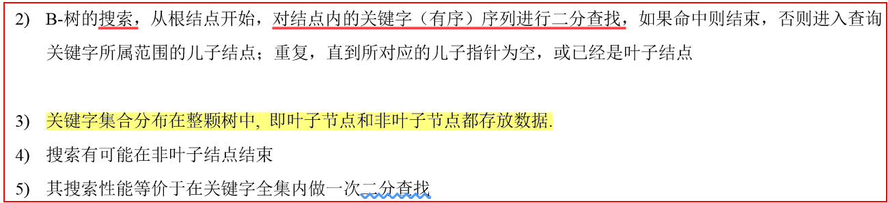

## 三份复习资料

1、尚硅谷周阳视频+PDF笔记：D:\Personal\Study\zk\5、MySQL：MySQL视频资料-尚硅谷周阳

2、数据库面试题--鲁班学院周瑜的视频+PDF笔记：D:\Personal\Study\zk\5、MySQL：数据库面试题--鲁班学院

3、此文档的两个.md文档

# Java数据库

### **有哪些锁**

公平锁、非公平锁、可重入锁、

### **复习**

锁的目的是为了维护数据库的一致性。当多个用户同时访问数据库时，就会出现数据不一致的问题。

# 一、锁

### **1、表锁、行锁（间隙锁：用于可重读级别，防止幻读）**

#### **概念**

**1、表锁**

即使操作一条数据也会锁住整张表，不适合高并发的操作。MyISAM存储引擎就是使用的表锁。

**2、行锁**

操作时只锁某一行，不会对其他行有影响，适合高并发的操作。InnoDB就是使用的行锁。Innodb也支持表锁。

- LOCK_REC_NOT_GAP：单个行记录上的锁。 
- LOCK_GAP：间隙锁，锁定一个范围，但不包括记录本身。GAP锁的目的，是为了防止同一事务 的两次当前读，出现幻读的情况。 
- LOCK_ORDINARY：锁定一个范围，并且锁定记录本身。对于行的查询，都是采用该方法，主要 目的是解决幻读的问题。

#### **优缺点**

1、表级锁：

锁定粒度大，发生锁冲突的概率最高，并发度最低。

但是，加锁快，开销小；不会出现死锁。

2、行级锁：

锁定粒度最小，发生锁冲突的概率最低，并发度也最高。

但是，加锁慢，开销大；会出现死锁；

3、页面锁：

锁定粒度界于表锁和行锁之间，并发度一般。会出现死锁。

开销和加锁时间界于表锁和行锁之间；

## 2、读锁、写锁

- 读锁：共享锁、Shared Locks、S锁。 
- 写锁：排他锁、Exclusive Locks、X锁。 
- select :不加锁

### （1）读锁

对于普通 SELECT 语句，InnoDB 不会加任何锁

```
select ... lock in share mode
```

将查找到的数据加上一个S锁，允许其他事务继续获取这些记录的S锁，不能获取这些记录的X锁（会阻塞）

使用场景：读出数据后，其他事务不能修改，但是自己也不一定能修改，因为其他事务也可以使用select ... lock in share mode 继续加读锁。

### （2）写锁

select ... for update

将查找到的数据加上一个X锁，不允许其他事务获取这些记录的S锁和X锁。

使用场景：读出数据后，其他事务即不能写，也不能加读锁，那么就导致只有自己可以修改数据。

## 3、意向锁

- IS锁：意向共享锁、Intention Shared Lock。当事务准备在某条记录上加S锁时，需要先在表级别 加一个IS锁。 
- IX锁，意向排他锁、Intention Exclusive Lock。当事务准备在某条记录上加X锁时，需要先在表级 别加一个IX锁。

IS、IX锁是表级锁，它们的提出仅仅**为了在之后加表级别的S锁和X锁时可以快速判断表中的记录是否被上锁，以 避免用遍历的方式来查看表中有没有上锁的记录**。

#### 锁的优化策略

1. 读写分离

1. 分段加锁

1. 减少锁持有的时间

1. 多个线程尽量以相同的顺序去获取资源

 不能将锁的粒度过于细化，不然可能会出现线程的加锁和释放次数过多，反而效率不如一次加一把大锁。

### **什么是索引**

**索引是排好序的快速查找数据结构。** 在数据之外，数据库系统还维护着满足特定查找算法的数据结构，这些数据结构以某种方式引用（指向）数据， 这样就可以在这些数据结构上实现高级查找算法。这种数据结构，就是索引。

### **什么是事务：**

事务是由一组SQL语句组成的逻辑处理单元。

#### **事务的ACID是指什么？**

A：Atomicity原子性

C：Consistent一致性

I：Isolation隔离性

D：Durable持久性

#### **并发事务带来的问题**

1. 更新丢失：

​		当两个或多个事务选择同一行，然后基于最初选定的值更新该行时，由于每个事务都不知道其他事务的存在，就会发生丢失更新问题。最后的更新覆盖了由其他事务所做的更新。

​		如何避免：一个事务在完成修改/提交数据之前，另一个事务不能访问同一文件，则可避免此问题。

1. 脏读：

​		事务A读到了事务B**已修改但尚未提交**的数据，还在这个数据基础上做了操作。此时。如果事务B回滚，A读取的数据无效，不符合一致性要求。

1. 不可重复读：【MySQL默认的隔离级别】

​		一个事务在读取某些数据后的某个时间，再次读取以前读过的数据，却发现其读出的数据已经发生了改变、或某些记录已经被删除了。

​		即：事务A读到了事务B已经提交的修改数据，不符合隔离性。

1. 幻读：

​		一个事务按相同的查询条件重新读取以前检索过的数据，却发现其他事务插入了满足查询条件的新数据。

​		即：事务A读取到了事务B提交的新增数据，不符合隔离性。

- 脏读是读到了事务B里面修改的数据；
- 幻读是读到了事务B里面新增的数据；

#### **事务的隔离级别**

数据库必须具备4个特性ACID：原子性、一致性、隔离性、持久性

并发事务导致的4个问题：更新丢失、脏读、不可重读、幻读

**数据库提供的四种隔离级别：** **01：Read uncommitted(读未提交)：最低级别，任何情况都会发生。** **02：Read Committed(读已提交)：可避免脏读的发生。** **03：Repeatable read(可重复读)：可避免脏读、不可重复读的发生。** **04：Serializable(串行化)：避免脏读、不可重复读，幻读的发生。**

#### **注意事项：**

1. 无索引，行锁变表锁；尤其是var类型要加单引号。
2. 间隙锁：间隙锁（Gap Lock）是Innodb在


提交下为了解决幻读问题时引入的锁机制。当我们用范围条件而不是相等条件检索数据，并请求共享或排他锁时，InnoDB会给符合条件的已有数据记录的索引项加锁；对于键值在条件范围内但并不存在的记录，叫做“间隙”。

1. 间隙锁的危害：因为Query执行过程中通过范围查找的话，他会锁定整个范围内的所有索引键值，即使这个键值并不存在。而造成在锁定的时候，无法插入锁定键值范围内任何数据，在某些场景下可能会影响性能。
2. 如何锁定一行：

begin;

select * from table_name where a=8 for update;

锁定某一行后，其他操作会被阻塞，直到锁定行的会话提交commit

commit;


# 二、数据库设计优化

## 1、char 和 varchar 

**char(n) ：固定长度类型**，比如订阅 char(10)，当你输入 "abc" 三个字符的时候，它们占的空间还是 10 个字节，其他 7 个是空字节（使用空格补齐）。

- 优点：查询存取的效率高;
- 缺点：占用空间；
- 适用场景：存储密码的 md5 值，固定长度的，使用 char 非常合适。

**varchar(n) ：可变长度**，存储的值是每个值占用的字节再加上一个用来记录其长度的字节的长度。

- 使用场景：UTF-8这种复杂的字符集。

- 空间上考虑 varcahr 比较合适；
- 从效率上考虑 char 比较合适，二者使用需要权衡。

## 浮点数

 FLOAT 和 DOUBLE 为浮点类型，DECIMAL 为高精度小数类型。CPU 原生支持浮点运算，但是不支持 DECIMAl 类型的计算，因此 DECIMAL 的计算比浮点类型需要更高的代价。 金额数据在程序中选用 BigDecimal 类，数据库中 DECIMAL 

## 时间和日期

MySQL 提供了两种相似的日期时间类型：DATETIME 和 TIMESTAMP。

### 1. DATETIME

能够保存从 1000 年到 9999 年的日期和时间，精度为秒，使用 8 字节的存储空间。

它与时区无关。

默认情况下，MySQL 以一种可排序的、无歧义的格式显示 DATETIME 值，例如“2008-01-16 22:37:08”，这是 ANSI 标准定义的日期和时间表示方法。

### 2. TIMESTAMP

和 UNIX 时间戳相同，保存从 1970 年 1 月 1 日午夜（格林威治时间）以来的秒数，使用 4 个字节，只能表示从 1970 年到 2038 年。

它和时区有关，也就是说一个时间戳在不同的时区所代表的具体时间是不同的。

MySQL 提供了 FROM_UNIXTIME() 函数把 UNIX 时间戳转换为日期，并提供了 UNIX_TIMESTAMP() 函数把日期转换为 UNIX 时间戳。

默认情况下，如果插入时没有指定 TIMESTAMP 列的值，会将这个值设置为当前时间。

应该尽量使用 TIMESTAMP，因为它比 DATETIME 空间效率更高。


## 数据库的三范式

- 第一范式：强调的是列的原子性，即数据库表的每一列都是不可分割的原子数据项。
- 第二范式：要求实体的属性完全依赖于主关键字。所谓完全依赖是指不能存在仅依赖主关键字一部分的属性。
- 第三范式：任何非主属性不依赖于其它非主属性。

### 如何设计一个关系型数据库？

首先划分为两大部分，一个存储部分，类似文件系统将数据持久化到硬盘上， 另一个是程序实例部分，创建模块： 存储管理，缓存机制，SQL 解析，日志管理，权限划分，容灾机制 **，索引管理，锁模块 **。

# 三、索引

## 1、创建索引的语句

**（1）使用ALTER TABLE语句创建索引。**
 语法如下：

```
 alter table table_name add index index_name (column_list) ;普通索引
 alter table table_name add unique (column_list) ;唯一索引
 alter table table_name add primary key (column_list) ;主键索引
```

**（2）使用CREATE INDEX语句对表增加索引。**

 能够增加普通索引、UNIQUE索引两种。其格式如下：

```
create index index_name on table_name (column_list) ;
create unique index index_name on table_name (column_list) ;
```

 说明：table_name、index_name和column_list具有与ALTER TABLE语句中相同的含义，索引名不可选。另外，不能用CREATE INDEX语句创建PRIMARY KEY索引。

**（3）删除索引。**

 删除索引可以使用ALTER TABLE或DROP INDEX语句来实现。DROP INDEX可以在ALTER TABLE内部作为一条语句处理，其格式如下：

```
 drop index index_name on table_name ;
 alter table table_name drop index index_name ;
 alter table table_name drop primary key ;
```


## B 树和 B+ 树的概念和区别

1）B树的关键字和记录是放在一起的，叶子节点和非叶子节点都存放数据；

B + 树的非叶子节点不存放数据，只有关键字和指向下一个节点的索引，记录只放在叶子节点中。

2）在 B树中，越靠近根节点的记录查找时间越快，只要找到关键字即可确定记录的存在；而 B + 树中每个记录的查找时间基本是一样的，都需要从根节点走到叶子节点，而且在叶子节点中还要再比较关键字。从这个角度看 B树的性能好像要比 B + 树好，而**在实际应用中却是 B + 树的性能要好些**。

原因：

- 因为 **B + 树的非叶子节点没有指向实际数据的指针，若节点存储容量固定，这样B+树中的每个节点可容纳的元素个数比 B树多**，树高比 B树小，这样带来的好处是**减少磁盘访问次数**。尽管 B + 树找到一个记录所需的比较次数要比B树多，但是一次磁盘访问的时间相当于成百上千次内存比较的时间，因此实际中 B + 树的性能可能还会好些。
- **B + 树的叶子节点使用指针连接在一起，方便顺序遍历**（例如查看一个目录下的所有文件，一个表中的所有记录等）。
- **B + 树的查询效率更加稳定，每次查询的效率一样**。

**哈希索引**

对于哈希索引来说，底层的数据结构就是哈希表，因此在绝大多数需求为单条记录查询的时候，可以选择哈希索引，查询性能最快；其余大部分场景，建议选择BTree索引。

### 最左前缀法则

如果索引了多列，要遵守最左前缀法则。指的是查询一定要**从索引的最左前列开**始并且**不跳过索引中的列**。如果**查询中有某个列的范围查询，则其右边的所有列都无法使用索引。**
在创建索引的字段中第一个就是最左，每个左边的字段都是后面一个字段的一整个树，过滤条件要使用索引必须按照索引建立时的顺序，依次满足，一旦跳过某个字段，索引后面的字段都无法被使用。即要按照顺序命中索引。

## **为什么使用索引能提高效率**

1. 数据索引的存储是有序的
2. 在有序的情况下，通过索引查询一个数据是无需遍历索引记录的
3. 极端情况下，数据索引的查询效率为二分法查询效率，趋近于 log2(N)
4. 避免全表扫描

### 为什么要使用索引？

* 通过创建唯一性索引，可以保证数据库表中每一行数据的唯一性。
* 可以大大加快 数据的检索速度（大大减少的检索的数据量）,  这也是创建索引的最主要的原因。 
* 帮助服务器避免排序和临时表
* 将随机IO变为顺序IO

## 索引的优点

- 大大减少了服务器需要扫描的数据行数。
- 帮助服务器避免进行排序和分组，以及避免创建临时表（B+Tree 索引是有序的，可以用于 ORDER BY 和 GROUP BY 操作。临时表主要是在排序和分组过程中创建，不需要排序和分组，也就不需要创建临时表）。
- 将随机 I/O 变为顺序 I/O（B+Tree 索引是有序的，会将相邻的数据都存储在一起）。

## 什么情况下应不建或少建索引

* 非常小的表
* 非常大的表，建议使用分区技术
* 经常插入、删除、修改的表 
* 数据重复且分布平均的表字段 


## 索引优化

### 独立的列

在进行查询时，索引列不能是表达式的一部分，也不能是函数的参数，否则无法使用索引。

例如下面的查询不能使用 actor_id 列的索引：

```sql
SELECT actor_id FROM sakila.actor WHERE actor_id + 1 = 5;
```

### 多列索引

在需要使用多个列作为条件进行查询时，使用多列索引比使用多个单列索引性能更好。例如下面的语句中，最好把 actor_id 和 film_id 设置为多列索引。

```sql
SELECT film_id, actor_ id FROM sakila.film_actor
WHERE actor_id = 1 AND film_id = 1;
```

### 前缀索引

对于 BLOB、TEXT 和 VARCHAR 类型的列，必须使用前缀索引，只索引开始的部分字符。

前缀长度的选取需要根据索引选择性来确定。

###  多列索引

在需要使用多个列作为条件进行查询时，使用多列索引比使用多个单列索引性能更好。例如下面的语句中，最好把 actor_id 和 film_id 设置为多列索引。

```sql
SELECT film_id, actor_ id FROM sakila.film_actor
WHERE actor_id = 1 AND film_id = 1;
```

###  索引列的顺序

让选择性最强的索引列放在前面。

索引的选择性是指：不重复的索引值和记录总数的比值。最大值为 1，此时每个记录都有唯一的索引与其对应。选择性越高，每个记录的区分度越高，查询效率也越高。

### 聚簇索引

聚簇索引：将数据存储与索引放到了一块，找到索引也就找到了数据

非聚簇索引：将数据存储于索引分开结构，索引结构的叶子节点指向了数据的对应行

**聚簇索引具有唯一性**， 聚簇索引是将数据跟索引结构放到一块，因此一个表仅有一个聚簇索引 。

 **聚簇索引默认是主键**，如果表中没有定义主键，InnoDB 会选择一个**唯一的非空索引**代替。如果没有这样的索引，InnoDB 会**隐式定义一个主键**来作为聚簇索引。 

聚簇索引和非聚簇索引类似查字典时直接根据经验查字的大概位置和先去查偏旁部首再去翻页查询类似。

MyISAM没有聚簇索引，都是二级索引。

#### 优点

* 把相关数据保存在一起，减少了磁盘I/O。
* 数据访问更快。

### 覆盖索引

如果一个索引包含（或者说覆盖）所有需要查询的字段的值，我们就称
之为“覆盖索引”。我们知道在InnoDB存储引擎中，如果不是主键索引，叶子节点存储的是主键+列值。最终还是要“回表”，也就是要通过主键再查找一次。这样就会比较慢
覆盖索引就是把要查询出的列和索引是对应的，不做回表操作。


## 索引的使用经验

* 在经常需要搜索的列上，可以加快搜索的速度； 
* 在经常使用在WHERE子句中的列上面创建索引，加快条件的判断速度。 
* 在经常需要排序的列上创 建索引，因为索引已经排序，这样查询可以利用索引的排序，加快排序查询时间； 
* 对于中到大型表索引都是非常有效的，但是特大型表的话维护开销会很大，不适合建索引
* 在经常用在连接的列上，这些列主要是一些外键，可以加快连接的速度； 
* 避免 where 子句中对宇段施加函数，这会造成无法命中索引。
* 在使用InnoDB时使用与业务无关的自增主键作为主键，即使用逻辑主键，而不要使用业务主键。
* 将打算加索引的列设置为 NOT NULL ，否则将导致引擎放弃使用索引而进行全表扫描
* 删除长期未使用的索引，不用的索引的存在会造成不必要的性能损耗 
* 在使用 limit offset 查询缓慢时，可以借助索引来提高性能


## 性能分析

### Explain

#### id

如果没有子查询或者联合就只会显示1，如果有就按照顺序编号，对应其在 原始语句的位置。

#### type

type显示的是访问类型，是较为重要的一个指标，结果值从最好到最坏依次：
system > const > eq_ref > ref > fulltext > ref_or_null > index_merge > unique_subquery > index_subquery > range > index > ALL 

简易版：
system>const>eq_ref>ref>**range>index>AL**L
一般来说，得保证查询至少达到range级别，最好能达到ref。 

三个较差情况：
1.range：
只检索给定范围的行,使用一个索引来选择行。key 列显示使用了哪个索引
一般就是在你的where语句中出现了between、<、>、in等的查询
这种范围扫描索引扫描比全表扫描要好，因为它只需要开始于索引的某一点，而结束语另一点，不用扫描全部索引。和index的消耗差不多。

2.index：
依然是全表扫描，只不过是按照索引的次序而不是行，可以避免排序，出现index是sql使用了索引但是没用**通过索引进行过滤**，一般是使用了**覆盖索引**或者是**利用索引进行了排序分组** ，一般是where后面没有优化索引

3.all（最差）：
Full Table Scan，将遍历全表以找到匹配的行

#### key_len

表示索引中使用的字节数，可通过该列计算查询中使用的索引的长度。
key_len字段能够帮你检查是否充分的利用上了索引，越大越好

#### Extra

包含不适合在其他列中显示但十分重要的额外信息，主要用来检测
order by，group by或者关联查询是否使用了索引。
有以下几种情况：
1.Using filesort 2.Using temporary 3.using join buffer都是很差的是使用方式。要建立索引。
4.impossible where：不可能出现的情况，一般为 逻辑出现错误。
5.USING index：
利用索引进行了排序或分组，
表示相应的select操作中使用了覆盖索引(Covering Index)，避免访问了表的数据行，效率不错！
如果同时出现using where，表明索引被用来执行索引键值的查找;
如果没有同时出现using where，表明索引只是用来读取数据而非利用索引执行查找。

## 查询优化

**单表查询优化**
**常见索引失效：**
1 . 系统中经常出现的sql语句如下：
EXPLAIN SELECT SQL_NO_CACHE * FROM emp WHERE emp.age=30

EXPLAIN SELECT SQL_NO_CACHE * FROM emp WHERE emp.age=30 and deptid=4

EXPLAIN SELECT SQL_NO_CACHE * FROM emp WHERE emp.age=30 and deptid=4 AND emp.name = ‘abcd’

解决：
**where后筛选字段有多少就建立多少索引**

CREATE INDEX idx_age_deptid_name ON emp(age,deptid,NAME)

1.**最佳左前缀法则**

2.不在索引列上做任何操作（计算、函数、(自动or手动)类型转换），会导致索引失效而转向全表扫描,**在where后使用计算、函数、(自动or手动)类型转换都会使索引失效**

3.存储引擎不能使用索引中范围条件右边的列，即在建立索引时，范围查询要放到最后

4.mysql 在使用不等于(!= 或者<>)的时候无法使用索引会导致全表扫描

5.is not null 也无法使用索引,但是is null是可以使用索引的

6.like以通配符开头(’%abc…’)mysql索引失效会变成全表扫描的操作

7.字符串不加单引号索引失效，javabean类型和mysql字段的字符类型要一致，不然所以会失效。


**关联查询优化**

1、保证被驱动表的join字段已经被索引

2、**left join 时，选择小表作为驱动表，大表作为被驱动表。**

3、inner join 时，mysql会自己帮你把小结果集的表选为驱动表。

4、子查询尽量不要放在被驱动表，有可能使用不到索引。

5、能够直接多表关联的尽量直接关联，不用子查询。

子查询优化：

尽量不要使用not in 或者 not exists

用left outer join on xxx is null 替代

**排序分组优化**：

普通order by不能使用索引

**无过滤 不索引**，可加上过滤条件，使用索引

**顺序错，必排序**排序的顺序要对应

**方向反 必排序** desc asc要一样

ORDER BY子句，尽量使用Index方式排序,避免使用FileSort方式排序


group by 使用索引的原则几乎跟order by一致 ，唯一区别是groupby 即使没有过滤条件用到索引，也可以直接使用索引。

`最后使用索引的手段：覆盖索引 即不要使用select * `

# 四、Mysql架构

Mysql的架构可以在不同的场景中应用并发挥良好作用。主要体现在它的存储引擎架构上，**插件式的存储引擎架构**将**查询处理**和**其它的系统任务**以及**数据的存储提取**相分离。这种架构可以根据业务的需要选择合适的存储引擎。

## **1、架构**


MySQL基架大致包括如下几大模块组件：

### **（一）、连接层**

最上层是一些客户端和连接服务，包含本地sock 通信和大多数基于客户端/服务端工具实现的类似于tcp/ip 的 通信。主要完成一些类似于连接处理、授权认证、及相关的安全方案。在该层上引入了线程池的概念，为通过认证 安全接入的客户端提供线程。同样在该层上可以实现基于SSL 的安全链接。服务器也会为安全接入的每个客户端验 证它所具有的操作权限。

**（1）MySQL向外提供的交互接口（Connectors）**

​         Connectors组件，是MySQL向外提供的交互组件，如java,.net,php等语言可以通过该组件来操作SQL语句，实现与SQL的交互。

**（2）连接池组件(Connection Pool)**

​        负责监听对客户端向MySQL Server端的各种请求，接收请求，转发请求到目标模块。每个成功连接MySQL Server的客户请求都会被创建或分配一个线程，该线程负责客户端与MySQL Server端的通信，接收客户端发送的命令，传递服务端的结果信息等。

### **（二）、服务层**

**（3）管理服务组件和工具组件(Management Service & Utilities)**

​         系统管理和控制工具

​		提供对MySQL的集成管理，如备份(Backup),恢复(Recovery),安全管理(Security)等

**（4）SQL接口组件(SQL Interface)**

 SQL 接口。接受用户的SQL 命令，并且返回用户需要查询的结果。比如select from 就是调用SQL Interface

​		**接收用户SQL命令**，如DML,DDL和存储过程等，并将最终结果返回给用户。

**（5）解析组件(Parser)**

```
解析器。SQL 命令传递到解析器的时候会被解析器验证和解析
```

​	首先**分析SQL命令**语法的合法性，并尝试将SQL命令分解成数据结构，若分解失败，则提示SQL语句不合理。

**（6）优化器组件（Optimizer）**

查询优化器。SQL 语句在查询之前会使用查询优化器对查询进行优化，比如有where 条件时，优化器来决定先投影还是先过滤。

 对SQL命令按照标准流程进行优化分析。

**（7）缓存主件（Caches & Buffers）**

查询缓存。

如果查询缓存有命中的查询结果，查询语句就可以直接去查询缓存中取数据。这个缓存机制是由一系列小缓存组成的。比如表缓存，记录缓存，key 缓存，权限缓存等

### **（三）、引擎层**

**（8）MySQL存储引擎**

  存储引擎层，存储引擎真正的负责了MySQL 中数据的存储和提取，服务器通过API 与存储引擎进行通信。不同的存储引擎具有的功能不同，这样我们可以根据自己的实际需要进行选取。

#### InnoDB

是 MySQL 默认的事务型存储引擎，只有在需要它不支持的特性时，才考虑使用其它存储引擎。

实现了四个标准的隔离级别，默认级别是可重复读（REPEATABLE READ）。

**在可重复读隔离级别下，通过多版本并发控制（MVCC）+ Next-Key Locking 防止幻影读。**

**主索引是聚簇索引，在索引中保存了数据**，从而避免直接读取磁盘，因此对查询性能有很大的提升。

内部做了很多优化，包括从磁盘读取数据时采用的可预测性读、能够加快读操作并且自动创建的自适应哈希索引、能够加速插入操作的插入缓冲区等。

支持真正的在线热备份。其它存储引擎不支持在线热备份，要获取一致性视图需要停止对所有表的写入，而在读写混合场景中，停止写入可能也意味着停止读取。

#### MyISAM

设计简单，数据以紧密格式存储。对于只读数据，或者表比较小、可以容忍修复操作，则依然可以使用它。

提供了大量的特性，包括压缩表、空间数据索引等。

不支持事务。

不支持行级锁，只能对整张表加锁，读取时会对需要读到的所有表加共享锁，写入时则对表加排它锁。但在表有读取操作的同时，也可以往表中插入新的记录，这被称为并发插入（CONCURRENT INSERT）。

可以手工或者自动执行检查和修复操作，但是和事务恢复以及崩溃恢复不同，可能导致一些数据丢失，而且修复操作是非常慢的。

如果指定了 DELAY_KEY_WRITE 选项，在每次修改执行完成时，不会立即将修改的索引数据写入磁盘，而是会写到内存中的键缓冲区，只有在清理键缓冲区或者关闭表的时候才会将对应的索引块写入磁盘。这种方式可以极大的提升写入性能，但是在数据库或者主机崩溃时会造成索引损坏，需要执行修复操作。

#### Myisam 和 InnoDB 的区别

- **是否支持行级锁** : MyISAM 只有表级锁 (table-level locking)，而 InnoDB 支持行级锁(row-level locking) 和表级锁, 默认为行级锁，适合高并发操作。
- **是否支持外键**： MyISAM 不支持，而 InnoDB 支持
- **是否支持事务**：MyISAM 不支持，而 InnoDB 支持
- **缓存**：MyISAM 只缓存索引，InnoDB 缓存索引和真实数据，所以对内存要求高
- **崩溃恢复**：MyISAM 崩溃后发生损坏的概率比 InnoDB 高很多，而且恢复的速度也更慢。

### **（四）、存储层**

数据存储层，主要是将数据存储在运行于裸设备的文件系统之上，并完成与存储引擎的交互。

**关于存储引擎**

**MyISAM与InnoDB**





**aliSQL**

Perconac产品：主要功能XtraDB存储引擎（可以完全代替innoDB），提升了高负载情况下的InnoDB的性能、为DBA提供了一些非常有用的性能诊断工具。性能和并发上做的更好。

## 2、常用命令

查看数据库的事务隔离级别，默认<可重复读>

```
show variables like 'tx_isolation';
```

关闭自动提交

```
set autocommit=0;
```

分析系统中行锁的情况

```
show status like 'innodb_row_lock%';
```

#### **profile**

查看sql的执行周期

```
show variables like '%profiling%'
```

查看最近的几次查询

```
show profile
```

根据查询id查看某次查询的具体消耗

```
show profile cpu,block io for query Query_id
```

show engines:查看所有的数据库引擎

```
show variables like '%storage_engine%' 查看默认的数据库引擎
```

#### **join**



on后面＋连接的条件；where后面＋过滤的条件

**内连接**

select <select_list> from tableA A **inner join** tableB B **on** A.Key = B.key

**左连接**

select <select_list> from A  **left join** B **on** A.Key = B.key

**左连接（不要AB的共有）**

select <select_list> from A  **left join** B **on** A.Key = B.key **where** B.Key=null

**全外连接**

select <select_list> from A **FULL OUTER JOIN** B **on** A.Key = B.key

select <select_list> from A **left join** B **on** A.Key = B.key


#### union

select <select_list> from A **right join** B **on** A.Key = B.key

**注意mysql不支持full  outer join，使用union命令拼接左连接+右连接（union语句执行时自动去重）**

**index**

create index idx_user_name on user(name)

show index from table_name


#### **lock**

**mysql的读写锁有什么区别：**

读锁会阻塞写，但不会阻塞读；而写锁会把读和写都阻塞。

show open tables;

上锁(给mylock表上读锁，给book表上写锁):

读锁是共享锁，其他用户都可以读select,但是任何用户都不能修改。

lock table mylock read, book write;

解锁

unlock tables;


表锁：偏向Myisam存储引擎

分析系统上的表锁定（检查table_locks_waited、table_locks_immediate变量）

show status like 'table%';

table_locks_waited：出现表级锁定争用而发生等待的次数，此值较高说明存在较严重的表级锁争用情况

table_locks_immediate：产生表级锁定的次数，表示可以立即获取锁的查询次数，每次立即获得锁，此字段+1


行锁：偏向Innodb存储引擎（与Myisam的不同：支持事务、支持行锁）


### **性能下降的原因**

- 查询语句写的烂
- 索引失效
- 关联查询写的join太多
- 服务器调优及各个参数设置（缓冲、线程数等）

### **SQL的执行顺序**

语句的执行过程

mysql 的查询流程大致是： mysql 客户端通过协议与mysql 服务器建连接，发送查询语句，先检查查询缓存，如果命中，直接返回结果， 否则进行语句解析,也就是说，在解析查询之前，服务器会先访问查询缓存(query cache)——它存储SELECT 语句以及相应的查询结果集。如果某个查询结果已经位于缓存中，服务器就不会再对查询进行解析、优化、以及执行。它仅仅将缓存中的结果返回给用户即可，这将大大提高系统的性能。 语法解析器和预处理：首先mysql 通过关键字将SQL 语句进行解析，并生成一颗对应的“解析树”。mysql 解析 器将使用mysql 语法规则验证和解析查询；预处理器则根据一些mysql 规则进一步检查解析数是否合法。 查询优化器当解析树被认为是合法的了，并且由优化器将其转化成执行计划。一条查询可以有很多种执行方式， 最后都返回相同的结果。优化器的作用就是找到这其中最好的执行计划。。 然后，mysql 默认使用的BTREE 索引，并且一个大致方向是:无论怎么折腾sql，至少在目前来说，mysql 最多只 用到表中的一个索引。

#### **手写的顺序：**



#### **真正执行的顺序：**

随着Mysql 版本的更新换代，其优化器也在不断的升级，优化器会分析不同执行顺序产生的性能消耗不同而动 态调整执行顺序。下面是经常出现的查询顺序：

#### **机读从From开始**





## 3、索引

**索引的底层原理是B+树。**

MySQL 官方对索引的定义为：索引（Index）是帮助MySQL 高效获取数据的数据结构。可以得到索引的本质： 索引是数据结构。可以简单理解为

**索引是排好序的快速查找数据结构。** 在数据之外，数据库系统还维护着满足特定查找算法的数据结构，这些数据结构以某种方式引用（指向）数据， 这样就可以在这些数据结构上实现高级查找算法。这种数据结构，就是索引。

**优缺点 (查找快、增删慢)**

#### **优势：**

1. 提高数据**检索**的效率，降低数据库的**IO**成本。
2. 通过索引列对数据进行**排序**，降低数据排序（Order By）的成本，降低了**CPU**的消耗。

#### **劣势：**

1. 虽然索引大大提高了查询速度，同时却会**降低更新表的速度**，如对表进行INSERT、UPDATE和DELETE。因为更新表时，MySQL不仅要保存数据，还要保存一下索引文件每次更新添加了索引列的字段，都会调整因为更新所带来的键值变化后的索引信息。
2. 实际上索引也是一张表，该表保存了主键与索引字段，并指向实体表的记录，所以索引列也是要**占用空间** 的。

#### **思考：**

**1、为什么说B+树比B树更适合实际应用中操作系统的文件索引和数据库索引？**

**1) B+树的磁盘读写代价更低** B+树的内部结点并没有指向实际数据的指针。因此其**内部结点相对B 树更小**。

​	如果把所有同一内部结点的关键字	存放在同一盘块中，那么盘块所能容纳的关键字数量也越多。

​	**一次性读入内存中的需要查找的关键字也就越多**。相对来说**IO 读写次数也就降低**了。 

**2) B+树的查询效率更加稳定** 	由于非终结点并不是最终指向文件内容的结点，而只是叶子结点中关键字的索引。

​	任何关键字的查找必须走一条从根结点到叶子结点的路。

​	所有关键字查询的路径长度相同，导致**每一个数据的查询效率相当**。

**2、B树与B+树的区别？**

B树





B+树

B树的关键字和记录是放在一起的，叶子节点和非叶子节点都存放数据；

B + 树的非叶子节点不存放数据，只有关键字和指向下一个节点的索引，记录只放在叶子节点中。

## 4、事务

### （1）四大特性

1. **原子性（Atomicity）：** 事务是最小的执行单位，不允许分割。事务的原子性确保动作要么全部完成，要么完全不起作用；
2. **一致性（Consistency）：** 执行事务前后，数据保持一致，多个事务对同一个数据读取的结果是相同的；
3. **隔离性（Isolation）：** 并发访问数据库时，一个用户的事务不被其他事务所干扰，各并发事务之间数据库是独立的；
4. **持久性（Durability）：** 一个事务被提交之后。它对数据库中数据的改变是持久的，即使数据库发生故障也不应该对其有任何影响。

### （2）隔离级别

- READ-UNCOMMITTED：读未提交，最低隔离级别、事务未提交前，就可被其他事务读取（会出现幻读、脏读、不可重复读）。

- READ-COMMITTED：读已提交，一个事务提交后才能被其他事务读取到（会造成幻读、不可重复读）。

- REPEATABLE-READ：可重复读，mysql 默认级别，保证多次读取同一个数据时，其值都和事务开始时候的内容是一致，禁止读取到别的事务未提交的数据（会造成幻读）。

- SERIALIZABLE：序列化，代价最高最可靠的隔离级别，该隔离级别能防止脏读、不可重复读、幻读。

**补充：**

**脏读 ：表示一个事务能够读取另一个事务中还未提交的数据。**比如，某个事务尝试插入记录 A，此时该事务还未提交，然后另一个事务尝试读取到了记录 A。

**不可重复读 ：是指在一个事务内，多次读同一数据，数据发生了变化。**

**幻读 ：指同一个事务内多次查询返回的结果集不一样，读到了新增的数据。**比如同一个事务 A 第一次查询时候有 n 条记录，但是第二次同等条件下查询却有 n+1 条记录，这就好像产生了幻觉。发生幻读的原因也是另外一个事务新增或者删除或者修改了第一个事务结果集里面的数据，同一个记录的数据内容被修改了，所有数据行的记录就变多或者变少了。