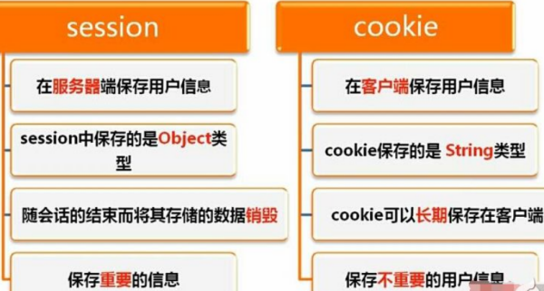

# 面经

# 一、HTTP

## 1.1、HTTP报文结构

请求报文和响应报文都是由以下4部分组成

1.请求行：Method Request-URI HTTP-Version 结尾符

2.请求头

3.空行：http协议规定的格式，一般采用\r\n

4.消息主体

## 1.2、请求头的内容

https://www.cnblogs.com/MCHang/archive/2013/03/19/2968827.html

1. Accept-Language: zh-cn,zh;q=0.5
2. Accept-Charset: GB2312,utf-8;q=0.7,*;q=0.7*
3. Accept: text/html,application/xhtml+xml,application/xml;q=0.9,*/*;q=0.8
4. Accept-Encoding: gzip, deflate
5. User-Agent: Mozilla/5.0 (compatible; 域名)
6. Host: 域名
7. Connection: Keep-Alive

## 2、Cookie 和Session的区别？

简略版

- Cookie数据存放在客户的浏览器上, Session数据放在服务器上
- Session相对于Cookie更安全
- 若考虑减轻服务器负担,应当使用Cookie 

详细版

Cookie 和 Session都是用来**跟踪浏览器用户身份**的会话方式。

区别在于：

1. 数据存放位置不同：cookie存放在浏览器上，session存放在在服务器上。
2. 安全程度不同：cookie不是很安全，别人可以分析存放在本地的COOKIE并进行COOKIE欺骗
3. 性能使用程度不同：session会在一定时间内保存在服务器上。当访问增多，会比较占用你服务器的性能,考虑到减轻服务器性能方面，应当使用cookie。
4. 数据存储大小不同：单个cookie保存的数据不能超过4K，很多浏览器都限制一个站点最多保存20个cookie，而session则存储与服务端，浏览器对其没有限制。

## 3、cookie 和session 的联系：

1、session是通过cookie来工作的。

2、session和cookie之间是通过$_COOKIE['PHPSESSID']来联系的。_

3、通过$_COOKIE['PHPSESSID']可以知道session的id，从而获取到其他的信息。

## 4、HTTP状态码⭐

1xx :指示信息–表示请求已接收,继续处理
2xx :成功–表示请求已被成功接收、理解、接受
3xx :重定向–要完成请求必须进行更进一步的操作
4xx :**客户端错误**–请求有语法错误或请求无法实现；404：浏览者其所请求的页面不存在或链接错误，
5xx :**服务器端错误**–服务器未能实现合法的请求

## 5、get 和 post 请求有哪些区别？ ⭐

- GET在浏览器回退时是无害的，而POST会再次提交请求。
- GET请求会被浏览器主动缓存，而POST不会，除非手动设置。
- GET请求只能进行url编码，而POST支持多种编码方式。
- GET请求参数会被完整保留在浏览器历史记录里，而POST中的参数不会被保留。
- GET请求在URL中传送的参数是有长度限制的，而POST没有。
- 对参数的数据类型，GET只接受ASCII字符，而POST没有限制。
- GET比POST更不安全，因为参数直接暴露在URL上，所以不能用来传递敏感信息。
- GET参数通过URL传递，POST放在Request body中。

## 6、HTTP和HTTPS的区别 ⭐

1. **证书**：HTTP不需要申请证书，HTTPS需要到CA（Certificate Authority，证书颁发机构）申请证书, HTTP不需要
2. **明文/密文**：HTTP明文传输，HTTPS使用SSL加密，密文传输,
3. **端口号不同**：HTTP使用80端口，HTTPS默认使用443端口,
4. **安全性**：HTTP是无状态的协议，HTTPS协议是由HTTP+SSL构建的可进行**加密传输、身份认证**的协议，比HTTP更加安全。

## 7、HTTP 1.0和HTTP 1.1的主要区别是什么?

1. **长连接** : 

   **在HTTP/1.0中，默认使用的是短连接**，也就是说每次请求都要重新建立一次连接。HTTP 是基于TCP/IP协议的,每一次建立或者断开连接都需要三次握手四次挥手的开销，如果每次请求都要这样的话，开销会比较大。因此最好能维持一个长连接，可以用个长连接来发多个请求。

   **HTTP 1.1起，默认使用长连接** ,默认开启Connection： keep-alive。 **HTTP/1.1的持续连接有非流水线方式和流水线方式** 。流水线方式是客户在收到HTTP的响应报文之前就能接着发送新的请求报文。与之相对应的非流水线方式是客户在收到前一个响应后才能发送下一个请求。

2. **错误状态响应码** :在HTTP1.1中新增了24个错误状态响应码，如409（Conflict）表示请求的资源与资源的当前状态发生冲突；410（Gone）表示服务器上的某个资源被永久性的删除。

3. **缓存处理** :在HTTP1.0中主要使用header里的If-Modified-Since,Expires来做为缓存判断的标准，HTTP1.1则引入了**更多的缓存控制策略**例如Entity tag，If-Unmodified-Since, If-Match, If-None-Match等更多可供选择的缓存头来控制缓存策略。

4. **带宽优化及网络连接的使用** :**HTTP1.0中，存在一些浪费带宽的现象**，例如客户端只是需要某个对象的一部分，而服务器却将整个对象送过来了，并且不支持断点续传功能**，HTTP1.1则在请求头引入了range头域，它允许只请求资源的某个部分**，即返回码是206（Partial Content），这样就方便了开发者自由的选择以便于充分利用带宽和连接。

## 8、HTTP的长连接,短连接

**HTTP协议的长连接和短连接，实质上是TCP协议的长连接和短连接。**

在HTTP/1.0中默认使用**短连接**。客户端和服务器每进行一次HTTP操作，就建立一次连接，任务结束就中断连接。

而从HTTP/1.1起，默认使用**长连接**，用以保持连接特性。会在响应头加入这行代码：

- **Connection**:keep-alive

在使用长连接的情况下，客户端和服务器之间用于传输HTTP数据的TCP连接不会关闭，客户端再次访问这个服务器时，会继续使用这一条已经建立的连接。

Keep-Alive不会永久保持连接，它有一个保持时间，可以在不同的服务器软件（如Apache）中设定这个时间。实现长连接需要客户端和服务端都支持长连接。

## 9、在浏览器中输入url地址 ->> 显示主页的过程 ⭐

**打开一个网页，整个过程会使用哪些协议**

总体来说分为以下几个过程:

1. DNS解析
2. TCP连接
3. 发送HTTP请求
4. 服务器处理请求并返回HTTP报文
5. 浏览器解析渲染页面
6. 连接结束

具体可以参考下面这篇文章：

- https://segmentfault.com/a/1190000006879700

# 二、TCP/UDP

## 1、TCP 协议如何保证可靠传输

1. TCP会主动将应用数据分割成自己认为最适合发送的数据块。
2. TCP 给发送的每一个包进行编号，接收方对数据包进行排序，把数据有序传送给应用层。
3. TCP 的接收端会丢弃重复的数据。                         
4. **差错检测：** TCP 将保持它首部和数据的检验和。这是一个端到端的检验和，目的是检测数据在传输过程中的任何变化。如果收到段的**检验和有差错，TCP 将丢弃这个报文段和不确认收到此报文段**。
5. **流量控制：** TCP 连接的每一方都有固定大小的缓冲空间，TCP的接收端只允许发送端发送接收端缓冲区能接纳的数据。当接收方来不及处理发送方的数据，能提示发送方降低发送的速率，防止包丢失。TCP 使用的流量控制协议是可变大小的滑动窗口协议。 （**TCP 利用滑动窗口实现流量控制，通知发送方减小发送速率**）
6. **拥塞控制：** 当网络拥塞时，减少数据的发送。拥塞控制算法有：慢开始、拥塞避免；快重传、快恢复。
7. **ARQ协议：** 也是为了实现可靠传输的，它的基本原理就是每发完一个分组就停止发送，等待对方确认。在收到确认后再发下一个分组。
8. **超时重传：** 当 TCP 发出一个段后，它启动一个定时器，等待目的端确认收到这个报文段。如果不能及时收到一个确认，将重发这个报文段。

## 1、简述 TCP 和 UDP 的区别⭐

- TCP面向连接（如打电话要先拨号建立连接）;UDP是无连接的，即发送数据之前不需要建立连接。
- TCP提供可靠的服务。也就是说，通过TCP连接传送的数据，无差错，不丢失，不重复，且按序到达;UDP尽最大努力交付，即不保证可靠交付。
- UDP具有较好的实时性，工作效率比TCP高，适用于对高速传输和实时性有较高的通信或广播通信。
- 每一条TCP连接只能是点到点的;UDP支持一对一，一对多，多对一和多对多的交互通信。
- TCP对系统资源要求较多，UDP对系统资源要求较少。

**在浏览器中输入url地址 ->> 显示主页的过程(面试常客)**

百度好像最喜欢问这个问题。

**打开一个网页，整个过程会使用哪些协议**

总体来说分为以下几个过程:

1. DNS解析
2. TCP连接
3. 发送HTTP请求
4. 服务器处理请求并返回HTTP报文
5. 浏览器解析渲染页面
6. 连接结束

具体可以参考下面这篇文章：

- https://segmentfault.com/a/1190000006879700

**选择**

什么时候应该使用TCP： 当对网络通讯质量有要求的时候，比如：整个数据要准确无误的传递给对方，这往往用于一些要求可靠的应用，比如HTTP、HTTPS、FTP等传输文件的协议，POP、SMTP等邮件传输的协议。 在日常生活中，常见使用TCP协议的应用如下： 浏览器，用的HTTP FlashFXP，用的FTP Outlook，用的POP、SMTP Putty，用的Telnet、SSH QQ文件传输。什么时候应该使用UDP： 当对网络通讯质量要求不高的时候，要求网络通讯速度能尽量的快，这时就可以使用UDP。 比如，日常生活中，常见使用UDP协议的应用如下： QQ语音 QQ视频 TFTP。

## TCP 三次握手和四次挥手(重点)⭐

先介绍各单词的含义：

1为有效，0为无效

- URG：紧急指针标志
- **ACK：确认序号标志**
- PSH：push标志
- RST：重置连接标志
- SYN （Synchronize Sequence Numbers） ：同步序列号，用于建立连接过程
- FIN：finish标志，用于释放链接

 握手是为了建立连接，流程如下图 ：

  
 
seq：为自己的标记缓存的初始序号
ack：确认号  

 **第一次握手**：
一开始都是close状态，客户端主动打开，服务端进入listen监听状态，等待请求，客户端发出连接请求报文（SYN包），报文头为SYN,seq为任意正整数x，此时进入同步发送状态（SYN_SEND），等待服务器确认。
**第二次握手：**
如果服务端同意接收信息，会发出确认报文（SYN+ACK包 ），报文头seq为另外一个正整数y，ack为x+1，服务端进入同步收到的状态（SYN_RCVD）；
前两步都不携带数据，都需要消耗一个序列号。
**第三次握手：**
客户端接收到确认报文（SYN+ACK包 ），进入ESTABLISHED状态，还要向服务端给出确认，发出确认报文（ACK包 ack=y+1 ），两端都进入ESTABLISHED状态，完成三次握手。
**此后，双方就建立了链接，可以开始通信了。** 

## 为什么需要三次握手?⭐

简单说就是： 为了双方确认自己与对方的发送与接收是正常的。两次握手的话至多只有连接发起方的起始序列号能被确认， 另一方选择的序列号则得不到确认，不能建立起双向通信。

**为了初始化Sequence Number 的初始值**： 为了实现可靠数据传输， TCP 协议的通信双方， 都必须维护一个序列号， 以标识发送出去的数据包中， 哪些是已经被对方收到的。 三次握手的过程即是通信双方相互告知序列号起始值， 并确认对方已经收到了序列号起始值的必经步骤。 

## 首次握手的隐患–SYN超时

**原因：**
Server收到Client的SYN ,回复SYN- ACK的时候未收到ACK确认，导致 Server 一直在 SYN_RCVD 状态，
Server不断重试直至超时, 影响正常数据发送，但 Linux 默认等待63秒才断开连接
所以黑客可能利用这个漏洞进行恶意攻击。

**防护措施：**
SYN队列满后,通过tcp_ syncookies参数回发SYN Cookie
若为正常连接则客户端会回发 SYN Cookie 告诉服务端已经接收到请稍等,直接建立连接。

## 建立连接后，Client出现故障怎么办

保活机制
一直发送探测报文，直到达到设定次数还无响应就中断连接

## TCP四次挥手（重点）⭐

 目的：为了中止连接 

 流程图： 

  
 
 **第一次挥手：**
最开始两方都处于ESTABLISHED状态，客户端主动关闭，发出连接释放报文（FIN）并且停止发送数据，报文头：FIN和seq =u（等于前面已经传送过来的数据的最后一个字节的序号加1），然后进入**FINWAIT1**状态。 TCP规定，FIN报文段即使不携带数据，也要消耗一个序号。 
**第二次挥手：**
服务器收到报文，发出确认报文（ACK，ack=u+1，序列号seq=v），进入**CLOSEWAIT**状态。
CLOSEWAIT状态：半关闭状态，服务器端不接收数据但可能还要发送数据。
**第三次挥手：**
客户端收到报文进入**FINWAIT2**状态，等待服务器发送第三次挥手，这段时间可以接收数据。服务端数据发送完后，会发送释放报文（FIN），但服务器很可能又发送了一些数据，序列号会变化，假定此时的序列号为seq=w ，此时进入**LASTACK**状态。
**第四次挥手：**
客户端收到报文后必须发送确认报文（ACK，ack=w+1，seq=u+1），进入**TIMEWAIT**，但连接没有释放，等待2MSL（2倍最大报文段寿命）来保证连接的可靠关闭才进入**CLOSED**状态。服务端收到确认直接进入**CLOSED**状态。

**为什么什么有TIME_WAIT状态**

* 保证全双工链接可靠关闭
* 保证重复的数据段消失，方式端口被重用时产生数据混淆

### 为什么连接的时候是三次握手，关闭的时候却是四次握手⭐

因为在连接时当Server端收到Client端的SYN连接请求报文后，可以直接发送SYN+ACK报文。其中ACK报文是用来应答的，SYN报文是用来同步的。但是关闭连接时，当Server端收到FIN报文时，因为可能还有数据需要传输回去，并不能立即关闭SOCKET，所以只能先回复一个ACK报文，告诉Client端，"你发的FIN报文我收到了，但我还有一些数据没有发完"。只有等到我Server端所有的报文都发送完了，才会发送FIN报文，因此不能一起发送。所以需要四步握手。 

tip: 全双工（Full Duplex）是通讯传输的一个术语。通信允许数据在两个方向上同时传输

#### 服务器出现大量CLOSE_ WAIT状态的原因

被动关闭的一方可能存在代码问题没有正确关闭链接导致的

对方关闭socket连接,我方忙于读或写,没有及时关闭连接
**解决：**
检查代码,特别是释放资源的代码
检查配置,特别是处理请求的线程配置

## UDP的特点

面向非连接
不维护连接状态,支持同时向多个客户端传输相同的消息
数据包报头只有8个字节,额外开销较小
吞吐量只受限于数据生成速率、传输速率以及机器性能
尽最大努力交付,不保证可靠交付,不需要维持复杂的链接状态表
面向报文,不对应用程序提交的报文信息进行拆分或者合并

# 网络

## 1、TCP/IP四层网络模型⭐

**第一层 网络接口层**

网络接口层包括用于协作IP数据在已有网络介质上传输的协议。

协议：ARP,RARP
**第二层 网间层**

网间层对应于OSI七层参考模型的网络层。负责数据的包装、寻址和路由。同时还包含网间控制报文协议(Internet Control Message Protocol,ICMP)用来提供网络诊断信息。

协议：本层包含IP协议、RIP协议(Routing Information Protocol，路由信息协议)，ICMP协议。
**第三层 传输层**

传输层对应于OSI七层参考模型的传输层，它提供两种端到端的通信服务。

其中TCP协议(Transmission Control Protocol)提供可靠的数据流运输服务，UDP协议(Use Datagram Protocol)提供不可靠的用户数据报服务。
**第四层 应用层**

应用层对应于OSI七层参考模型的应用层和表达层。

因特网的应用层协议包括Finger、Whois、FTP(文件传输协议)、Gopher、HTTP(超文本传输协议)、Telent(远程终端协议)、SMTP(简单邮件传送协议)、IRC(因特网中继会话)、NNTP（网络新闻传输协议）等。

## 2、OSI七层网络模型⭐

**第一层 物理层**

作用：负责最后将信息编码成电流脉冲或其它信号用于网上传输。它由计算机和网络介质之间的实际界面组成，可定义电气信号、符号、线的状态和时钟要求、数据编码和数据传输用的连接器。所有比物理层高的层都通过事先定义好的接口而与它通话。

协议：如最常用的RS-232规范、10BASE-T的曼彻斯特编码以及RJ-45就属于第一层。
**第二层 数据链路层**

作用：数据链路层通过物理网络链路提供可靠的数据传输。

协议：ATM，FDDI等。 
**第三层 网络层**

作用：这层对端到端的包传输进行定义，他定义了能够标识所有结点的逻辑地址，还定义了路由实现的方式和学习的方式。为了适应最大传输单元长度小于包长度的传输介质，网络层还定义了如何将一个包分解成更小的包的分段方法。

协议：IP,IPX等
**第四层 传输层**

作用：传输层向高层提供可靠的端到端的网络数据流服务。传输层的功能一般包括流控、多路传输、虚电路管理及差错校验和恢复。流控管理设备之间的数据传输，确保传输设备不发送比接收设备处理能力大的数据；多路传输使得多个应用程序的数据可以传输到一个物理链路上；虚电路由传输层建立、维护和终止；差错校验包括为检测传输错误而建立的各种不同结构；而差错恢复包括所采取的行动（如请求数据重发），以便解决发生的任何错误。

协议：TCP，UDP，SPX。
**第五层 会话层**

作用：会话层建立、管理和终止表示层与实体之间的通信会话。通信会话包括发生在不同网络应用层之间的服务请求和服务应答，这些请求与应答通过会话层的协议实现。它还包括创建检查点，使通信发生中断的时候可以返回到以前的一个状态。

协议：RPC，SQL等
**第六层 表示层**

作用：这一层的主要功能是定义数据格式及加密。

协议：FTP,加密
**第七层 应用层**

作用：应用层是最接近终端用户的OSI层，这就意味着OSI应用层与用户之间是通过应用软件直接相互作用的。应用层的功能一般包括标识通信伙伴、定义资源的可用性和同步通信。
协议：telnet，HTTP,FTP,WWW,NFS,SMTP等。

## 在浏览器中输入url地址 ->> 显示主页的过程⭐

总体来说分为以下几个过程:

1. DNS解析，查询服务器缓存，解析url，找到服务器的IP地址 
2. TCP连接， 三次握手 
3. 发送HTTP请求
4. 服务器处理请求并返回HTTP报文
5. 浏览器解析渲染页面
6. 连接结束，四次挥手 

## Socket

Socket是对TCP/IP协议的抽象,是操作系统对外开放的接口
