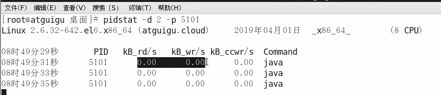

ulimit -u查看线程数限制

## 【动态】top

动态查看CPU、内存的占用量

右上角有个load average：系统1、5min、10min的平均负载值，如果3个值相加除以3乘以100%  >  60%，则系统的负载压力太大。

按1键，可以查看每个CPU的负载情况。

uptime：直接查看load average


## 【CPU】vmstat

查看CPU（包括但不限于）


## 【内存】free


free：以字节byte为单位

free -g：以G为单位

free -m：以M为单位


## 【内存】pidstat

查看指定进程使用的内存


## 【硬盘】df

df -h

h:human用人类看得懂的方式显示，K/M/G都会有


## 【磁盘IO】iostat

iostat -xdk 2 3 

Linux命令之磁盘IO查看iostst和pidstat




## 【网络IO】ifstat


## 【进程】ps

```
ps -ef|grep java|grep -v grep
```

ps -ef 和ps aux：两者没太大差别，讨论这个问题，要追溯到Unix系统中的两种风格，System Ｖ风格和BSD 风格，ps aux最初用到Unix Style中，而ps -ef被用在System V Style中，两者输出略有不同。

```
grep -v grep：去除包含grep的进程行
```

ps命令将某个进程显示出来

grep命令是查找

中间的|是管道命令 是指ps命令与grep同时执行

PS是LINUX下最常用的也是非常强大的进程查看命令

## 假如生产环境出现CPU占用过高，请谈谈你的分析思路和定位

### CPU占用过高的定位分析思路


#### 1、top命令找出CPU占比最高的


#### 2、ps -ef与jps进一步定位进程类型

ps -ef根据PID查看进程


#### 3、ps -mp定位到具体的线程


#### 4、使用计算器将线程ID转换成具体的16进制格式

【线程号应该是3929，不是5102】


#### 5、jstack打印栈内存信息，找到出错的代码行


## 对于JDK自带的JVM监控和性能分析工具用过哪些？

一般你是怎么用的？


**GitHub操作之开启**


## GitHub操作之常用词


### GitHub操作之in搜索


### GitHub操作之star和fork范围搜索


### GitHub操作之awesome搜索


### GitHub操作之#L数字


### GitHub操作之T搜索


### GitHub操作之搜索区域活跃用户


